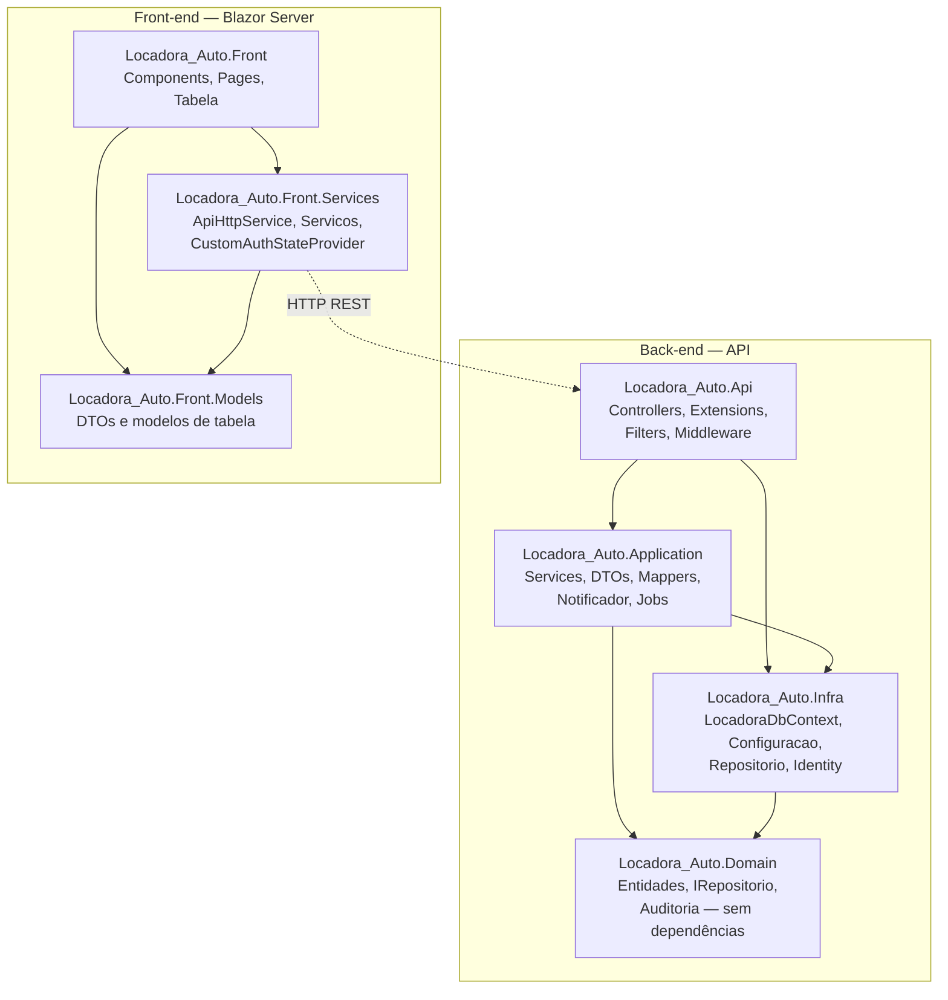
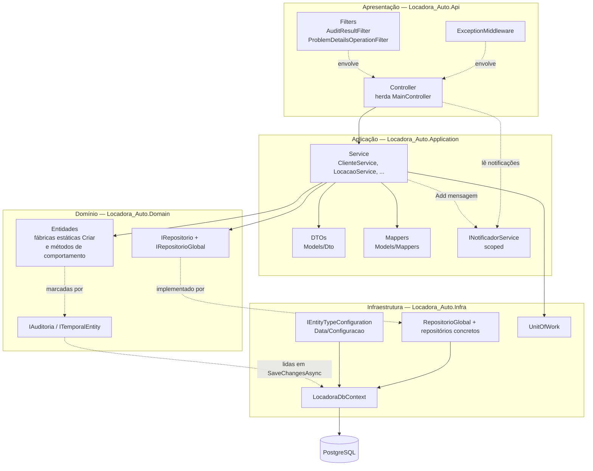
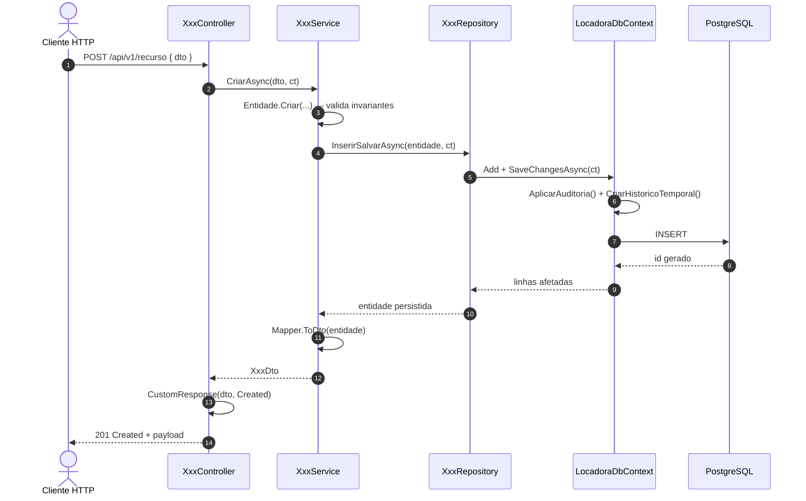
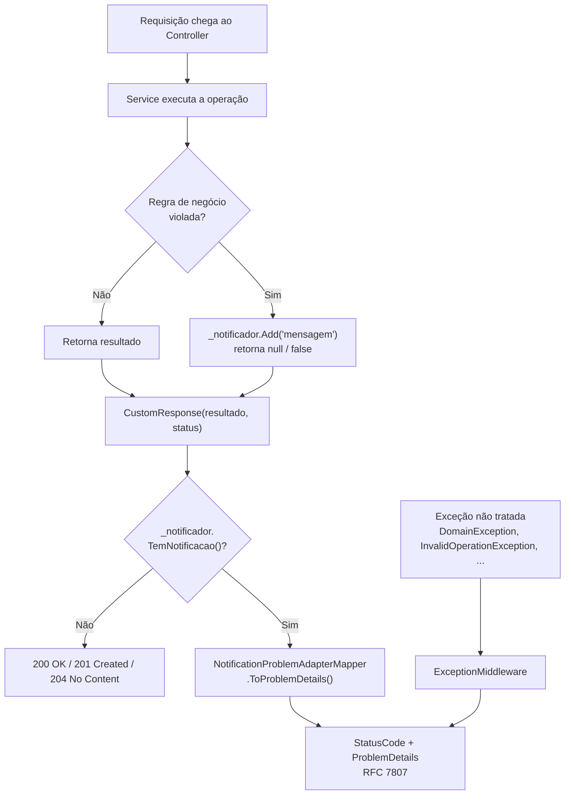
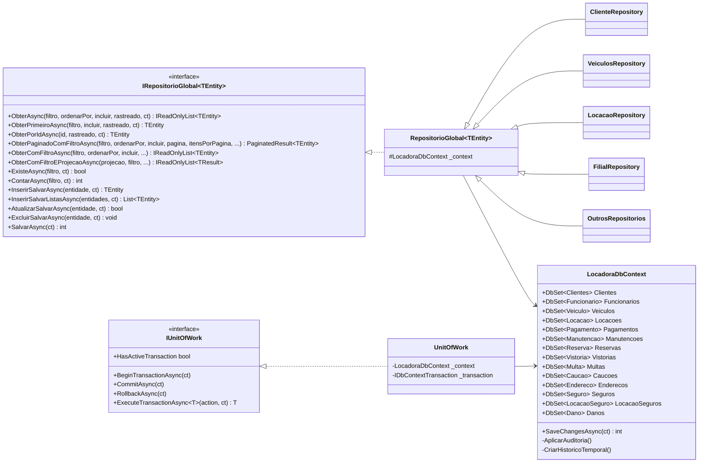
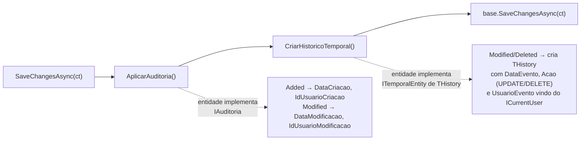
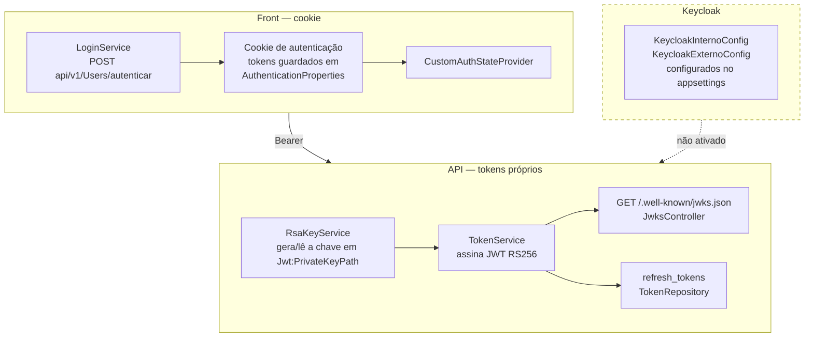
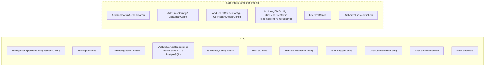
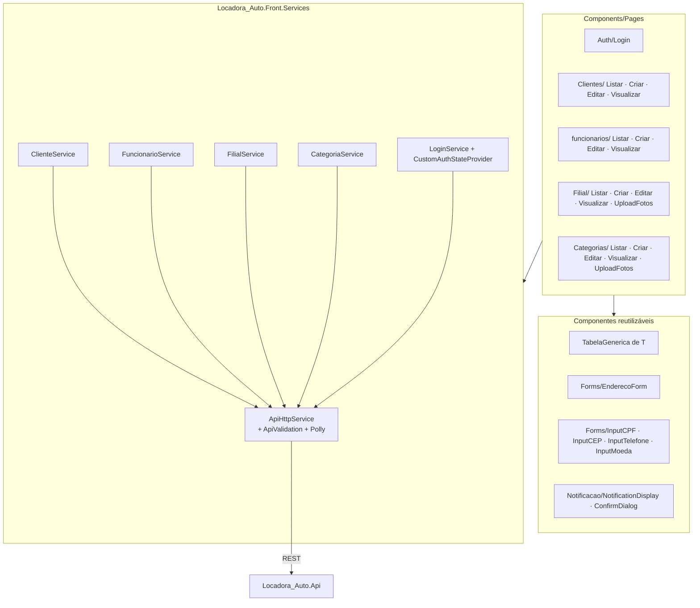

# 01 — Arquitetura

## Projetos e dependências

A solução `Locadora_Auto-Api.sln` tem seis projetos, todos `net8.0`.

`Locadora_Auto.Domain` não referencia nenhum outro projeto — é o núcleo. A dependência de
`Application` para `Infra` existe porque os serviços de aplicação recebem os repositórios
concretos e o `LocadoraDbContext` por injeção.

## Camadas e responsabilidades

## Fluxo de uma requisição bem-sucedida

## Tratamento de erros

Regras de negócio **não lançam exceção**: o serviço registra a mensagem no
`INotificadorService` (scoped, portanto vive durante toda a requisição) e retorna `null`/`false`.
O `MainController.CustomResponse` consulta o notificador antes de montar a resposta e, havendo
notificação, devolve um `ProblemDetails` (RFC 7807) no lugar do payload de sucesso.

Fora esse caminho, o `MainController` ainda expõe atalhos diretos: `NotFound(mensagem)`,
`Forbidden(mensagem)`, `ProblemResponse(status, detail, ...)` e `ValidationResponse(modelState)`
para erros de validação de modelo.

## Acesso a dados

Todo repositório concreto herda `RepositorioGlobal<TEntity>`, que já implementa a superfície
genérica de consulta e escrita. Consultas são `AsNoTracking` por padrão — para alterar uma
entidade é preciso pedir `rastreado: true`.

`LocadoraDbContext` herda `IdentityDbContext<User, IdentityRole, string>` e sobrescreve
**apenas `SaveChangesAsync`**. O `SaveChanges()` síncrono não aplica auditoria nem histórico
temporal — por isso todo o código usa a versão assíncrona.

### Auditoria e histórico temporal

Hoje apenas duas entidades participam desse mecanismo:

| Entidade | Interfaces | Tabela de histórico |
|---|---|---|
| `Clientes` | `IAuditoria`, `ITemporalEntity<ClienteHistorico>` | `tb_cliente_historico` |
| `User` | `ITemporalEntity<UserHistorico>` | `tb_user_historico` |

## Banco de dados

- PostgreSQL via **Npgsql**; o modelo do EF Core é a fonte de verdade e o schema sai das
  migrations em `Infra/Data/Migrations/`.
- Nomenclatura **snake_case**, resultado de `UseSnakeCaseNamingConvention()` somada aos
  `ToTable`/`HasColumnName` explícitos em `Data/Configuracao/`.
- Colunas de data são `timestamp with time zone`. Um conversor global em `OnModelCreating`
  normaliza todo `DateTime`/`DateTime?` para `Kind=Utc` na escrita e remarca na leitura — daí
  a regra de sempre usar `DateTime.UtcNow`.
- `LocadoraDbContextFactory` (`IDesignTimeDbContextFactory`) existe para as migrations, porque
  o `CurrentUser` real depende de `HttpContext`.
- `db.sql` na raiz é o schema **MySQL antigo**, apenas referência histórica.
  `db_postgres.sql` é gerado por `dotnet ef migrations script --idempotent`.

## Autenticação

Duas abordagens convivem no repositório:

## Estado atual do `Program.cs`

Vários blocos estão comentados para facilitar o desenvolvimento e serão reativados:

## Processamento em segundo plano

`TarefaDiariaBackgroundService` é um `BackgroundService` que acorda às 03:00 todos os dias,
cria um escopo de DI, resolve o `LocadoraDbContext` e chama `SaveChangesAsync`. O corpo da
rotina ainda está vazio (a linha de limpeza de logs está comentada).

O domínio já expõe dois métodos pensados para execução agendada, ainda sem *job* que os chame:

- `Locacao.MarcarComoAtrasada(DateTime agora)` — marca como `Atrasada` a locação `Criada` cuja
  data fim prevista já passou.
- `Reserva.Expirar(DateTime agora)` — marca como `Expirado` a reserva `Reservado` cuja data de
  início já passou.

## Front-end

O `Locadora_Auto.Front` é Blazor Server e conversa com a API por `HttpClient` com políticas
Polly. As telas de listagem usam o componente genérico `Components/Tabela/TabelaGenerica.razor`
(filtro, ordenação, paginação, seleção e ações em massa), configurado por `ColunaTabela<T>` e
`AcaoTabela<T>` de `Front/Models/Tabelas/`.

O componente `TabelaGenerica.razor` está fisicamente em `Components/Tabela/` mas declara
`@namespace Locadora_Auto.Front.Components.UI` — o `@using` correto é `...Components.UI`.

## Observações

- `AddSqlServerRepositories()` e `SqlServerHealthCheck` têm nomes herdados de outro banco; a
  implementação é PostgreSQL.
- Versionamento usa o pacote legado `Microsoft.AspNetCore.Mvc.Versioning` (v5). As rotas são
  inconsistentes: `ClientesController`, `FuncionariosController` e `UsersController` usam
  `api/v{version:apiVersion}/[controller]`; os demais fixam `api/v1/<nome>` — e
  `LocacoesController` usa `api/locacoes`, sem versão nenhuma.
- No PostgreSQL o `LIKE` é sensível a maiúsculas e a acentos (diferente do
  `utf8mb4_unicode_ci` do MySQL antigo). As buscas por texto aplicam `.ToLower().Contains(...)`
  dos dois lados; acento continua diferenciando.
- `Locadora_Auto.Front` aponta para `ApiConfig:BaseUrlApiLocacao = https://localhost:44310/`,
  que não corresponde à porta real da API (`61977`).
- Segredos ficam em `appsettings.Development.json`, que está commitado — não há user-secrets.
