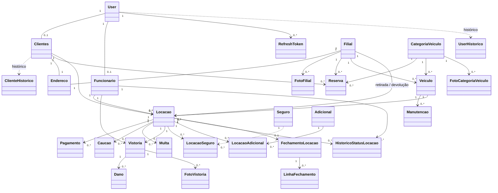
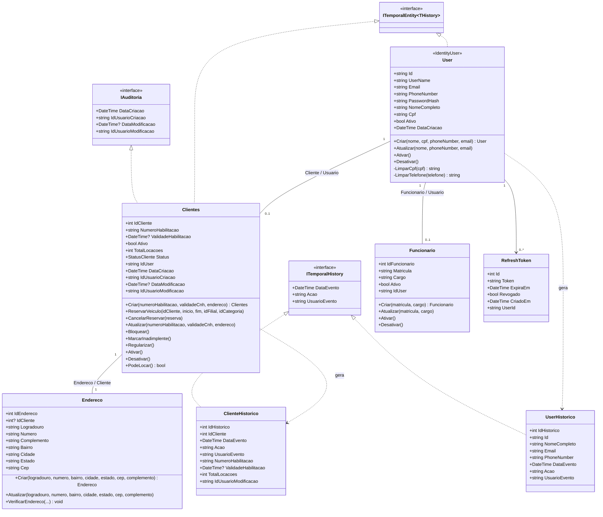
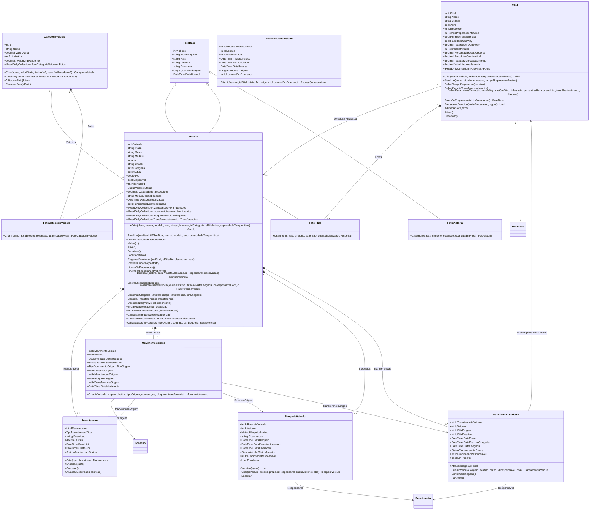
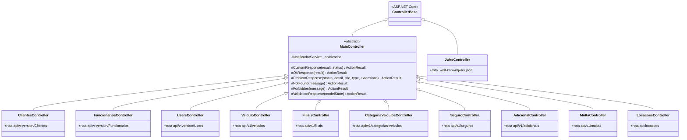

# 02 — Diagrama de classes

O domínio está em `Locadora_Auto.Domain/Entidades/`. As entidades são **ricas**: construtor
privado/protegido para o EF Core, fábrica estática `Criar(...)` que valida invariantes,
propriedades com `private set` e métodos de comportamento que representam as transições de
estado. Coleções internas seguem o padrão `private readonly List<T> _x` exposto como
`IReadOnlyCollection<T>`.

Como o modelo completo em um único diagrama fica ilegível, ele está dividido em quatro
contextos.

---

## 1. Visão geral do domínio

Só as entidades e suas ligações, sem atributos nem métodos.

---

## 2. Contexto: Pessoas e Identidade

`User` é a raiz da identidade (`IdentityUser` do ASP.NET Core) e guarda nome, CPF e telefone.
`Clientes` e `Funcionario` são perfis 1:1 opcionais sobre esse usuário — quem tem CPF, e-mail
e senha é o `User`; quem tem CNH e histórico de locações é o `Clientes`.

---

## 3. Contexto: Frota (veículos, categorias, filiais)

---

## 4. Contexto: Locação (agregado principal)

`Locacao` é a raiz de agregado mais rica do sistema. Ela controla o ciclo de vida da locação e
é a única porta de entrada para pagamentos, cauções, multas, vistorias, seguros contratados e
adicionais — todos criados por métodos da própria `Locacao` (as fábricas dessas classes são
`internal`).

```mermaid
classDiagram
    direction TB

    class Locacao {
        +int IdLocacao
        +int ClienteId
        +int IdVeiculo
        +int IdFuncionario
        +int IdFilialRetirada
        +int? IdFilialDevolucao
        +DateTime DataInicio
        +DateTime DataFimPrevista
        +DateTime? DataFimReal
        +int KmInicial
        +int? KmFinal
        +decimal ValorPrevisto
        +decimal? ValorFinal
        +decimal ValorDiariaContratada
        +StatusLocacao Status
        +IReadOnlyCollection~Pagamento~ Pagamentos
        +IReadOnlyCollection~Caucao~ Caucoes
        +IReadOnlyCollection~Multa~ Multas
        +IReadOnlyCollection~Vistoria~ Vistorias
        +IReadOnlyCollection~LocacaoSeguro~ Seguros
        +IReadOnlyCollection~LocacaoAdicional~ Adicionais
        +FechamentoLocacao Fechamento
        +Criar(cliente, veiculo, funcionario, reserva, filialRetirada, dataInicio, dataFimPrevista, kmInicial, valorPrevisto, valorDiariaContratada) Locacao
        +RegistrarDevolucao(dataFimReal, kmFinal, filialDevolucao)
        +Fechar(valorFinal)
        +LiquidarSaldo()
        +AbrirFechamento(idFuncionarioApuracao) FechamentoLocacao
        +ApurarPeriodo(filialRetirada) ApuracaoDePeriodo
        +ApurarQuilometragem(veiculo, categoria, periodo) ApuracaoDeQuilometragem
        +ApurarCombustivel(veiculo, filialDevolucao) ApuracaoDeCombustivel
        +LancarNoFechamento(tipo, baseCalculo, quantidade, valorUnitario, idFuncionario, motivo) LinhaFechamento
        +SelarFechamento() decimal
        +CorrigirFechamento(tipo, baseCalculo, quantidade, valorUnitario, idFuncionario, motivo) LinhaFechamento
        +SaldoEmAberto() decimal
        +Cancelar()
        +AtualizarDados(dataFimPrevista, kmInicial, valorPrevisto)
        +MarcarComoAtrasada(agora)
        +AdicionarPagamento(valor, formaPagamento)
        +ConfirmarPagamento(idPagamento)
        +CancelarPagamento(idPagamento, motivo)
        +MarcarComoFalha(idPagamento)
        +RegistrarCaucao(valor)
        +BloquearCaucao(idCaucao)
        +DeduzirCaucao(idCaucao, valor)
        +DevolverCaucao(idCaucao)
        +AdicionarMulta(tipo, valor)
        +PagarMulta(idMulta)
        +CompensarMultaComCaucao(idMulta)
        +CancelarMulta(idMulta)
        +AdicionarSeguro(seguro, valorDiaria, franquia)
        +CancelarSeguro(idLocacaoSeguro)
        +RegistrarVistoria(idFuncionario, tipo, combustivel, km, observacoes)
        +RegistrarDanoVistoria(idVistoria, descricao, tipo, valor)
        +RemoverDanoVistoria(idDano, idVistoria)
        +RegistrarFoto(fotos, idVistoria)
        +AdicionarAdicional(idAdicional, valorDiaria, quantidade)
        +RemoverAdicional(idAdicional)
        +CalcularTotalAdicionais() decimal
        +CalcularDias() int
    }

    class Pagamento {
        +int IdPagamento
        +decimal Valor
        +DateTime DataPagamento
        +StatusPagamento Status
        +FormaPagamento FormaPagamento
        ~Pagamento(valor, formaPagamento)
        ~Confirmar()
        ~Cancelar(motivo)
        ~MarcarComoFalhou()
    }

    class Caucao {
        +int IdCaucao
        +decimal Valor
        +StatusCaucao Status
        ~Criar(valor) Caucao
        ~Deduzir(valor)
        ~Bloquear()
        ~Devolver()
    }

    class Multa {
        +int IdMulta
        +TipoMulta Tipo
        +decimal Valor
        +StatusMulta Status
        ~Criar(valor, tipo) Multa
        ~MarcarComoPaga()
        ~CompensarComCaucao()
        ~Cancelar()
    }

    class Vistoria {
        +int IdVistoria
        +int IdLocacao
        +TipoVistoria Tipo
        +NivelCombustivel Combustivel
        +string Observacoes
        +DateTime DataVistoria
        +int IdFuncionario
        +int KmVeiculo
        +IReadOnlyCollection~FotoVistoria~ Fotos
        +IReadOnlyCollection~Dano~ Danos
        ~Criar(idLocacao, idFuncionario, tipo, combustivel, kmVeiculo, observacoes) Vistoria
        +RegistrarDano(descricao, tipo, valor)
        +RemoverDano(idDano)
        +AprovarDano(idDano)
        +ColocarDanoEmAnalise(idDano)
        +IsentarDano(idDano)
        +MarcarDanoComoPago(idDano)
        +PossuiDanos() bool
        +AdicionarFoto(foto)
        +RemoverFoto(idFoto)
        +AtualizarKm(km)
        +AtualizarCombustivel(nivel)
        +AtualizarObservacoes(observacoes)
    }

    class Dano {
        +int IdDano
        +int IdVistoria
        +string Descricao
        +TipoDano Tipo
        +decimal ValorEstimado
        +StatusDano Status
        +DateTime DataRegistro
        ~Criar(idVistoria, descricao, tipo, valor) Dano
        +AtualizarValor(novoValor)
        +ColocarEmAnalise()
        +Aprovar()
        +MarcarComoCobrado()
        +MarcarComoPago()
        +Isentar()
        +Cancelar()
    }

    class Seguro {
        +int IdSeguro
        +string Nome
        +string Descricao
        +decimal ValorDiaria
        +decimal Franquia
        +string Cobertura
        +bool Ativo
        +Criar(nome, descricao, valorDiaria, franquia, cobertura) Seguro
        +Atualizar(nome, descricao, valorDiaria, franquia, cobertura)
        +Ativar()
        +Desativar()
    }

    class ApuracaoDePeriodo {
        +int Diarias
        +int DiariasPorTeto
        +int HorasExcedentes
        +int HorasApuradas
        +int DiariasCobradas
        +decimal ValorDiaria
        +decimal ValorHoraExcedente
        +TimeSpan RestoDoUltimoCiclo
        +decimal Total
        +Calcular(dataInicio, dataFimReal, valorDiariaContratada, toleranciaMinutos, percentualHoraExcedente)$ ApuracaoDePeriodo
        +BaseCalculoDasDiarias(dataInicio, duracao) string
        +BaseCalculoDasHoras(toleranciaMinutos) string
        +BaseCalculoDoTeto(toleranciaMinutos) string
    }

    class ApuracaoDeQuilometragem {
        +int KmRodados
        +int FranquiaKm
        +int KmExcedentes
        +decimal ValorKmExcedente
        +bool KmLivre
        +decimal Total
        +Calcular(kmInicial, kmFinal, limiteKm, valorKmExcedente, diariasCobradas)$ ApuracaoDeQuilometragem
        +BaseCalculo(kmInicial, kmFinal, limiteKm, diariasCobradas) string
    }

    class ApuracaoDeCombustivel {
        +SituacaoDoCombustivel Situacao
        +NivelCombustivel NivelRetirada
        +NivelCombustivel NivelDevolucao
        +decimal? CapacidadeTanqueLitros
        +int LitrosFaltantes
        +decimal PrecoLitro
        +decimal TaxaServico
        +bool Cobravel
        +decimal TotalDoCombustivel
        +decimal TotalDaTaxa
        +decimal Total
        +Calcular(nivelRetirada, nivelDevolucao, capacidadeTanqueLitros, precoLitro, taxaServico)$ ApuracaoDeCombustivel
        +FracaoDe(nivel)$ decimal
        +BaseCalculoDoCombustivel() string
        +BaseCalculoDaTaxa() string
    }

    class FechamentoLocacao {
        +int IdFechamento
        +int IdLocacao
        +DateTime DataApuracao
        +int IdFuncionarioApuracao
        +DateTime? DataSelagem
        +decimal TotalDebitos
        +decimal TotalCreditos
        +decimal Saldo
        +bool Selado
        +IReadOnlyCollection~LinhaFechamento~ Linhas
        ~Abrir(idLocacao, idFuncionarioApuracao) FechamentoLocacao
        ~Lancar(tipo, baseCalculo, quantidade, valorUnitario, idFuncionario, motivo) LinhaFechamento
        ~Selar()
        ~RegistrarCorrecao(tipo, baseCalculo, quantidade, valorUnitario, idFuncionario, motivo) LinhaFechamento
    }

    class LinhaFechamento {
        +int IdLinhaFechamento
        +int IdFechamento
        +TipoLinhaFechamento Tipo
        +string BaseCalculo
        +decimal Quantidade
        +decimal ValorUnitario
        +decimal Total
        +DateTime DataLancamento
        +bool EhCorrecao
        +int? IdFuncionarioLancamento
        +string Motivo
        +NaturezaLinhaFechamento Natureza
        ~Lancar(tipo, baseCalculo, quantidade, valorUnitario, ehCorrecao, idFuncionario, motivo) LinhaFechamento
        +Arredondar(valor)$ decimal
        +NaturezaDe(tipo)$ NaturezaLinhaFechamento
    }

    class LocacaoSeguro {
        +int IdLocacaoSeguro
        +int IdLocacao
        +int IdSeguro
        +bool Ativo
        +decimal ValorDiariaContratada
        +decimal FranquiaContratada
        ~Contratar(idSeguro, valorDiaria, franquia) LocacaoSeguro
        ~Cancelar()
    }

    class Adicional {
        +int IdAdicional
        +string Nome
        +decimal ValorDiaria
        +bool Ativo
        +Criar(nome, valorDiaria) Adicional
        +Atualizar(nome, valorDiaria)
        +Ativar()
        +Desativar()
    }

    class LocacaoAdicional {
        +int IdLocacaoAdicional
        +int IdAdicional
        +int IdLocacao
        +decimal ValorDiariaContratada
        +decimal ValorTotal
        +int Quantidade
        +int Dias
        +Criar(idAdicional, valorDiaria, quantidade, dias) LocacaoAdicional
        +CalcularTotal() decimal
    }

    class HistoricoStatusLocacao {
        +int Id
        +int IdLocacao
        +string Status
        +DateTime DataStatus
        +int IdFuncionario
    }

    Locacao "1" *-- "0..*" Pagamento : Pagamentos
    Locacao "1" *-- "0..*" Caucao : Caucoes
    Locacao "1" *-- "0..*" Multa : Multas
    Locacao "1" *-- "0..*" Vistoria : Vistorias
    Locacao "1" *-- "0..*" LocacaoSeguro : Seguros
    Locacao "1" *-- "0..*" LocacaoAdicional : Adicionais
    Locacao "1" *-- "0..1" FechamentoLocacao : Fechamento
    FechamentoLocacao "1" *-- "0..*" LinhaFechamento : Linhas
    Locacao ..> ApuracaoDePeriodo : ApurarPeriodo()
    Locacao ..> ApuracaoDeQuilometragem : ApurarQuilometragem()
    Locacao ..> ApuracaoDeCombustivel : ApurarCombustivel()
    Filial ..> ApuracaoDePeriodo : tolerância e percentual (retirada)
    Filial ..> ApuracaoDeCombustivel : preço do litro e taxa (devolução)
    CategoriaVeiculo ..> ApuracaoDeQuilometragem : limite e valor do km
    Locacao "1" --> "0..*" HistoricoStatusLocacao
    Vistoria "1" *-- "0..*" Dano : Danos
    Vistoria "1" *-- "0..*" FotoVistoria : Fotos
    Seguro "1" ..> "0..*" LocacaoSeguro : IdSeguro sem FK
    Adicional "1" --> "0..*" LocacaoAdicional : LocacaoAdicionals
    Locacao --> Clientes : Cliente
    Locacao --> Veiculo : Veiculo
    Locacao --> Funcionario : Funcionario
    Locacao --> Filial : FilialRetirada / FilialDevolucao
```

---

## 5. Enumerações

```mermaid
classDiagram
    direction LR

    class StatusCliente {
        <<enumeration>>
        Habilitado
        Inadimplente
        Bloqueado
    }

    class StatusVeiculo {
        <<enumeration>>
        Disponivel = 1
        Bloqueado = 2
        Locado = 3
        EmManutencao = 4
        EmPreparacao = 5
        EmTransferencia = 6
        Desmobilizado = 7
    }

    class TipoDocumentoOrigem {
        <<enumeration>>
        Cadastro = 1
        Contrato = 2
        OrdemServico = 3
        Patio = 4
        Prazo = 5
        Bloqueio = 6
        Transferencia = 7
        Desmobilizacao = 8
    }

    class MotivoBloqueio {
        <<enumeration>>
        Documental = 1
        Comercial = 2
        Evento = 3
        Sinistro = 4
        NaoDevolvido = 5
        Desmobilizacao = 6
        Outro = 7
    }

    class StatusTransferencia {
        <<enumeration>>
        EmTransito = 1
        Concluida = 2
        Cancelada = 3
    }

    class OrigemRecusa {
        <<enumeration>>
        Consulta = 1
        Banco = 2
    }

    class StatusLocacao {
        <<enumeration>>
        Criada
        EmAndamento
        Atrasada
        Devolvida
        Fechada
        ComSaldoResidual
        Finalizada
        Cancelada
    }

    class StatusReserva {
        <<enumeration>>
        Reservado
        Cancelado
        Finalizado
        Expirado
    }

    class StatusPagamento {
        <<enumeration>>
        Pendente
        Pago
        Cancelado
        Falhou
    }

    class FormaPagamento {
        <<enumeration>>
        Dinheiro = 1
        CartaoCredito = 2
        CartaoDebito = 3
        Pix = 4
        Boleto = 5
    }

    class StatusCaucao {
        <<enumeration>>
        Pendente
        Bloqueada
        Utilizada
        Devolvida
    }

    class TipoMulta {
        <<enumeration>>
        Atraso
        DanoVeiculo
        MultaTransito
        Limpeza
        Outros
    }

    class StatusMulta {
        <<enumeration>>
        Pendente
        Paga
        CompensadaCaucao
        Cancelada
    }

    class TipoLinhaFechamento {
        <<enumeration>>
        Diaria = 1
        HoraExcedente = 2
        DiariaPorTetoDeHoras = 3
        KmExcedente = 4
        Combustivel = 5
        TaxaServicoAbastecimento = 6
        Protecao = 7
        Acessorio = 8
        TaxaRetornoOneWay = 9
        LimpezaEspecial = 10
        Avaria = 11
        MultaTransito = 12
        PagamentoAbatido = 20
        Isencao = 21
    }

    class NaturezaLinhaFechamento {
        <<enumeration>>
        Debito = 1
        Credito = 2
    }

    class SituacaoDoCombustivel {
        <<enumeration>>
        SemDiferenca = 1
        Cobravel = 2
        TanqueNaoCadastrado = 3
        PrecoNaoConfigurado = 4
    }

    class TipoVistoria {
        <<enumeration>>
        Retirada = 1
        Devolucao = 2
        Avaria = 3
    }

    class NivelCombustivel {
        <<enumeration>>
        Vazio = 1
        UmQuarto = 2
        Meio = 3
        TresQuartos = 4
        Cheio = 5
    }

    class TipoDano {
        <<enumeration>>
        Risco = 1
        Amassado = 2
        Quebra = 3
        Vidro = 4
        Outro = 5
    }

    class StatusDano {
        <<enumeration>>
        Registrado = 1
        Aprovado = 2
        Cobrado = 3
        Pago = 4
        Isento = 5
        EmAnalise = 6
        Cancelado = 6
    }

    class TipoManutencao {
        <<enumeration>>
        Preventiva = 1
        Corretiva = 2
        Revisao = 3
        TrocaPneu = 4
        Funilaria = 5
    }

    class StatusManutencao {
        <<enumeration>>
        Aberta = 1
        EmAndamento = 2
        Finalizada = 3
        Cancelada = 4
    }
```

`StatusCaucao` é declarado **dentro** da classe `Caucao` (`Caucao.StatusCaucao`);
`TipoManutencao` e `StatusManutencao` estão **fora** do namespace `Locadora_Auto.Domain.Entidades`,
no namespace global. Os demais ficam no namespace das entidades.

---

## 6. Camada de aplicação — serviços

Cada serviço recebe o repositório correspondente e o `INotificadorService`. Contratos e

```mermaid
classDiagram
    direction LR

    class INotificadorService {
        <<interface>>
        +Add(notificacao)
        +ObterNotificacoes() List~Notificacao~
        +TemNotificacao() bool
    }

    class IClienteService {
        <<interface>>
        +ObterPorIdAsync(id, ct) ClienteDto
        +ObterPorCpfAsync(cpf, ct) ClienteDto
        +ObterTodosAsync(ct) IReadOnlyList~ClienteDto~
        +ObterPaginadoAsync(...) PaginatedResult~ClienteDto~
        +CriarClienteAsync(dto, ct) ClienteDto
        +AtualizarClienteAsync(id, dto, ct) bool
        +ExcluirClienteAsync(id, ct) bool
        +AtivarClienteAsync(id, ct) bool
        +DesativarClienteAsync(id, ct) bool
        +ExisteClienteAsync(cpf, ct) bool
        +ContarClientesAtivosAsync(ct) int
    }

    class IReservaService {
        <<interface>>
        +ObterPorIdAsync(id, ct) ReservaDto
        +ObterTodosPaginadoAsync(...) PaginatedResult~ReservaDto~
        +ObterPorClienteAsync(idCliente, ct) IReadOnlyList~ReservaDto~
        +CriarAsync(dto, ct) ReservaDto
        +CancelarAsync(id, ct) bool
        +FinalizarAsync(id, ct) bool
        +ExpirarVencidasAsync(ct) int
    }

    class ILocacaoService {
        <<interface>>
        +CriarAsync(dto, ct) LocacaoDto
        +AtualizarAsync(id, dto, ct) LocacaoDto
        +FinalizarAsync(id, dataFimReal, kmFinal, valorFinal, filialDevolucao, ct) bool
        +CancelarAsync(id, ct) bool
        +ObterPorIdAsync(id, ct) LocacaoDto
        +ObterTodasAsync(ct) IEnumerable~LocacaoDto~
        +AdicionarPagamentoAsync(id, pagamento, ct) bool
        +ConfirmarPagamentoAsync(id, idPagamento, ct) bool
        +CancelarPagamentoAsync(id, idPagamento, motivo, ct) bool
        +MarcarComoFalhaAsync(id, idPagamento, ct) bool
        +AdicionarCalcaoAsync(idLocacao, valor, ct) bool
        +DevolverCalcaoAsync(idLocacao, idCaucao, ct) bool
        +BloquearCalcaoAsync(idLocacao, idCaucao, ct) bool
        +DeduzirCalcaoAsync(idLocacao, idCaucao, valor, ct) bool
        +AdicionarMultaAsync(idLocacao, dto, ct) bool
        +PagarMultaAsync(idLocacao, idMulta, ct) bool
        +CompensarMultaAsync(idLocacao, idMulta, ct) bool
        +CancelarMultaAsync(idLocacao, idMulta, ct) bool
        +AdicionarSeguroAsync(idLocacao, idSeguro, ct) bool
        +CancelarSeguroAsync(idLocacao, idLocacaoSeguro, ct) bool
        +RegistrarVistoriaAsync(idLocacao, dto, ct) bool
        +RegistrarFotoVistoriaAsync(id, dto, ct) bool
        +RegistrarDanoVistoriaAsync(id, dto, ct) bool
        +RemoverDanoVistoriaAsync(id, dto, ct) bool
        +InserirAdicionalAsync(idLocacao, dto, ct) bool
        +RemoverAdicionalAsync(idLocacao, idAdicional, ct) bool
    }

    class IVeiculoService {
        <<interface>>
        +ObterPorIdAsync(id, ct) VeiculoDto
        +ObterTodosAsync(ct) IReadOnlyList~VeiculoDto~
        +ObterTodosPaginadoAsync(consulta, idCategoria, idFilial, idStatus, ativo, ct) PaginatedResult~VeiculoDto~
        +ObterDisponiveisAsync(idFilial, ct) IReadOnlyList~VeiculoDto~
        +CriarAsync(dto, ct) VeiculoDto
        +AtualizarAsync(id, dto, ct) bool
        +ExcluirAsync(id, ct) bool
        +AtivarAsync(id, ct) bool
        +DesativarAsync(id, ct) bool
        +LiberarDaPreparacaoAsync(id, ct) bool
        +LiberarPreparacoesVencidasAsync(ct) LiberacaoPreparacaoDto
        +BloquearAsync(id, dto, ct) BloqueioVeiculoDto
        +LiberarBloqueioAsync(id, idBloqueio, ct) bool
        +ObterBloqueiosAsync(id, ct) IReadOnlyList~BloqueioVeiculoDto~
        +EnviarParaTransferenciaAsync(id, dto, ct) TransferenciaVeiculoDto
        +ConfirmarChegadaTransferenciaAsync(id, idTransferencia, dto, ct) bool
        +CancelarTransferenciaAsync(id, idTransferencia, ct) bool
        +ObterTransferenciasAsync(id, ct) IReadOnlyList~TransferenciaVeiculoDto~
        +DesmobilizarAsync(id, dto, ct) bool
        +ObterMovimentosAsync(id, consulta, de, ate, idTipoOrigem, ct) PaginatedResult~MovimentoVeiculoDto~
    }

    class IIndicadoresFrotaService {
        <<interface>>
        +ObterAsync(de, ate, idFilial, idCategoria, ct) IndicadoresFrotaDto
    }

    class IFilialService {
        <<interface>>
        +ObterPorIdAsync(id, ct) FilialDto
        +ObterTodasAsync(ct) IReadOnlyList~FilialDto~
        +ObterTodosPaginadoAsync(pagina, itemPorPagina, ct) PaginatedResult~FilialDto~
        +CriarFilialAsync(dto, ct) FilialDto
        +AtualizarFilialAsync(id, dto, ct) bool
        +ExcluirFilialAsync(id, ct) bool
        +AtivarFilialAsync(id, ct) bool
        +DesativarFilialAsync(id, ct) bool
        +RegistarFotoFilialAsync(id, fotos, ct) bool
    }

    class ICategoriaVeiculoService {
        <<interface>>
        +ObterPorIdAsync(id, ct) CategoriaVeiculoDto
        +ObterTodosPaginadoAsync(pagina, itemPorPagina, ct) PaginatedResult~CategoriaVeiculoDto~
        +CriarAsync(dto, ct) CategoriaVeiculoDto
        +AtualizarAsync(id, dto, ct) bool
        +ExcluirAsync(id, ct) bool
        +RegistarFotoCategoriaAsync(id, fotos, ct) bool
        +ExluirFotoCategoriaAsync(id, idFoto, ct) bool
    }

    class IFuncionarioService {
        <<interface>>
        +ObterPorMatriculaAsync(matricula, ct) FuncionarioDto
        +ObterPorFuncionarioCpfAsync(cpf, ct) FuncionarioDto
        +ObterPorUsuarioIdAsync(usuarioId, ct) FuncionarioDto
        +ObterPaginadoAsync(...) PaginatedResult~FuncionarioDto~
        +CriarFuncionarioAsync(dto, ct) FuncionarioDto
        +AtualizarFuncionarioAsync(id, dto, ct) bool
        +ExcluirFuncionarioAsync(id, ct) bool
        +AtivarFuncionarioAsync(id, ct) bool
        +DesativarFuncionarioAsync(id, ct) bool
        +VerificarDisponibilidadeMatriculaAsync(matricula, idExcluir, ct) bool
    }

    class ISeguroService {
        <<interface>>
        +ObterPorIdAsync(id, ct) SeguroDto
        +ObterTodosAsync(ct) IReadOnlyList~SeguroDto~
        +ObterSeguroAtivoAsync(ct) IReadOnlyList~SeguroDto~
        +CriarAsync(dto, ct) SeguroDto
        +AtualizarAsync(id, dto, ct) bool
        +AtivarAsync(id, ct) bool
        +DesativarAsync(id, ct) bool
    }

    class IAdicionalService {
        <<interface>>
        +ObterPorIdAsync(id, ct) AdicionalDto
        +ObterTodosAsync(ct) IReadOnlyList~AdicionalDto~
        +ObterSeguroAtivoAsync(ct) IReadOnlyList~AdicionalDto~
        +CriarAsync(dto, ct) AdicionalDto
        +AtualizarAsync(id, dto, ct) bool
        +AtivarAsync(id, ct) bool
        +DesativarAsync(id, ct) bool
    }

    class IMultaService {
        <<interface>>
        +ObterMultasPorLocacaoAsync(idLocacao, ct) IEnumerable~MultaDto~
        +ObterMultasStatusAsync(status, ct) IEnumerable~MultaDto~
        +ObterMultasPorTipoAsync(tipo, ct) IEnumerable~MultaDto~
    }

    class IUserService {
        <<interface>>
    }
    class ITokenService {
        <<interface>>
        +GerarToken(cpf) TokenDto
        +GerarIdRefreshToken() string
    }
    class IRoleService {
        <<interface>>
    }
    class IImageService {
        <<interface>>
        +RedimensionarAsync(imagem, width, height, quality) byte[]
    }
    class IUploadDownloadFileService {
        <<interface>>
    }
    class IValidadorArquivoService {
        <<interface>>
    }
    class IMailService {
        <<interface>>
    }

    IClienteService ..> INotificadorService
    ILocacaoService ..> INotificadorService
    IVeiculoService ..> INotificadorService
    IIndicadoresFrotaService ..> INotificadorService
    IFilialService ..> INotificadorService
    ICategoriaVeiculoService ..> INotificadorService
    IFuncionarioService ..> INotificadorService
    ISeguroService ..> INotificadorService
    IAdicionalService ..> INotificadorService
    IMultaService ..> INotificadorService
```

implementações vivem em `Application/Services/<Area>Services/`.

## 7. Controllers da API

Onde o diagrama mostra `api/v-version/...`, a rota real é
`api/v{version:apiVersion}/[controller]` — as chaves foram trocadas porque quebram a sintaxe do
Mermaid. Esses três controllers são os únicos que declaram `[ApiVersion("1.0")]`; os demais
fixam `api/v1/<nome>` e `LocacoesController` usa `api/locacoes`, sem versão.

---

## Observações

Pontos do modelo que divergem do que os nomes sugerem — registrados como estão hoje no código:

- **`StatusDano`** tem valor duplicado: `EmAnalise = 6` e `Cancelado = 6`. Os dois membros
  compartilham o mesmo valor inteiro, então são indistinguíveis depois de persistidos.
- **`StatusCaucao.Utilizada`** está declarado mas nunca é atribuído por nenhum método.
- **`Veiculo`** carrega três indicadores de disponibilidade em paralelo: `Ativo`, `Disponivel`
  e `Status` (`StatusVeiculo`). `Criar` inicializa `Ativo`/`Disponivel` mas deixa `Status` no
  default (`0`, que não corresponde a nenhum membro — o enum começa em `1`); os métodos de
  manutenção mexem em `Status`, e `Locacao` mexe em `Disponivel`.
- **`LocacaoSeguro.IdSeguro`** existe como coluna mas não tem `HasOne<Seguro>` configurado —
  não há chave estrangeira para `tb_seguro` no banco.
- **`Locacao.AdicionarAdicional`** calcula `valorTotal` via `CalcularTotalAdicionais()` e não
  usa o resultado; o total efetivo é o computado dentro de `LocacaoAdicional.Criar`.
- **`Caucao.Deduzir`** e **`Locacao.CompensarMultaComCaucao`**: o laço de compensação não
  decrementa `valorRestante` (a linha está comentada), então cada caução com saldo é deduzida
  do valor cheio da multa.
- **`Reserva.Criar`** tem os parâmetros intercalados — `(idCliente, inicio, idilial, fim,
  idCategoria)`, com o id da filial entre as duas datas e o nome grafado errado. Chame com
  argumentos nomeados para não trocar a ordem.
