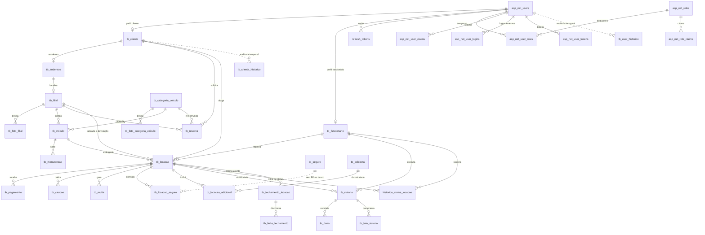
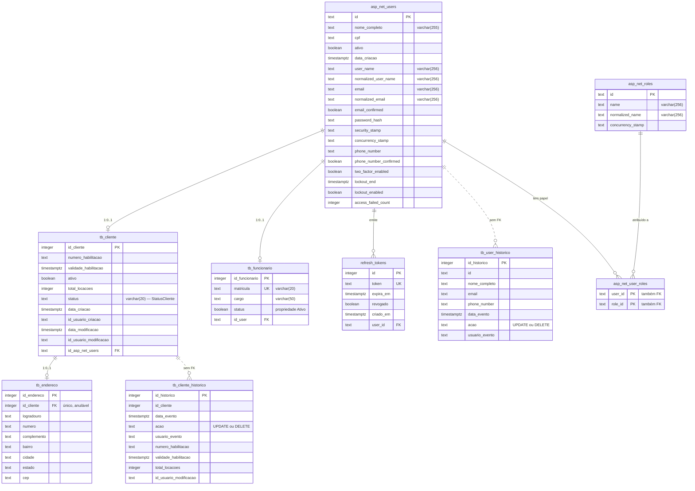
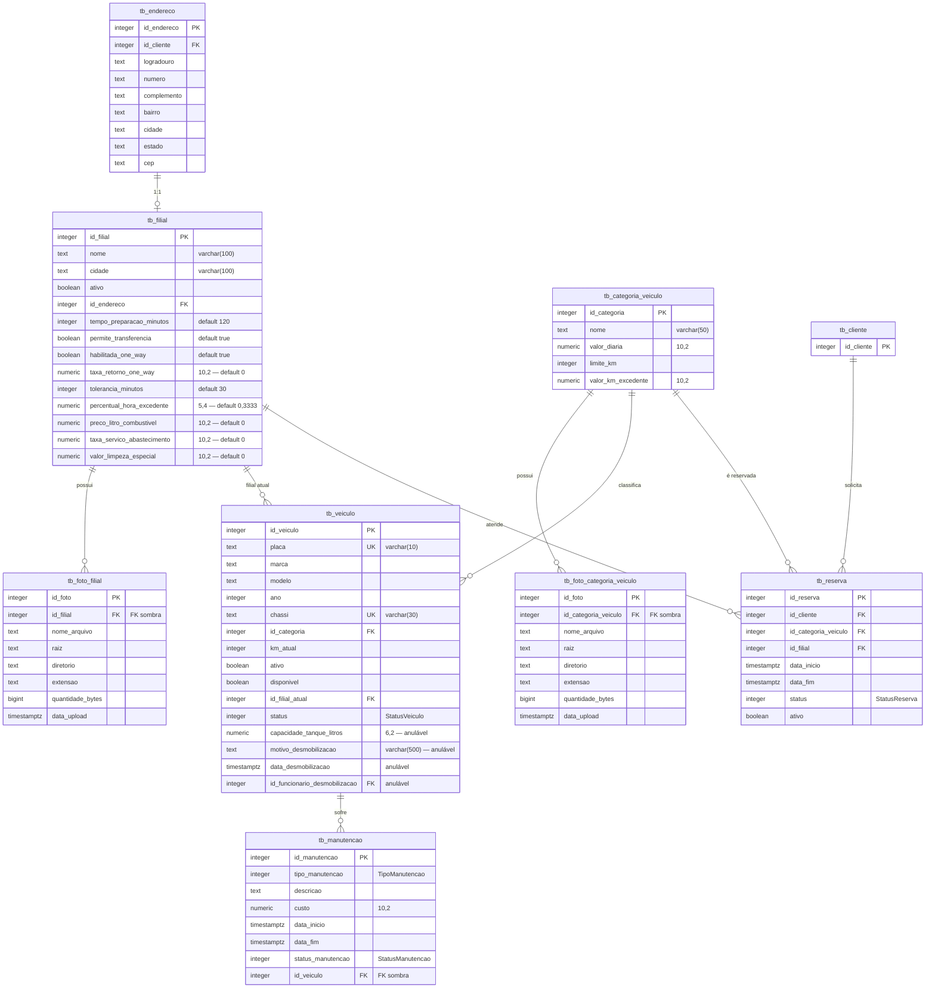

# 03 — Modelo entidade-relacionamento

Banco **PostgreSQL** acessado via Npgsql. O modelo do EF Core é a fonte de verdade: o schema é
gerado pelas migrations em `Infra/Data/Migrations/` e o arquivo `db_postgres.sql` na raiz é a
saída de `dotnet ef migrations script --idempotent`. Tabelas e colunas seguem **snake_case**.

> O `db.sql` na raiz é o schema MySQL antigo, mantido apenas como referência histórica. Ele
> **não** corresponde ao modelo atual.

---

## 1. Visão geral — todas as tabelas

Relações tracejadas (`..`) não têm chave estrangeira no banco: as tabelas de histórico são
preenchidas por reflexão no `SaveChangesAsync` e `tb_locacao_seguro.id_seguro` não foi mapeado
com `HasOne<Seguro>`.

---

## 2. Identidade e pessoas

`asp_net_user_claims`, `asp_net_user_logins`, `asp_net_user_tokens` e `asp_net_role_claims`
são tabelas padrão do ASP.NET Core Identity, renomeadas para snake_case no `OnModelCreating`.

---

## 3. Frota, filiais e reservas

A reserva é feita por **categoria**, não por veículo específico — a escolha da placa acontece
só na abertura da locação.

---

## 4. Locação e financeiro

```mermaid
erDiagram
    tb_locacao {
        integer id_locacao PK
        integer id_cliente FK
        integer id_veiculo FK
        integer id_funcionario FK
        integer id_filial_retirada FK
        integer id_filial_devolucao FK "anulável"
        timestamptz data_inicio
        timestamptz data_fim_prevista
        timestamptz data_fim_real
        integer km_inicial
        integer km_final
        numeric valor_previsto "10,2"
        numeric valor_final "10,2"
        numeric valor_diaria_contratada "10,2 — congelada na abertura (RN-06)"
        text status "varchar(20) — StatusLocacao"
    }

    tb_pagamento {
        integer id_pagamento PK
        numeric valor "10,2"
        timestamptz data_pagamento
        text status "StatusPagamento"
        integer id_forma_pagamento "FormaPagamento"
        integer id_locacao FK
    }

    tb_caucao {
        integer id_caucao PK
        numeric valor "10,2"
        text status "varchar(20) — StatusCaucao"
        integer id_locacao FK "FK sombra"
    }

    tb_multa {
        integer id_multa PK
        text tipo "varchar(20) — TipoMulta"
        numeric valor "10,2"
        text status "varchar(20) — StatusMulta"
        integer id_locacao FK "FK sombra"
    }

    tb_seguro {
        integer id_seguro PK
        text nome "varchar(45)"
        text descricao "varchar(100)"
        numeric valor_diaria "10,2"
        numeric franquia
        text cobertura "varchar(200)"
        boolean ativo
    }

    tb_locacao_seguro {
        integer id_locacao_seguro PK
        integer id_locacao FK
        integer id_seguro "sem FK"
        boolean ativo
        numeric valor_diaria_contratada "10,2 — congelada na contratação (RN-18)"
        numeric franquia_contratada "10,2 — congelada na contratação (RN-25)"
        timestamptz data_contratacao "desde quando cobre (RN-19)"
        timestamptz data_cancelamento "anulável — até quando cobriu (RN-19)"
    }

    tb_fechamento_locacao {
        integer id_fechamento PK
        integer id_locacao FK "UK — um por contrato (RN-32)"
        timestamptz data_apuracao
        integer id_funcionario_apuracao FK
        timestamptz data_selagem "nulo enquanto a apuração corre"
        numeric total_debitos "10,2"
        numeric total_creditos "10,2"
        numeric saldo "10,2 — assinado; negativo é crédito a devolver (RN-29)"
    }

    tb_linha_fechamento {
        integer id_linha_fechamento PK
        integer id_fechamento FK
        integer tipo "TipoLinhaFechamento"
        text base_calculo "varchar(300) — como se chegou ao número (RN-31)"
        numeric quantidade "12,4 — fracionária para pró-rata (RN-19)"
        numeric valor_unitario "10,2"
        numeric total "10,2 — arredondado por linha, AwayFromZero (RN-33)"
        timestamptz data_lancamento
        boolean eh_correcao "default false"
        integer id_funcionario_lancamento FK "anulável; obrigatório em correção e isenção"
        text motivo "varchar(500) — anulável, pela mesma regra"
    }

    tb_adicional {
        integer id_adicional PK
        text nome "varchar(50)"
        numeric valor_diaria "10,2"
        boolean ativo
    }

    tb_locacao_adicional {
        integer id_locacao_adicional PK
        integer id_adicional FK
        integer id_locacao FK
        numeric valor_diaria "ValorDiariaContratada"
        numeric valor_total
        integer quantidade
        integer dias
    }

    tb_vistoria {
        integer id_vistoria PK
        integer id_locacao FK
        integer id_funcionario FK
        integer tipo "TipoVistoria"
        integer nivel_combustivel "NivelCombustivel"
        text observacoes
        timestamptz data_vistoria
        integer km_veiculo
    }

    tb_dano {
        integer id_dano PK
        integer id_vistoria FK
        text descricao "varchar(200)"
        integer tipo_dano "TipoDano"
        numeric valor_estimado "10,2"
        integer tipo_status "StatusDano"
        timestamptz data_registro
    }

    tb_foto_vistoria {
        integer id_foto PK
        integer id_vistoria FK "FK sombra"
        text nome_arquivo
        text raiz
        text diretorio
        text extensao
        bigint quantidade_bytes
        timestamptz data_upload
    }

    historico_status_locacao {
        integer id PK
        integer id_locacao "coluna solta, sem FK"
        integer locacao_id_locacao FK "FK gerada por convenção"
        text status "varchar(20)"
        timestamptz data_status
        integer id_funcionario FK
    }

    tb_cliente {
        integer id_cliente PK
    }

    tb_veiculo {
        integer id_veiculo PK
    }

    tb_funcionario {
        integer id_funcionario PK
    }

    tb_filial {
        integer id_filial PK
    }

    tb_cliente     ||--o{ tb_locacao : "aluga"
    tb_veiculo     ||--o{ tb_locacao : "é alugado"
    tb_funcionario ||--o{ tb_locacao : "registra"
    tb_filial      ||--o{ tb_locacao : "retirada e devolução"

    tb_locacao ||--o{ tb_pagamento : "recebe"
    tb_locacao ||--o{ tb_caucao : "retém"
    tb_locacao ||--o{ tb_multa : "gera"
    tb_locacao ||--o{ tb_locacao_seguro : "contrata"
    tb_locacao ||--o{ tb_locacao_adicional : "inclui"
    tb_locacao ||--o{ tb_vistoria : "é vistoriada"
    tb_locacao ||--o{ historico_status_locacao : "trilha"

    tb_seguro    ||..o{ tb_locacao_seguro : "sem FK"
    tb_adicional ||--o{ tb_locacao_adicional : "é contratado"

    tb_vistoria    ||--o{ tb_dano : "constata"
    tb_vistoria    ||--o{ tb_foto_vistoria : "documenta"
    tb_funcionario ||--o{ tb_vistoria : "executa"
    tb_funcionario ||--o{ historico_status_locacao : "registra"
```

---

## 5. Dicionário de tabelas

| Tabela | Entidade | Papel | `ON DELETE` das FKs |
|---|---|---|---|
| `asp_net_users` | `User` | Identidade: login, CPF, nome, telefone | — |
| `asp_net_roles`, `asp_net_user_roles`, `asp_net_user_claims`, `asp_net_user_logins`, `asp_net_user_tokens`, `asp_net_role_claims` | Identity | Papéis e claims do ASP.NET Core Identity | `CASCADE` |
| `refresh_tokens` | `RefreshToken` | Tokens de renovação emitidos pela API | `CASCADE` |
| `tb_user_historico` | `UserHistorico` | Histórico temporal de `User` | sem FK |
| `tb_cliente` | `Clientes` | Perfil de cliente sobre um `User` (CNH, status, auditoria) | `CASCADE` |
| `tb_cliente_historico` | `ClienteHistorico` | Histórico temporal de `Clientes` | sem FK |
| `tb_funcionario` | `Funcionario` | Perfil de funcionário sobre um `User` (matrícula, cargo) | `CASCADE` |
| `tb_endereco` | `Endereco` | Endereço de cliente **ou** de filial | `CASCADE` |
| `tb_filial` | `Filial` | Unidade física da locadora | `CASCADE` |
| `tb_foto_filial` | `FotoFilial` | Fotos da filial | `CASCADE` |
| `tb_categoria_veiculo` | `CategoriaVeiculo` | Categoria tarifária (diária, limite de km, km excedente) | — |
| `tb_foto_categoria_veiculo` | `FotoCategoriaVeiculo` | Fotos da categoria | `CASCADE` |
| `tb_veiculo` | `Veiculo` | Veículo da frota | `RESTRICT` |
| `tb_manutencao` | `Manutencao` | Manutenções do veículo | `CASCADE` |
| `tb_reserva` | `Reserva` | Reserva de categoria em uma filial e período | `RESTRICT` (cliente/categoria), `CASCADE` (filial) |
| `tb_locacao` | `Locacao` | Contrato de locação — raiz do agregado | `RESTRICT` em todas |
| `tb_pagamento` | `Pagamento` | Pagamentos da locação | `RESTRICT` |
| `tb_caucao` | `Caucao` | Cauções retidas | `CASCADE` |
| `tb_multa` | `Multa` | Multas geradas após devolução | `CASCADE` |
| `tb_seguro` | `Seguro` | Catálogo de seguros | — |
| `tb_locacao_seguro` | `LocacaoSeguro` | Seguro contratado em uma locação | `CASCADE` (locação) |
| `tb_adicional` | `Adicional` | Catálogo de itens adicionais | — |
| `tb_locacao_adicional` | `LocacaoAdicional` | Adicional contratado, com quantidade e dias | `CASCADE` |
| `tb_vistoria` | `Vistoria` | Vistoria de retirada, devolução ou avaria | `CASCADE` |
| `tb_foto_vistoria` | `FotoVistoria` | Fotos da vistoria | `CASCADE` |
| `tb_dano` | `Dano` | Dano constatado em vistoria de devolução | `CASCADE` |
| `historico_status_locacao` | `HistoricoStatusLocacao` | Trilha de mudanças de status da locação | `CASCADE` |

### Índices únicos

| Tabela | Coluna(s) |
|---|---|
| `tb_veiculo` | `placa`, `chassi` (dois índices separados) |
| `tb_funcionario` | `matricula` |
| `tb_endereco` | `id_cliente` |
| `refresh_tokens` | `token` |

---

## 6. Como os enums são persistidos

Não há padrão único: parte dos enums é gravada como texto e parte como inteiro.

| Enum | Coluna | Tipo no banco |
|---|---|---|
| `StatusCliente` | `tb_cliente.status` | `varchar(20)` — texto |
| `StatusLocacao` | `tb_locacao.status` | `varchar(20)` — texto |
| `StatusCaucao` | `tb_caucao.status` | `varchar(20)` — texto |
| `TipoMulta` / `StatusMulta` | `tb_multa.tipo` / `.status` | `varchar(20)` — texto |
| `StatusPagamento` | `tb_pagamento.status` | `text` |
| `FormaPagamento` | `tb_pagamento.id_forma_pagamento` | `integer` |
| `StatusVeiculo` | `tb_veiculo.status` | `integer` |
| `StatusReserva` | `tb_reserva.status` | `integer` |
| `TipoVistoria` / `NivelCombustivel` | `tb_vistoria.tipo` / `.nivel_combustivel` | `integer` |
| `TipoDano` / `StatusDano` | `tb_dano.tipo_dano` / `.tipo_status` | `integer` |
| `TipoManutencao` / `StatusManutencao` | `tb_manutencao.tipo_manutencao` / `.status_manutencao` | `integer` |

---

## Observações

- **`tb_locacao_seguro.id_seguro`** não tem chave estrangeira: `LocacaoSeguroConfig` mapeia
  apenas o relacionamento com `Locacao`. A integridade referencial com `tb_seguro` fica por
  conta da aplicação.
- **`historico_status_locacao`** tem duas colunas para a mesma coisa: `id_locacao` (declarada
  na entidade, sem FK, porque o mapeamento explícito está comentado em
  `HistoricoStatusLocacaoConfig`) e `locacao_id_locacao` (`NOT NULL`, criada por convenção do EF
  a partir da navegação `Locacao`, essa sim com FK).
- **`tb_endereco`** serve a dois donos: `id_cliente` aponta para o cliente (anulável e único) e
  `tb_filial.id_endereco` aponta de volta para o endereço. Um endereço de filial fica com
  `id_cliente` nulo.
- **FKs sombra**: `tb_caucao.id_locacao`, `tb_multa.id_locacao`, `tb_manutencao.id_veiculo`,
  `tb_foto_filial.id_filial`, `tb_foto_categoria_veiculo.id_categoria_veiculo` e
  `tb_foto_vistoria.id_vistoria` existem só no banco — não há propriedade correspondente na
  classe. Todas são anuláveis, embora conceitualmente sejam obrigatórias.
- **`tb_funcionario.status`** é `boolean` e mapeia a propriedade `Ativo` — o nome da coluna
  sugere um enum de status, mas é uma flag.
- **`tb_seguro.franquia`** é `numeric` sem precisão definida, diferente dos demais valores
  monetários, que são `numeric(10,2)`.
- Buscas por texto precisam de `.ToLower()` dos dois lados: no PostgreSQL o `LIKE` distingue
  maiúsculas e acentos, ao contrário do `utf8mb4_unicode_ci` do MySQL antigo. Acento continua
  diferenciando mesmo com `ToLower()` — resolver exigiria a extensão `unaccent`.
