# 04 — Casos de uso

Os casos de uso abaixo foram extraídos dos endpoints existentes em `Api/Controllers/V1/Controllers/`
e das telas em `Front/Components/Pages/`. Representam o que o sistema **faz hoje**, não um
escopo desejado.

> A autenticação e os `[Authorize]` dos controllers estão comentados no momento, então na
> prática qualquer chamador alcança qualquer endpoint. Os atores abaixo descrevem a intenção
> do desenho — os papéis já existem no Identity (`asp_net_roles`) e serão exigidos quando a
> autorização for reativada.

## Atores

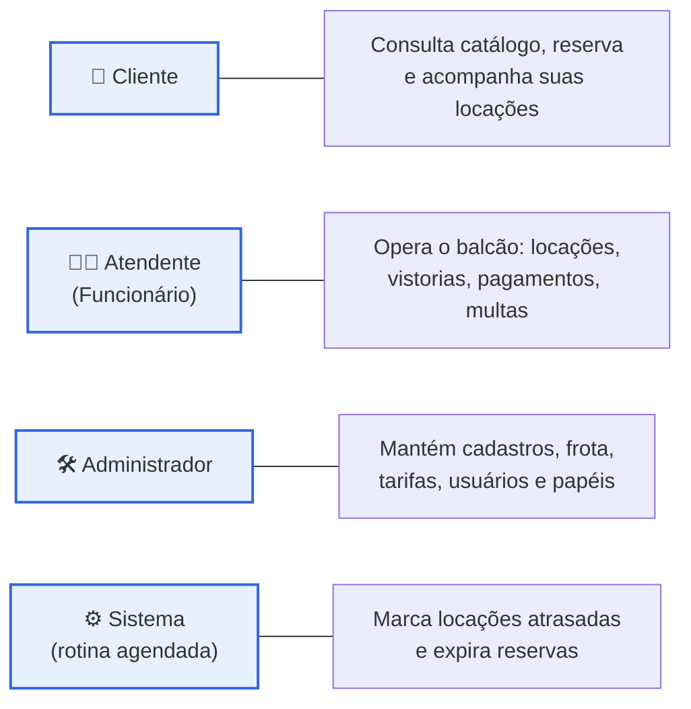

`Atendente` e `Administrador` são ambos `Funcionario` no modelo — a distinção é por papel
(`role`), não por entidade.

---

## 1. Visão geral

```mermaid
flowchart LR
    Cliente(["👤 Cliente"])
    Atendente(["🧑‍💼 Atendente"])
    Admin(["🛠️ Administrador"])
    Sistema(["⚙️ Sistema"])

    subgraph Sis["Sistema Locadora_Auto"]
        direction TB
        subgraph M1["Identidade e acesso"]
            UC01("Autenticar")
            UC02("Renovar token")
            UC03("Gerenciar usuários")
            UC04("Gerenciar papéis")
        end
        subgraph M2["Cadastros"]
            UC10("Gerenciar clientes")
            UC11("Gerenciar funcionários")
            UC12("Gerenciar filiais")
            UC13("Gerenciar categorias")
            UC14("Gerenciar seguros")
            UC15("Gerenciar adicionais")
        end
        subgraph M3["Frota"]
            UC20("Gerenciar veículos")
            UC21("Consultar disponibilidade")
            UC22("Controlar manutenção")
        end
        subgraph M4["Operação"]
            UC30("Reservar veículo")
            UC31("Abrir locação")
            UC32("Finalizar locação")
            UC33("Cancelar locação")
            UC34("Registrar vistoria")
            UC35("Registrar dano")
        end
        subgraph M5["Financeiro"]
            UC40("Registrar pagamento")
            UC41("Controlar caução")
            UC42("Aplicar multa")
            UC43("Contratar seguro")
            UC44("Incluir adicional")
        end
        subgraph M6["Rotinas"]
            UC50("Marcar locação atrasada")
            UC51("Expirar reserva")
        end
    end

    Cliente --> UC01
    Cliente --> UC21
    Cliente --> UC30

    Atendente --> UC01
    Atendente --> UC30
    Atendente --> UC31
    Atendente --> UC32
    Atendente --> UC33
    Atendente --> UC34
    Atendente --> UC35
    Atendente --> UC40
    Atendente --> UC41
    Atendente --> UC42
    Atendente --> UC43
    Atendente --> UC44
    Atendente --> UC21
    Atendente --> UC22

    Admin --> UC03
    Admin --> UC04
    Admin --> UC10
    Admin --> UC11
    Admin --> UC12
    Admin --> UC13
    Admin --> UC14
    Admin --> UC15
    Admin --> UC20
    Admin --> UC22

    Sistema --> UC50
    Sistema --> UC51
```

---

## 2. Identidade e acesso

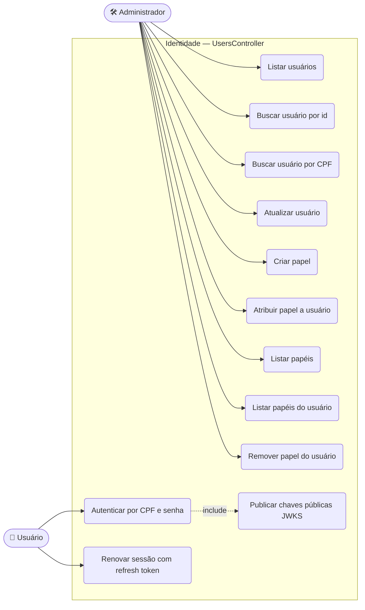

---

## 3. Cadastros

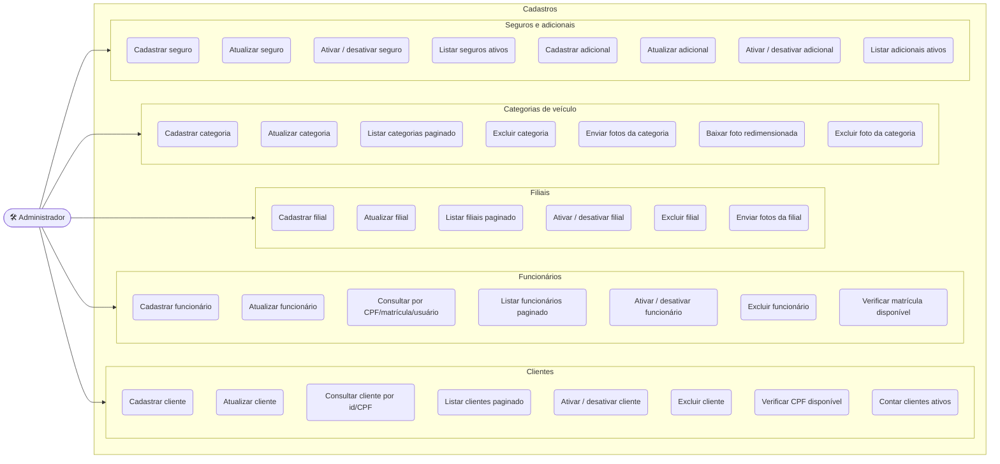

Cadastrar cliente e cadastrar funcionário **criam também o `User`** correspondente — o CPF, o
nome, o telefone e o e-mail ficam em `asp_net_users`, e o perfil (CNH ou matrícula) na tabela
específica.

---

## 4. Frota

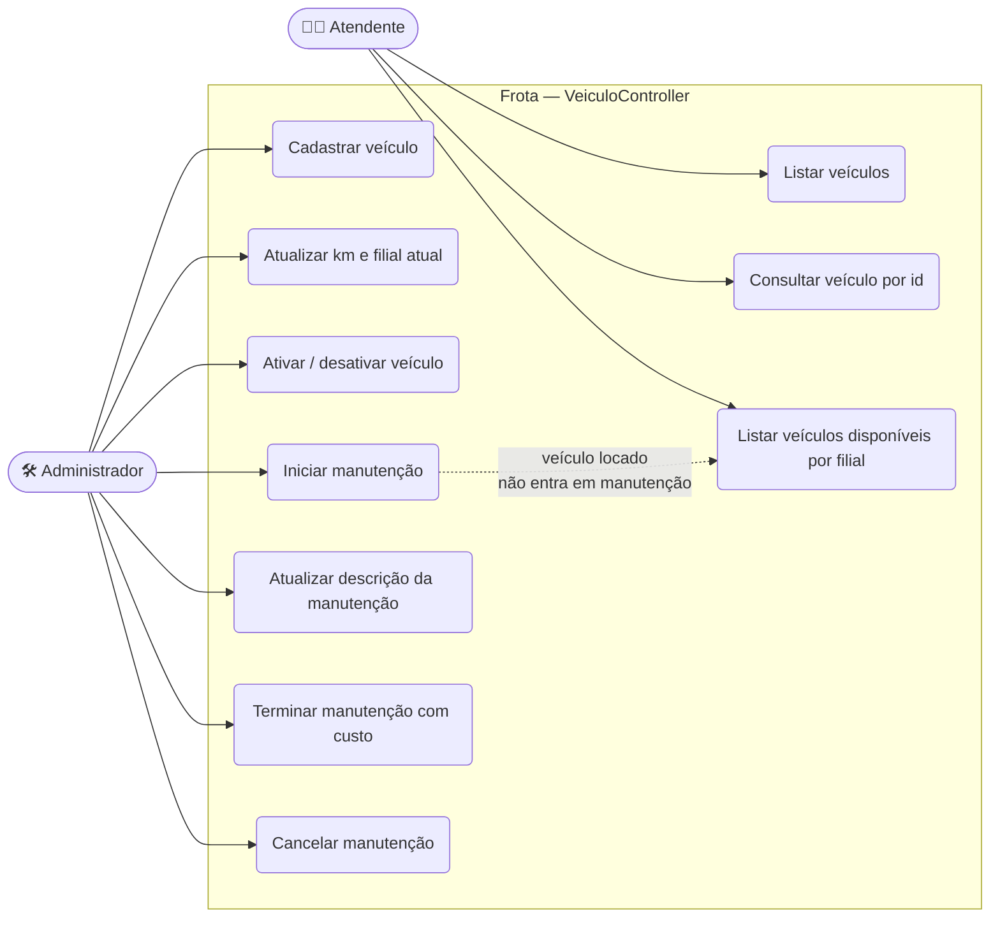

---

## 5. Operação — reserva, locação e vistoria

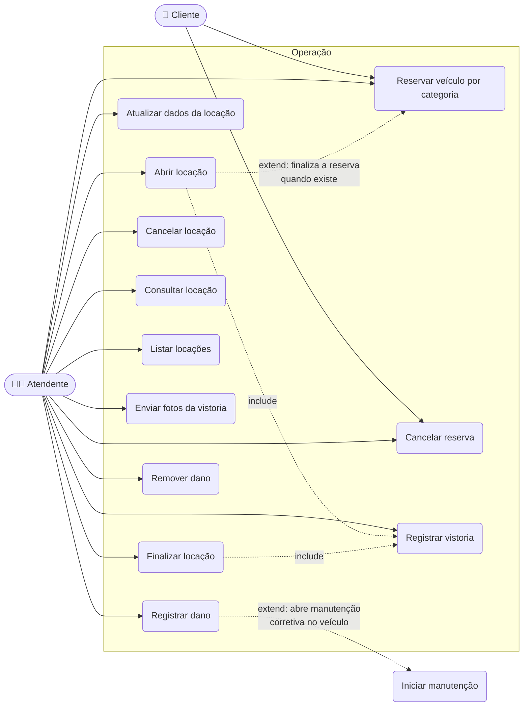

### Regras verificadas na abertura da locação

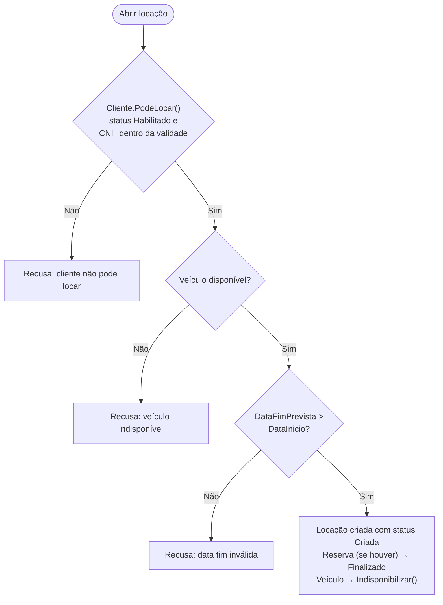

### Regras verificadas na finalização

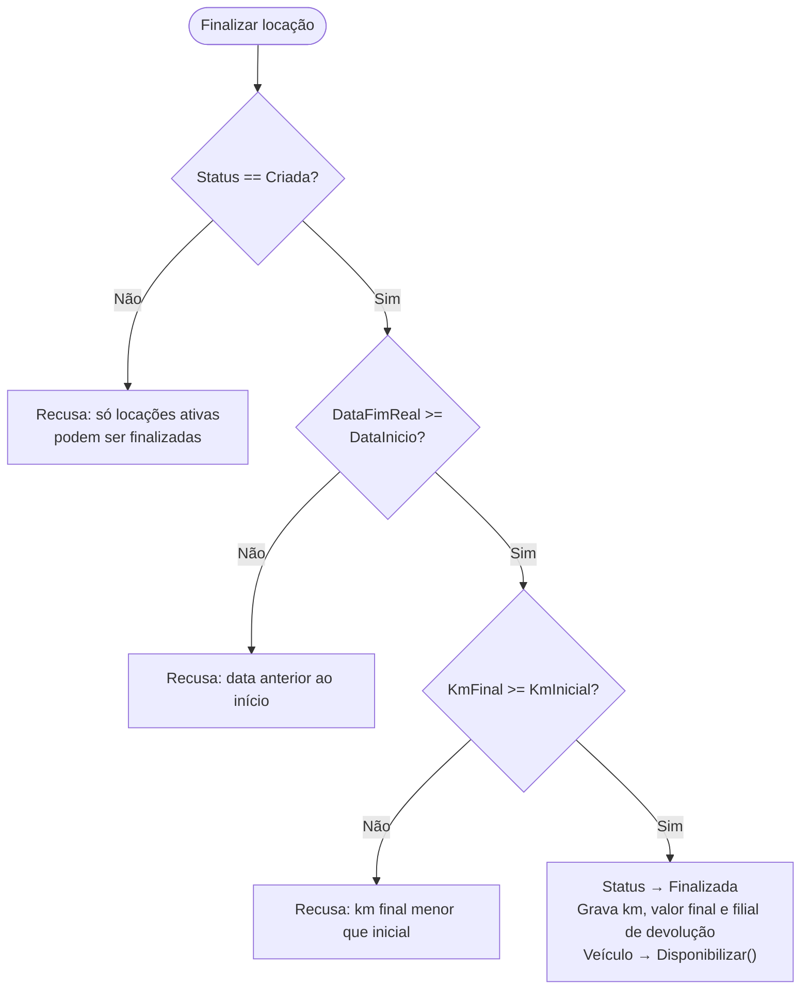

---

## 6. Financeiro

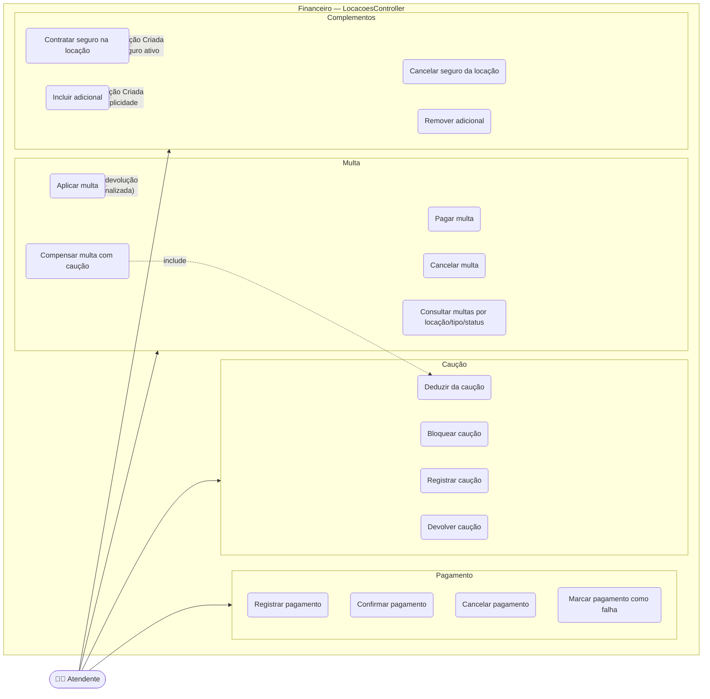

---

## 7. Rotinas automáticas

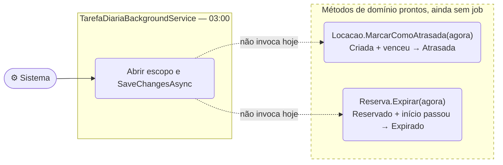

---

## 8. Rastreabilidade — caso de uso → endpoint → serviço

### Identidade

| Caso de uso | Endpoint | Serviço |
|---|---|---|
| Autenticar | `POST api/v1/Users/autenticar` | `IUserService`, `ITokenService` |
| Renovar token | `POST api/v1/Users/renovar` | `ITokenService`, `ITokenRepository` |
| Listar usuários | `GET api/v1/Users` | `IUserService` |
| Buscar usuário por id / CPF | `GET api/v1/Users/{id:guid}` · `GET api/v1/Users/cpf/{cpf}` | `IUserService` |
| Atualizar usuário | `PUT api/v1/Users/{id:guid}` | `IUserService` |
| Criar papel | `POST api/v1/Users/roles` | `IRoleService` |
| Atribuir / remover papel | `POST api/v1/Users/{userId:guid}/roles/{role}` · `DELETE` idem | `IRoleService` |
| Listar papéis / papéis do usuário | `GET api/v1/Users/roles` · `GET api/v1/Users/{userId:guid}/roles` | `IRoleService` |
| Publicar JWKS | `GET /.well-known/jwks.json` | `RsaKeyService` |

### Clientes e reservas

| Caso de uso | Endpoint | Serviço |
|---|---|---|
| Listar clientes | `GET api/v1/Clientes` | `IClienteService.ObterTodosAsync` |
| Listar paginado | `GET api/v1/Clientes/obter-clientes-paginado` | `IClienteService.ObterPaginadoAsync` |
| Consultar por id / CPF | `GET api/v1/Clientes/{id:int}` · `GET api/v1/Clientes/cpf/{cpf}` | `IClienteService` |
| Cadastrar cliente | `POST api/v1/Clientes` | `IClienteService.CriarClienteAsync` |
| Atualizar cliente | `PUT api/v1/Clientes/{id:int}` | `IClienteService.AtualizarClienteAsync` |
| Excluir cliente | `DELETE api/v1/Clientes/{id:int}` | `IClienteService.ExcluirClienteAsync` |
| Ativar / desativar | `PATCH api/v1/Clientes/{id:int}/ativar` · `/desativar` | `IClienteService` |
| Verificar CPF | `GET api/v1/Clientes/verificar-cpf/{cpf}` | `IClienteService.ExisteClienteAsync` |
| Contar ativos | `GET api/v1/Clientes/contar-ativos` | `IClienteService.ContarClientesAtivosAsync` |
| Reservar veículo | `POST api/v1/Clientes/reserva` | `IClienteService.CriarReservaAsync` |
| Cancelar reserva | `PATCH api/v1/Clientes/{id:int}/cancelar-reserva/{idReserva:int}` | `IClienteService.CancelarReservaAsync` |

### Funcionários

| Caso de uso | Endpoint | Serviço |
|---|---|---|
| Cadastrar funcionário | `POST api/v1/Funcionarios` | `IFuncionarioService.CriarFuncionarioAsync` |
| Atualizar funcionário | `PUT api/v1/Funcionarios/{id:int}` | `IFuncionarioService.AtualizarFuncionarioAsync` |
| Consultar funcionário | `GET api/v1/Funcionarios/obter-funcionario` (cpf, matrícula ou usuarioId) | `IFuncionarioService` |
| Listar paginado / todos | `GET api/v1/Funcionarios` · `GET api/v1/Funcionarios/todos` | `IFuncionarioService` |
| Verificar existência | `GET api/v1/Funcionarios/existe` | `IFuncionarioService.ExisteFuncionarioAsync` |
| Matrícula disponível | `GET api/v1/Funcionarios/disponibilidade-matricula` | `IFuncionarioService.VerificarDisponibilidadeMatriculaAsync` |
| Contar ativos | `GET api/v1/Funcionarios/contar-ativos` | `IFuncionarioService.ContarFuncionariosAtivosAsync` |
| Ativar / desativar / excluir | `PATCH .../ativar` · `.../desativar` · `DELETE .../{id:int}` | `IFuncionarioService` |

### Filiais e categorias

| Caso de uso | Endpoint | Serviço |
|---|---|---|
| Listar filiais paginado | `GET api/v1/filiais` | `IFilialService.ObterTodosPaginadoAsync` |
| Consultar filial | `GET api/v1/filiais/{id:int}` | `IFilialService.ObterPorIdAsync` |
| Cadastrar / atualizar filial | `POST api/v1/filiais` · `PUT api/v1/filiais/{id:int}` | `IFilialService` |
| Ativar / desativar / excluir filial | `PATCH .../ativar` · `.../desativar` · `DELETE .../{id:int}` | `IFilialService` |
| Enviar fotos da filial | `POST api/v1/filiais/{id:int}/registrar-foto` | `IFilialService.RegistarFotoFilialAsync` |
| Listar categorias paginado | `GET api/v1/categorias-veiculos` | `ICategoriaVeiculoService.ObterTodosPaginadoAsync` |
| Cadastrar / atualizar categoria | `POST api/v1/categorias-veiculos` · `PUT .../{id:int}` | `ICategoriaVeiculoService` |
| Excluir categoria | `DELETE api/v1/categorias-veiculos/{id:int}` | `ICategoriaVeiculoService.ExcluirAsync` |
| Enviar fotos da categoria | `POST api/v1/categorias-veiculos/{id:int}/registrar-foto` | `ICategoriaVeiculoService.RegistarFotoCategoriaAsync` |
| Baixar foto redimensionada | `GET api/v1/categorias-veiculos/{id:int}/fotos/{idFoto:int}?width=&height=` | `IImageService.RedimensionarAsync` |
| Excluir foto da categoria | `DELETE api/v1/categorias-veiculos/{id:int}/excluir-foto/{idFoto:int}` | `ICategoriaVeiculoService.ExluirFotoCategoriaAsync` |

### Veículos e manutenção

| Caso de uso | Endpoint | Serviço |
|---|---|---|
| Listar / consultar veículo | `GET api/v1/veiculos` · `GET api/v1/veiculos/{id:int}` | `IVeiculoService` |
| Listar disponíveis | `GET api/v1/veiculos/disponiveis` | `IVeiculoService.ObterDisponiveisAsync` |
| Cadastrar / atualizar veículo | `POST api/v1/veiculos` · `PUT api/v1/veiculos/{id:int}` | `IVeiculoService` |
| Ativar / desativar veículo | `PATCH api/v1/veiculos/{id:int}/ativar` · `/desativar` | `IVeiculoService` |
| Iniciar manutenção | `POST api/v1/veiculos/{id:int}/manutencao/iniciar-manutencao` | `IVeiculoService` → `Veiculo.IniciarManutencao` |
| Terminar manutenção | `POST api/v1/veiculos/{id:int}/manutencao/terminar-manutencao` | `Veiculo.TerminaManutencao` |
| Cancelar manutenção | `POST api/v1/veiculos/{id:int}/manutencao/cancelar-manutencao/{idManutencao:int}` | `Veiculo.CancelarManutencao` |
| Atualizar descrição | `POST api/v1/veiculos/{id:int}/manutencao/atualizar-manutencao` | `Veiculo.AtualizarDescricaoManutencao` |

### Locação, vistoria e financeiro

| Caso de uso | Endpoint | Método de domínio |
|---|---|---|
| Abrir locação | `POST api/locacoes` | `Locacao.Criar` |
| Atualizar locação | `PUT api/locacoes/{id:int}` | `Locacao.AtualizarDados` |
| Finalizar locação | `POST api/locacoes/{id:int}/finalizar` | `Locacao.Finalizar` |
| Cancelar locação | `POST api/locacoes/{id:int}/cancelar` | `Locacao.Cancelar` |
| Consultar / listar | `GET api/locacoes/{id:int}` · `GET api/locacoes` | — |
| Registrar pagamento | `POST api/locacoes/{id:int}/pagamento` | `Locacao.AdicionarPagamento` |
| Confirmar pagamento | `POST api/locacoes/{id:int}/pagamento/{idPagamento:int}/comfirmar` | `Locacao.ConfirmarPagamento` |
| Cancelar pagamento | `POST api/locacoes/{id:int}/pagamento/{idPagamento:int}/cancelar` | `Locacao.CancelarPagamento` |
| Marcar pagamento como falha | `POST api/locacoes/{id:int}/pagamento/{idPagamento:int}/marcar-falha` | `Locacao.MarcarComoFalha` |
| Registrar caução | `POST api/locacoes/{id:int}/caucao/{valor:decimal}` | `Locacao.RegistrarCaucao` |
| Bloquear caução | `POST api/locacoes/{id:int}/caucao/{idCaucao:int}/bloquear` | `Locacao.BloquearCaucao` |
| Deduzir caução | `POST api/locacoes/{id:int}/caucao/{idCaucao:int}/deduzir` | `Locacao.DeduzirCaucao` |
| Devolver caução | `POST api/locacoes/{id:int}/caucao/{idCaucao:int}/devolver` | `Locacao.DevolverCaucao` |
| Aplicar multa | `POST api/locacoes/{id:int}/multas` | `Locacao.AdicionarMulta` |
| Pagar multa | `POST api/locacoes/{id:int}/multas/{idMulta:int}/pagar` | `Locacao.PagarMulta` |
| Compensar multa com caução | `POST api/locacoes/{id:int}/multas/{idMulta:int}/compensar` | `Locacao.CompensarMultaComCaucao` |
| Cancelar multa | `POST api/locacoes/{id:int}/multas/{idMulta:int}/cancelar` | `Locacao.CancelarMulta` |
| Consultar multas | `GET api/v1/multas/{idLocacao:int}` · `/tipo-multa/{idTipo:int}` · `/status-multa/{idTipo:int}` | `IMultaService` |
| Contratar seguro | `POST api/locacoes/{id:int}/seguros/{idSeguro:int}/adicionar` | `Locacao.AdicionarSeguro` |
| Cancelar seguro | `POST api/locacoes/{id:int}/seguros/{idLocacaoSeguro:int}/cancelar` | `Locacao.CancelarSeguro` |
| Incluir adicional | `POST api/locacoes/{id:int}/adicional` | `Locacao.AdicionarAdicional` |
| Remover adicional | `POST api/locacoes/{id:int}/adicional/{idAdicional}/remover` | `Locacao.RemoverAdicional` |
| Registrar vistoria | `POST api/locacoes/{id:int}/vistoria` | `Locacao.RegistrarVistoria` |
| Enviar fotos da vistoria | `POST api/locacoes/{id:int}/vistoria/enviar-fotos` | `Locacao.RegistrarFoto` |
| Registrar dano | `POST api/locacoes/{id:int}/vistoria/registrar-dano` | `Locacao.RegistrarDanoVistoria` |
| Remover dano | `POST api/locacoes/{id:int}/vistoria/remover-dano` | `Locacao.RemoverDanoVistoria` |

---

## 9. Cobertura no front-end

O Blazor cobre hoje uma parte do que a API expõe:

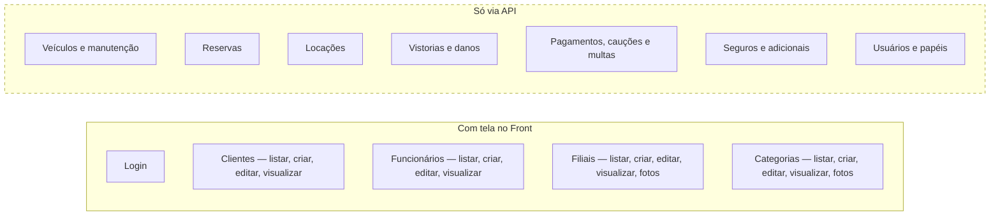

---

## Observações

- **Excluir cliente / funcionário / filial / categoria** existe como endpoint, mas as FKs de
  `tb_locacao` são `ON DELETE RESTRICT` — a exclusão falha se houver locação associada.
- **Aplicar multa** só é permitido com a locação em `Finalizada` (`Locacao.AdicionarMulta`
  recusa qualquer outro status), então não há como multar uma locação em andamento.
- **`Locacao.AdicionarPagamento`** compara o valor contra `ValorFinal`, que só é preenchido na
  finalização. Em uma locação recém-criada `ValorFinal` é `null`, e a comparação
  `valor > ValorFinal` com `null` é sempre falsa — na prática a validação de saldo não atua
  antes da devolução.
- **Consultar multas por status** usa `GET api/v1/multas/status-multa/{idTipo:int}` — o nome do
  parâmetro de rota é `idTipo` nas duas variantes (tipo e status).
- O verbo do endpoint de confirmação de pagamento está grafado `comfirmar`.
