# 05 — Máquinas de estado

Cada diagrama reflete literalmente as transições implementadas nos métodos das entidades em
`Locadora_Auto.Domain/Entidades/`. Estados declarados no enum mas nunca atribuídos aparecem
marcados como **inalcançável**.

---

## 1. Locação — `StatusLocacao`

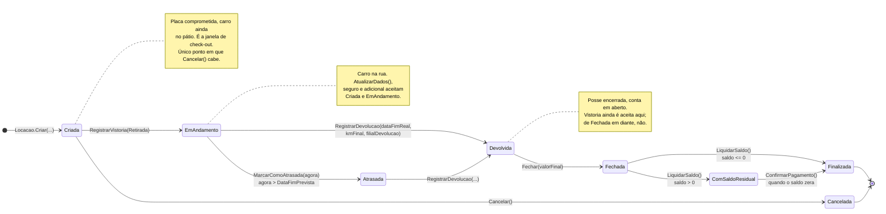

**As duas vidas do contrato.** A física vai de `Criada` a `Devolvida` e responde "onde está o
carro"; a financeira vai de `Fechada` a `Finalizada`/`ComSaldoResidual` e responde "quem deve o
quê". Antes da A1 existia só uma, e receber o carro gravava `Finalizada` — com o contrato já
constando concluído, tudo o que a apuração cobraria (km excedente, combustível, limpeza, avaria,
diária excedente) se perdia sem deixar rastro.

`RegistrarDevolucao` exige o **par de vistorias** (RN-57): sem base comparável entre retirada e
devolução não há cobrança que se sustente numa contestação.

Transições **proibidas**, todas cobertas por teste em `LocacaoTests`:

- `Criada → Devolvida` — devolver carro que nunca foi liberado.
- `EmAndamento → Cancelada` e `Atrasada → Cancelada` — carro que rodou se devolve, não se cancela;
  cancelar apagaria o contrato e o quilômetro rodado junto.
- `Fechada → Devolvida` — reabrir fechamento. Correção é lançamento novo (RN-31).
- `Finalizada → *` e `Cancelada → *`.
- `DevolverCaucao()` antes de `Fechada`.

### Regras

| RN | Regra | Porquê |
|---|---|---|
| **RN-57** | Contrato nasce em `Criada`; só vai a `EmAndamento` com vistoria de retirada registrada | Sem par de vistorias não há cobrança de avaria defensável |
| **RN-58** | A devolução grava `Devolvida`, nunca `Finalizada` | Devolução é vistoria; o contrato morre no fechamento |
| **RN-59** | `Cancelada` é estado próprio e só é alcançável a partir de `Criada` | Carro que rodou se devolve, não se cancela |
| **RN-60** | `Atrasada` aceita devolução e volta ao fluxo normal; o atraso conta por instante, não por data | Era estado sem saída, e hora é dado contratual |
| **RN-61** | Só `Finalizada` e `Cancelada` liberam o período do veículo na constraint de sobreposição | Cancelamento libera período retroativo; contrato cumprido protege o histórico |
| **RN-62** | Toda transição de status de contrato grava `HistoricoStatusLocacao` com autor e instante | **Ainda não implementada** — a entidade existe e ninguém a alimenta |

### Efeitos colaterais no veículo e na reserva

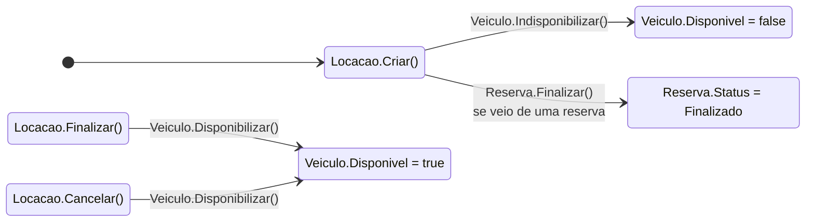

---

## 2. Veículo

O veículo carrega **três indicadores independentes**. Só `Disponivel` e `Status` mudam por
comportamento; `Ativo` é uma flag administrativa.

### 2.1 Flag `Disponivel`

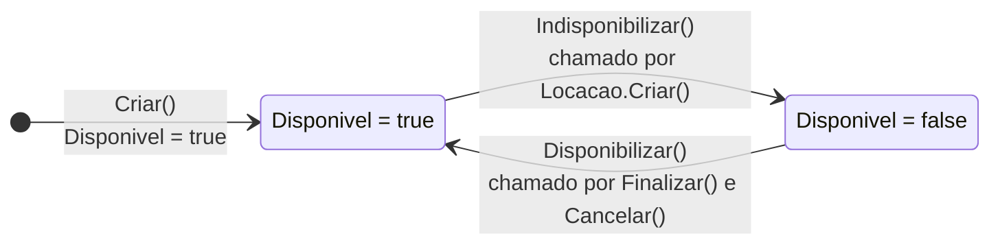

### 2.2 Enum `StatusVeiculo`

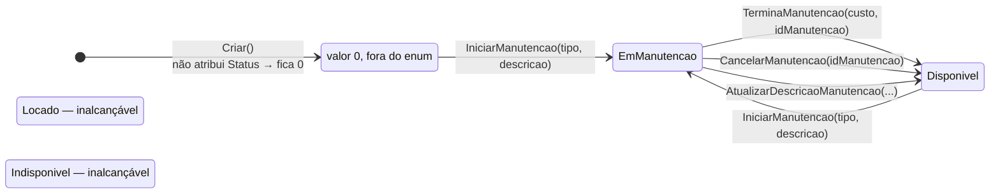

Os quatro métodos de manutenção recusam a operação quando `Status == Locado`, mas nenhum
método atribui `Locado` — a guarda nunca dispara. `AtualizarDescricaoManutencao` também
devolve o veículo para `Disponivel`, mesmo sendo apenas uma edição de texto.

---

## 3. Reserva — `StatusReserva`

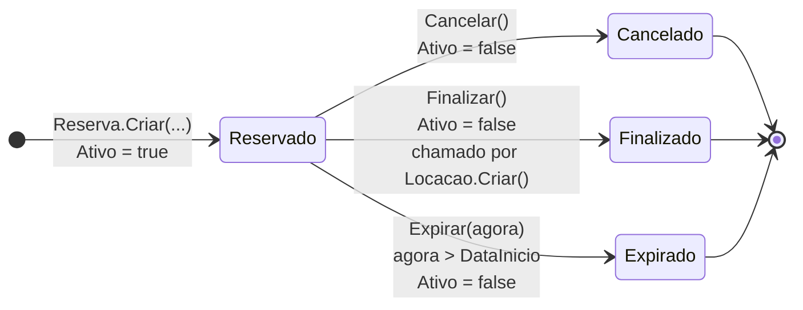

`Criar` valida que `inicio` e `fim` são futuros e que `fim > inicio` — comparando com
`DateTime.Now` (local), enquanto o restante do sistema trabalha em UTC.

---

## 4. Pagamento — `StatusPagamento`

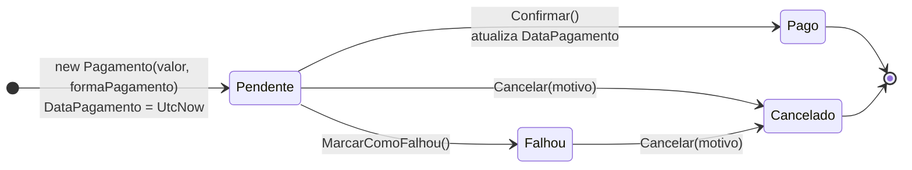

`Cancelar(motivo)` só recusa quando o status é `Pago`; o parâmetro `motivo` é recebido mas não
é armazenado em lugar nenhum.

---

## 5. Caução — `Caucao.StatusCaucao`

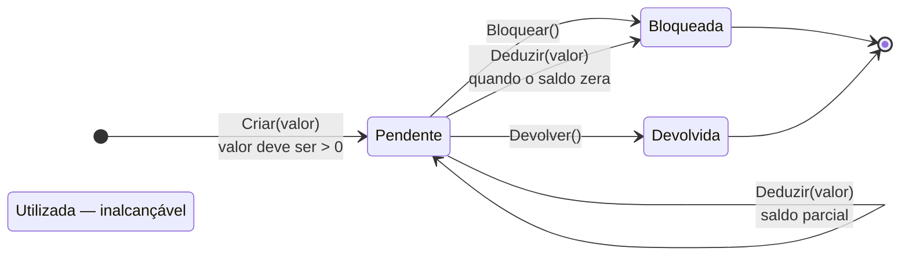

`Deduzir` subtrai de `Valor` e, se o saldo chegar a zero, muda para `Bloqueada` — não para
`Utilizada`, que nunca é atribuída.

---

## 6. Multa — `StatusMulta`

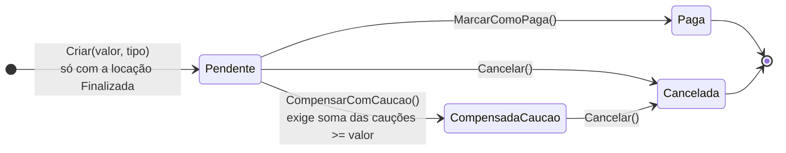

---

## 7. Dano — `StatusDano`

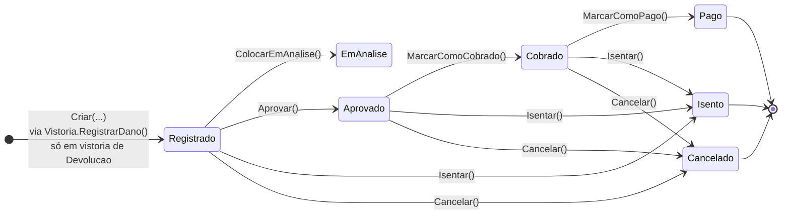

`EmAnalise` e `Cancelado` compartilham o valor `6` no enum. Depois de persistidos são o mesmo
número — e, como `Aprovar()` exige status `Registrado`, um dano colocado em análise não tem
como avançar.

`AtualizarValor(novoValor)` é recusado quando o status é `Pago` ou `Isento`.

---

## 8. Manutenção — `StatusManutencao`

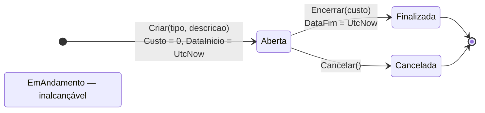

Uma manutenção corretiva é aberta automaticamente pelo domínio quando uma vistoria registra
dano: `Locacao.RegistrarDanoVistoria` chama
`Veiculo.IniciarManutencao(TipoManutencao.Corretiva, "Manutenção gerada automaticamente por dano em vistoria")`.

---

## 9. Cliente — `StatusCliente`

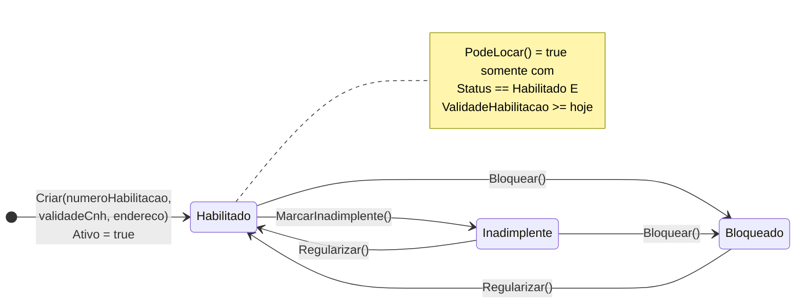

`Atualizar(...)` recoloca o cliente em `Habilitado` e `Ativo = true` independentemente do
estado anterior — editar os dados de um cliente bloqueado o desbloqueia.

`Ativar()` / `Desativar()` mexem apenas na flag `Ativo` e não participam de `PodeLocar()`.

---

## 10. Visão consolidada — a jornada de uma locação

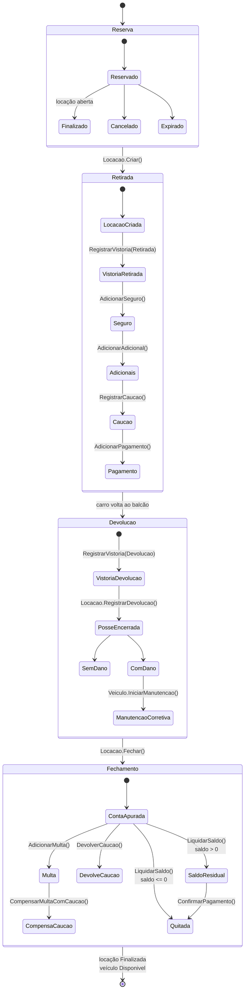

A vistoria de devolução vem **antes** do `RegistrarDevolucao`, e não depois: é ela que traz o
hodômetro e o nível do tanque, e sem ela a devolução é recusada (RN-57). A multa e a caução
moram no fechamento porque é lá que existe conta contra a qual compensar.

---

## Observações

Resumo dos estados sem transição de entrada em todo o código:

| Enum | Membro inalcançável |
|---|---|
| `StatusVeiculo` | `Locado`, `Indisponivel` |
| `StatusCaucao` | `Utilizada` |
| `StatusManutencao` | `EmAndamento` |

`StatusLocacao` saiu da lista: `EmAndamento` passou a ser atribuído pela vistoria de retirada e
`Pendente` foi removido — era a `Reserva` com outro nome, já que `Criar` compromete a placa.

E os pontos em que o comportamento diverge do nome:

- `Veiculo.AtualizarDescricaoManutencao()` também altera o `Status` do veículo.
- `Veiculo.Criar()` deixa `Status` em `0`, valor fora do intervalo do enum (que começa em `1`).
- `StatusDano.EmAnalise` e `StatusDano.Cancelado` valem ambos `6`.
- `Clientes.Atualizar()` reabilita cliente bloqueado ou inadimplente.
