# 05 — Máquinas de estado

Cada diagrama reflete literalmente as transições implementadas nos métodos das entidades em
`Locadora_Auto.Domain/Entidades/`. Estados declarados no enum mas nunca atribuídos aparecem
marcados como **inalcançável**.

---

## 1. Locação — `StatusLocacao`


**As duas vidas do contrato.** A física vai de `Criada` a `Devolvida` e responde "onde está o
carro"; a financeira vai de `Fechada` a `Finalizada`/`ComSaldoResidual` e responde "quem deve o
quê". Antes da A1 existia só uma, e receber o carro gravava `Finalizada` — com o contrato já
constando concluído, tudo o que a apuração cobraria (km excedente, combustível, limpeza, avaria,
diária excedente) se perdia sem deixar rastro.

`RegistrarDevolucao` exige o **par de vistorias** (RN-57): sem base comparável entre retirada e
devolução não há cobrança que se sustente numa contestação.

Transições **proibidas**, todas cobertas por teste em `LocacaoTests`:

- `Criada → Devolvida` — devolver carro que nunca foi liberado.
- `EmAndamento → Cancelada` e `Atrasada → Cancelada` — carro que rodou se devolve, não se cancela;
  cancelar apagaria o contrato e o quilômetro rodado junto.
- `Fechada → Devolvida` — reabrir fechamento. Correção é lançamento novo (RN-31).
- `Finalizada → *` e `Cancelada → *`.
- `DevolverCaucao()` antes de `Fechada`.

### Regras

| RN | Regra | Porquê |
|---|---|---|
| **RN-57** | Contrato nasce em `Criada`; só vai a `EmAndamento` com vistoria de retirada registrada | Sem par de vistorias não há cobrança de avaria defensável |
| **RN-58** | A devolução grava `Devolvida`, nunca `Finalizada` | Devolução é vistoria; o contrato morre no fechamento |
| **RN-59** | `Cancelada` é estado próprio e só é alcançável a partir de `Criada` | Carro que rodou se devolve, não se cancela |
| **RN-60** | `Atrasada` aceita devolução e volta ao fluxo normal; o atraso conta por instante, não por data | Era estado sem saída, e hora é dado contratual |
| **RN-61** | Só `Finalizada` e `Cancelada` liberam o período do veículo na constraint de sobreposição | Cancelamento libera período retroativo; contrato cumprido protege o histórico |
| **RN-62** | Toda transição de status de contrato grava `HistoricoStatusLocacao` com autor e instante | **Ainda não implementada** — a entidade existe e ninguém a alimenta |

### Efeitos colaterais no veículo e na reserva

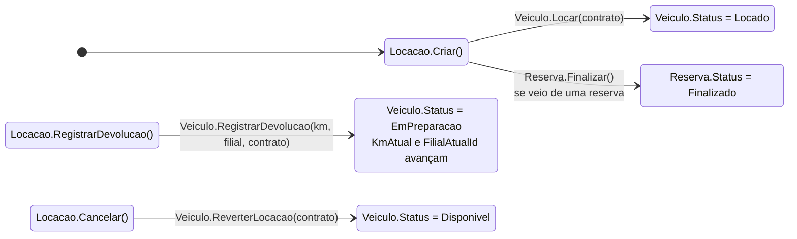

O cancelamento devolve o carro **direto** à oferta, e a devolução não: no cancelamento o contrato
foi anulado antes da retirada e o carro não rodou, então não há o que vistoriar, limpar ou
abastecer (RN-44). Quem tira o carro de `EmPreparacao` é o pátio ou o prazo da filial (RN-45).

---

## 2. Veículo

`Status` é a **fonte única de verdade** do ativo (RN-35). `Disponivel` continua existindo como
coluna — o filtro precisa traduzir para SQL — mas virou **derivado**, e `Ativo` é a flag
administrativa que entra nesse cálculo.

### 2.1 A flag `Disponivel` deixou de ser decidida

```
Disponivel = Ativo && Status == Disponivel
```

Recalculada em **toda** transição, dentro de `AplicarStatus` — que é o único ponto do sistema que
escreve `Status`. Não existem mais `Disponibilizar()` e `Indisponibilizar()`: eram eles que
permitiam um carro na rua ficar com `Status = Disponivel` e `Disponivel = false`, divergência que
nenhum relatório por status enxergava.

### 2.2 Enum `StatusVeiculo`

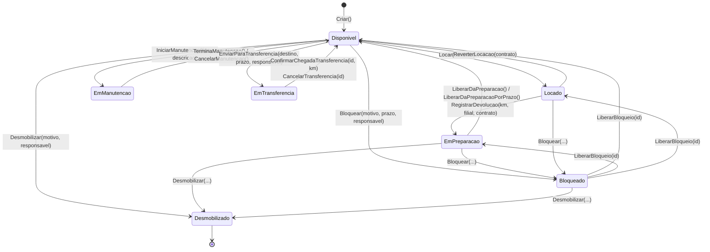

**Toda** transição do diagrama grava um `MovimentoVeiculo` (RN-37) com situação de origem, situação
de destino, documento que a autorizou, autor e data. A origem é parâmetro obrigatório de
`AplicarStatus`, então transição sem documento **não compila**.

### 2.3 Transições proibidas

| Proibida | Porquê |
|---|---|
| `Locado → Disponivel` (pela devolução) | Devolução passa obrigatoriamente por `EmPreparacao` (RN-44): o carro devolvido às 10h não está disponível às 10h. A seta `Locado → Disponivel` do diagrama é só o cancelamento da abertura, em que o carro não rodou |
| `Locado → EmManutencao` | Carro na rua não entra em oficina (RN-50) |
| `EmManutencao → Bloqueado` | Já está fora da oferta com uma OS respondendo por ele; sobrepor o bloqueio apagaria de qual ordem ele depende |
| `Locado`, `EmPreparacao`, `EmManutencao`, `Bloqueado` `→ EmTransferencia` | Só carro disponível pega a estrada: os outros estão com o cliente, sujos, desmontados ou com motivo próprio para estar parados |
| `Locado`, `EmManutencao`, `EmTransferencia` `→ Desmobilizado` | Vender carro com cliente dentro é o pior desfecho possível; em oficina há custo a apurar; em trânsito ele nem chegou a lugar nenhum |
| `Desmobilizado → qualquer` | Terminal (RN-56). A guarda mora no `AplicarStatus`, que é a escrita única, então vale inclusive para `Ativar()` — nenhuma transição nova pode ressuscitar carro vendido por esquecimento de quem a escreveu |
| Qualquer transição pela reserva | Reserva vende categoria, contrato entrega placa (RN-39). Prender placa na reserva trava frota e cria falta artificial |

### 2.4 `Bloqueado` chega por dois caminhos diferentes

A distinção é de negócio e a trilha a preserva no `TipoDocumentoOrigem`:

| Caminho | Origem na trilha | Tem prazo e responsável? | Entra no indicador de bloqueios vencidos? |
|---|---|---|---|
| `Bloquear(...)` — RN-52 | `Bloqueio`, com o `BloqueioVeiculo` como documento | Sim, obrigatórios | Sim |
| `Desativar()` — cadastro | `Cadastro` | Não, e nem faria sentido | Não |

A desativação não é temporária: a saída dela é `Ativar()`, e ela aparece em qualquer filtro por
`Ativo`. Ela não é o carro que "some da oferta e ninguém percebe", que é o defeito que a RN-52
existe para fechar. Por isso `Ativar()` **não** libera bloqueio: sem essa guarda, a reativação
cadastral devolveria à venda um carro que alguém tirou dela com motivo, prazo e responsável
registrados.

Liberar o bloqueio devolve o veículo ao `StatusAnterior` gravado nele, e não à oferta — é por isso
que o diagrama tem três setas saindo de `Bloqueado`. Bloqueio **suspende** a situação do ativo, não
a apaga.

### 2.5 O que a transferência não é

`EmTransferencia` é remanejamento **programado** de frota (RN-49). Devolução one-way não passa por
ele: pela RN-48 o carro fica disponível no destino, porque a taxa de retorno já pagou o
desequilíbrio e prendê-lo cobraria duas vezes pelo mesmo fato. Na devolução one-way o caminho é o
normal — `Locado → EmPreparacao`, com `FilialAtualId` já apontando para o destino (RN-47).

---

## 3. Reserva — `StatusReserva`

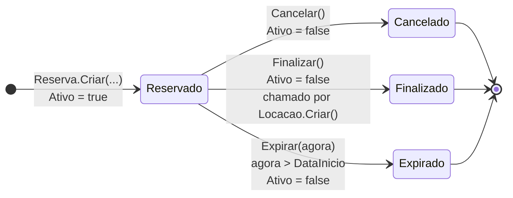

`Criar` valida que `inicio` e `fim` são futuros e que `fim > inicio` — comparando com
`DateTime.Now` (local), enquanto o restante do sistema trabalha em UTC.

---

## 3.1 Fechamento da locação — `FechamentoLocacao`

Não tem enum: o estado é a `DataSelagem`, e a pergunta que ela responde não é só "está selado" e
sim "desde quando" — que é o que a retenção fiscal do doc `07` §11 pergunta.

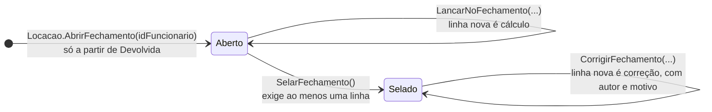

A selagem é a fronteira da RN-31: antes dela a conta é rascunho e linha nova é apuração; depois,
é histórico, e a única forma de mexer é **acrescentar** uma linha marcada como correção. Nenhuma
linha existente muda de valor em momento nenhum — `LinhaFechamento` não tem um único método que a
altere.

`AbrirFechamento` é **idempotente** (RN-32): chamado de novo, devolve a conta que já existe,
selada ou não. A garantia dura é o índice único sobre `id_locacao`.

Transições que não existem de propósito:

- `Selado → Aberto` — reabrir fechamento (doc `07` §6, transição proibida).
- `Aberto → Selado` sem linha nenhuma — a RN-02 garante o mínimo de uma diária em qualquer
  contrato, então conta vazia só pode ser apuração que não rodou.

**Os dois ciclos se juntaram no backlog `A10`.** `SelarFechamento()` leva o contrato a `Fechada` e
grava `Locacao.ValorFinal` com o saldo apurado — que pode ser **negativo** (RN-29), crédito a
devolver. `Locacao.Fechar(valorFinal)` continua existindo para o contrato sem apuração, mas **recusa**
quando há fechamento aberto: senão o `ValorFinal` e o saldo das linhas passariam a discordar sem
ninguém notar. Tirar o parâmetro de vez é o `A11`.

---

## 4. Pagamento — `StatusPagamento`

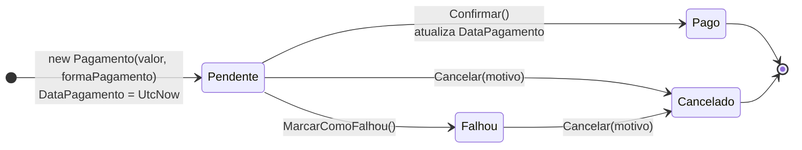

`Cancelar(motivo)` só recusa quando o status é `Pago`; o parâmetro `motivo` é recebido mas não
é armazenado em lugar nenhum.

---

## 5. Caução — `Caucao.StatusCaucao`

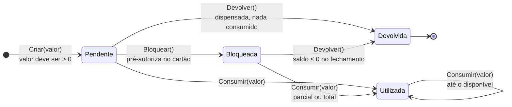

**Reescrita no backlog `A10`.** A máquina anterior estava quebrada de três jeitos: `Devolver()` só
aceitava `Pendente`, então a caução `Bloqueada` — que é o fluxo normal — nunca podia ser devolvida;
`Deduzir` descontava do próprio `Valor` e marcava `Bloqueada`; e `Utilizada` não era atribuída em
lugar nenhum.

Agora `Valor` é **o que o cliente depositou e não muda mais**, `ValorConsumido` registra o que o
fechamento usou, e `ValorDisponivel` é o que volta.

Duas coisas que o diagrama do doc `07` §6 sugeria e a implantação decidiu diferente, seguindo os
critérios de aceite do §10:

- **Consumo parcial já marca `Utilizada`.** O que o status responde é "esta garantia foi usada?", e
  para uma caução parcialmente consumida a resposta é sim. O §10 é explícito: consumidos R$ 940 de
  R$ 1.500, devolvidos R$ 560, e a caução **fica em `Utilizada`**.
- **Não há `Utilizada → Devolvida`.** O estorno do restante é fato financeiro, não mudança de
  estado — quem foi usada não passa a constar como devolvida. `Devolver()` é só para a garantia que
  ninguém tocou.

Quem resolve isso na apuração é `Locacao.ResolverCaucao()`, e **só depois de o fechamento ser
selado** (RN-30): caução é garantia, e liberá-la antes de apurar a conta é abrir mão dela no
momento em que ela serve para alguma coisa.

---

## 6. Multa — `StatusMulta`

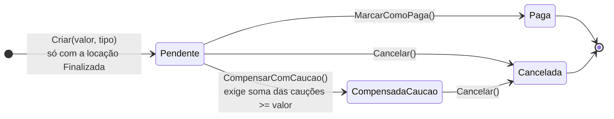

---

## 7. Dano — `StatusDano`

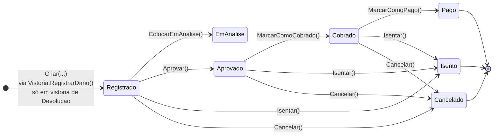

`EmAnalise` e `Cancelado` compartilham o valor `6` no enum. Depois de persistidos são o mesmo
número — e, como `Aprovar()` exige status `Registrado`, um dano colocado em análise não tem
como avançar.

`AtualizarValor(novoValor)` é recusado quando o status é `Pago` ou `Isento`.

---

## 8. Manutenção — `StatusManutencao`

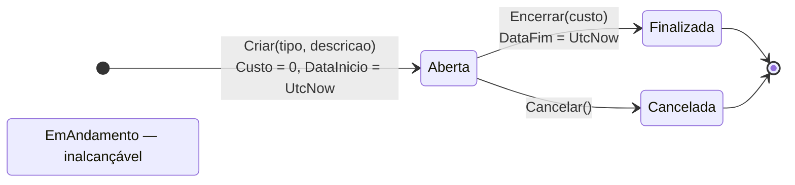

Uma manutenção corretiva é aberta automaticamente pelo domínio quando uma vistoria registra
dano: `Locacao.RegistrarDanoVistoria` chama
`Veiculo.IniciarManutencao(TipoManutencao.Corretiva, "Manutenção gerada automaticamente por dano em vistoria")`.

---

## 9. Cliente — `StatusCliente`

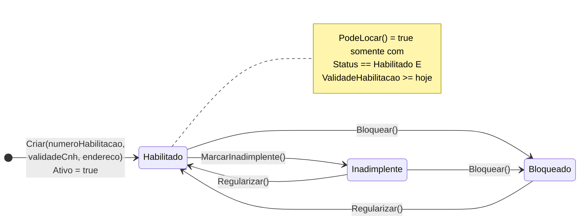

`Atualizar(...)` recoloca o cliente em `Habilitado` e `Ativo = true` independentemente do
estado anterior — editar os dados de um cliente bloqueado o desbloqueia.

`Ativar()` / `Desativar()` mexem apenas na flag `Ativo` e não participam de `PodeLocar()`.

---

## 10. Visão consolidada — a jornada de uma locação

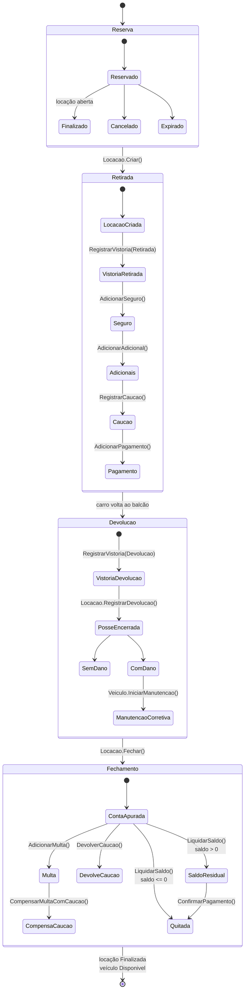

A vistoria de devolução vem **antes** do `RegistrarDevolucao`, e não depois: é ela que traz o
hodômetro e o nível do tanque, e sem ela a devolução é recusada (RN-57). A multa e a caução
moram no fechamento porque é lá que existe conta contra a qual compensar.

---

## Observações

Resumo dos estados sem transição de entrada em todo o código:

| Enum | Membro inalcançável |
|---|---|
| `StatusCaucao` | `Utilizada` |
| `StatusManutencao` | `EmAndamento` |

`StatusVeiculo` saiu da lista inteira: `Locado` é atribuído por `Locar()`, `Bloqueado` (o antigo
`Indisponivel`) por `Bloquear()` e por `Desativar()`, `EmPreparacao` pela devolução,
`EmTransferencia` pelo envio e `Desmobilizado` pela baixa do ativo. `StatusLocacao` também saiu:
`EmAndamento` passou a ser atribuído pela vistoria de retirada e `Pendente` foi removido — era a
`Reserva` com outro nome, já que `Criar` compromete a placa.

E os pontos em que o comportamento diverge do nome:

- `StatusDano.EmAnalise` e `StatusDano.Cancelado` valem ambos `6`.
- `Clientes.Atualizar()` reabilita cliente bloqueado ou inadimplente.
- `Caucao.Devolver()` só aceita `Pendente`, então caução `Bloqueada` — que é o fluxo normal — nunca
  pode ser devolvida. Está no backlog `09` (`A10`).

Dois defeitos que estavam nesta lista foram corrigidos junto com a RN-35: `Veiculo.Criar()` não
deixa mais `Status` em `0` (chama `AplicarStatus(Disponivel, Cadastro)`), e
`AtualizarDescricaoManutencao()` não mexe mais no status — edita só o texto, como o nome promete.
