# 06 — Diagramas de sequência

Fluxos ponta a ponta dos principais casos de uso, com os nomes reais de métodos e classes.

---

## 1. Autenticação

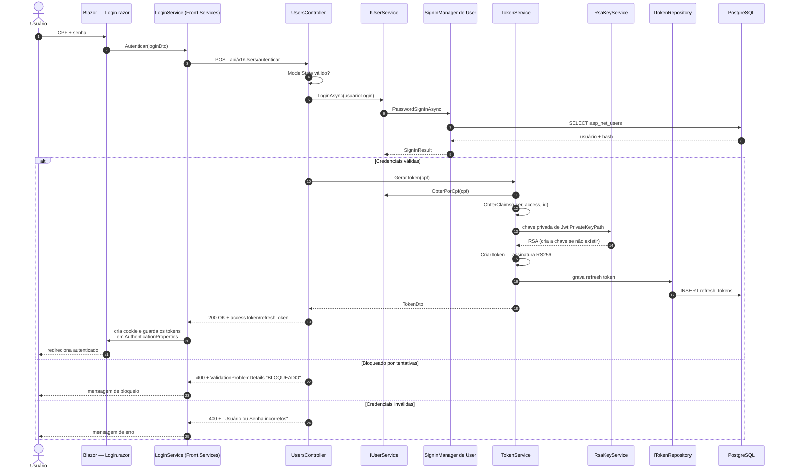

A API valida os próprios tokens com a chave pública publicada em `GET /.well-known/jwks.json`
(`JwksController`).

### 1.1 Renovação de sessão

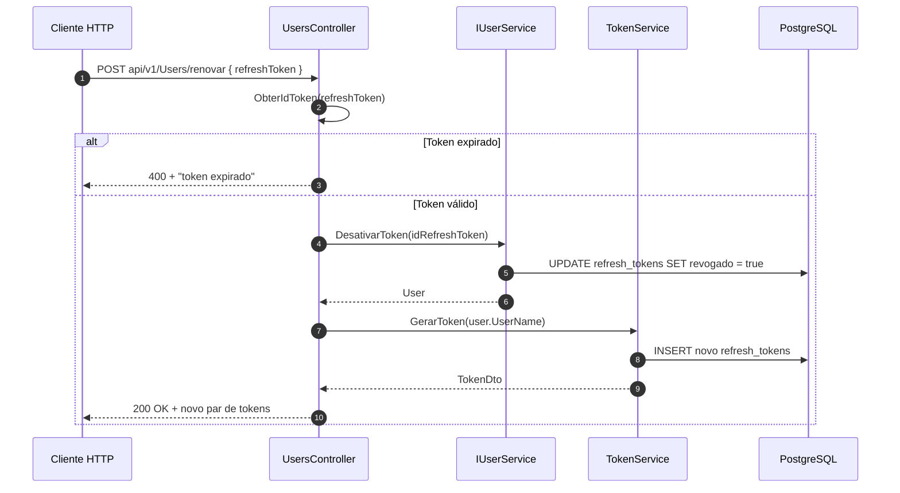

---

## 2. Cadastrar cliente

Cadastrar um cliente cria simultaneamente o `User` (identidade) e o `Clientes` (perfil) — o EF
grava as duas tabelas na mesma operação porque `user.Cliente` já vem preenchido.

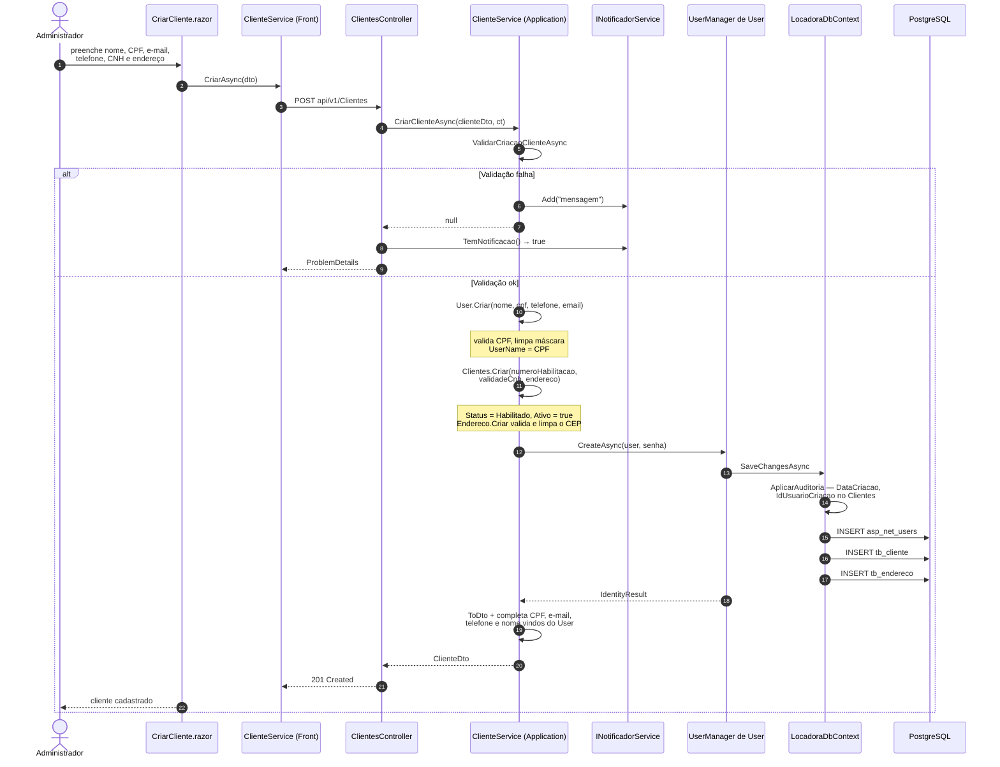

> Se `UserManager.CreateAsync` falhar, o serviço **lança** `InvalidOperationException` em vez
> de notificar — esse caso cai no `ExceptionMiddleware`, não no fluxo de `ProblemDetails` do
> notificador.

---

## 3. Reservar veículo

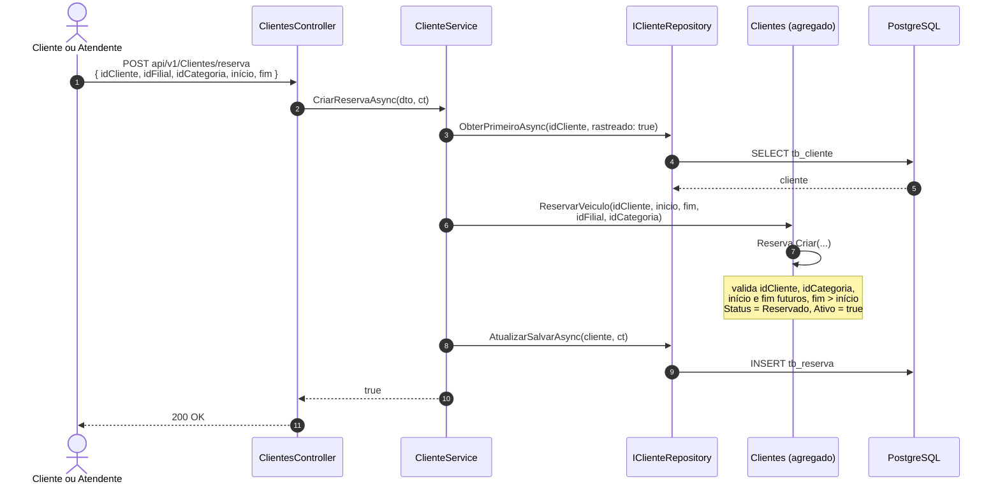

---

## 4. Abrir locação

O caso mais rico do sistema: valida a reserva (quando existe), carrega os quatro agregados
envolvidos e delega as invariantes para `Locacao.Criar`.

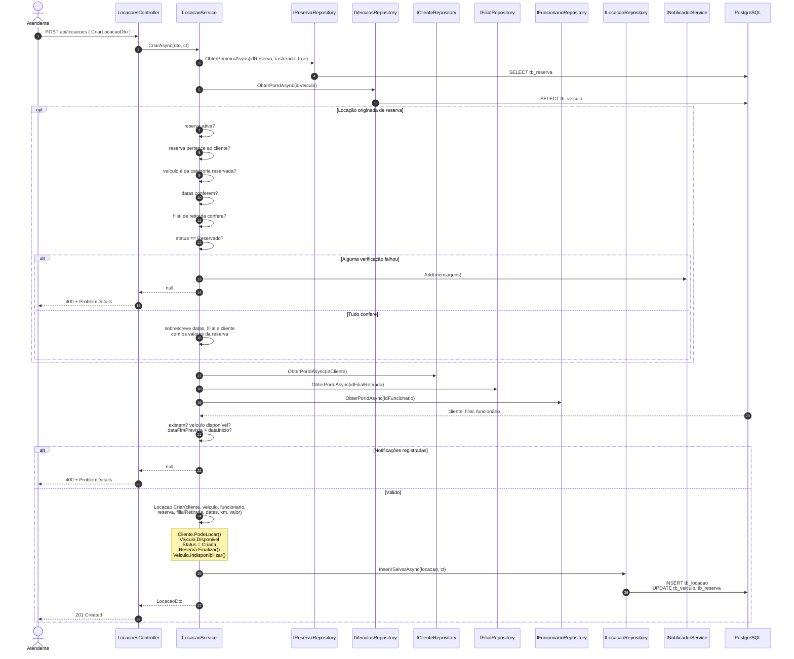

`Locacao.Criar` lança exceção (`ArgumentNullException` / `InvalidOperationException`) quando
uma invariante do domínio é violada — diferente das validações do serviço, que usam o
notificador. As duas formas de sinalizar erro coexistem neste fluxo.

---

## 5. Finalizar locação (devolução)

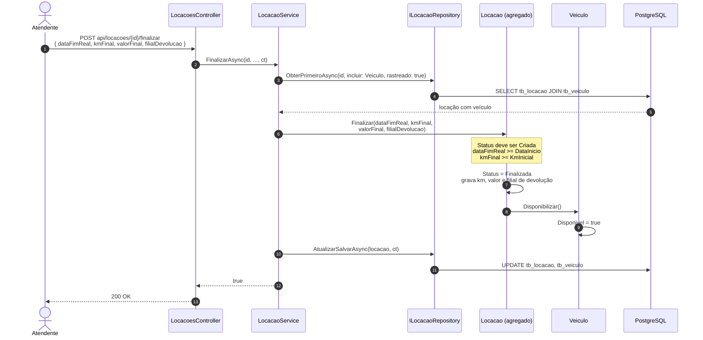

---

## 6. Vistoria de devolução com dano

Registrar um dano na vistoria dispara automaticamente a abertura de uma manutenção corretiva
no veículo.

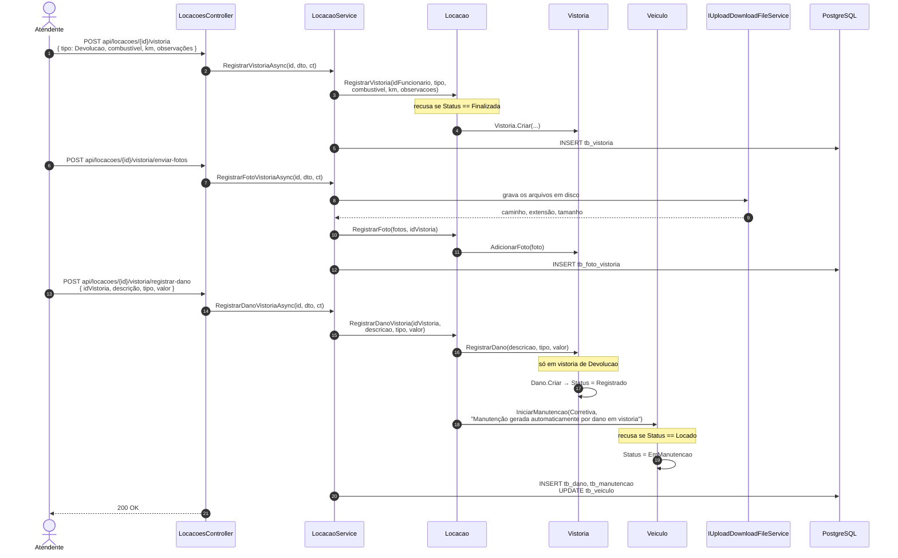

---

## 7. Multa compensada com caução

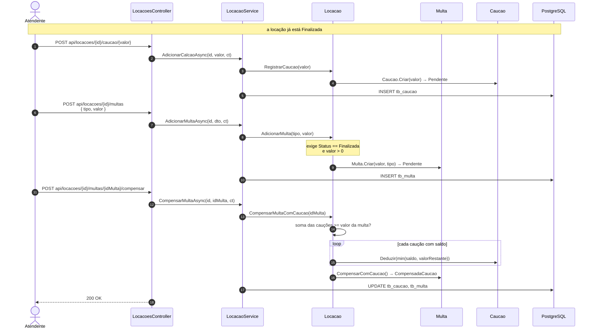

---

## 8. Upload e leitura de fotos

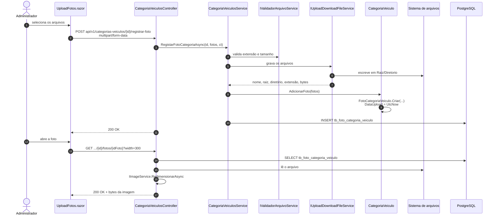

O mesmo desenho vale para `POST api/v1/filiais/{id}/registrar-foto` (`FotoFilial`) e para as
fotos de vistoria.

---

## 9. Auditoria e histórico temporal

Disparado a cada `SaveChangesAsync`, para qualquer entidade — não há chamada explícita nos
serviços.

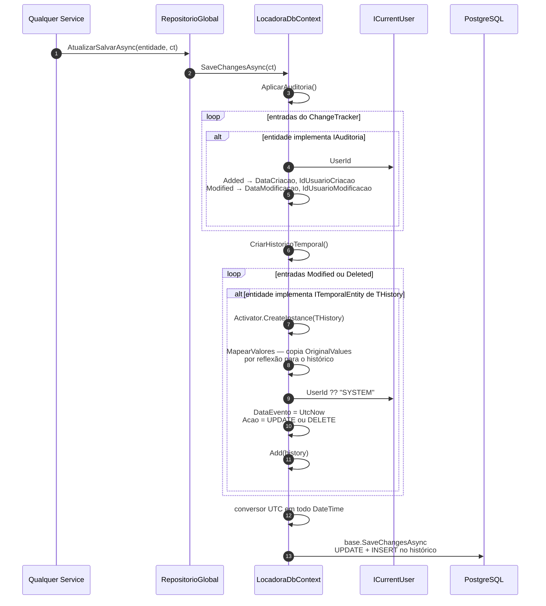

Hoje participam apenas `Clientes` (→ `tb_cliente_historico`) e `User` (→ `tb_user_historico`).
O `SaveChanges()` **síncrono** não passa por nada disso.

---

## 10. Erro de regra de negócio

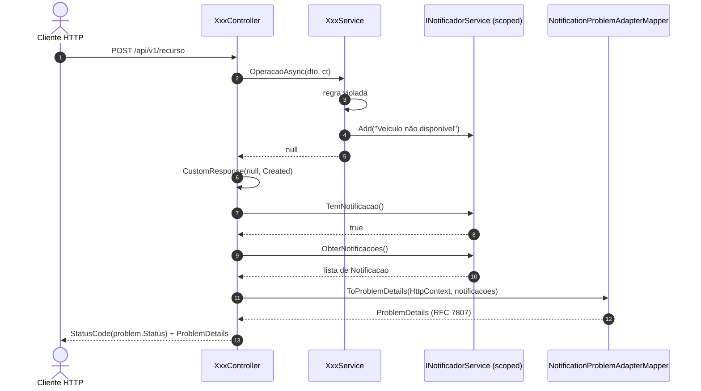

Como o `INotificadorService` é *scoped*, as notificações acumuladas durante a requisição são
todas devolvidas juntas — vários `Add` no mesmo serviço viram um único `ProblemDetails` com a
lista completa (é o que acontece nas validações de reserva do fluxo 4).

---

## 11. Rotina diária

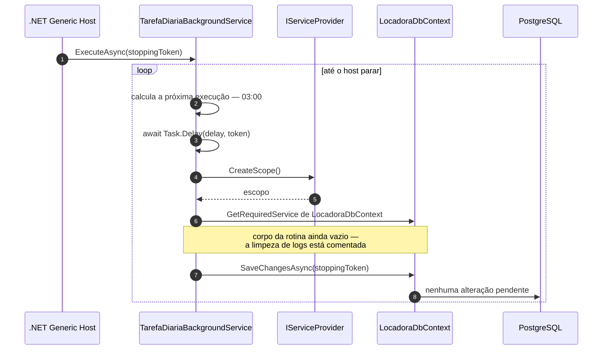

---

## Observações

- O fluxo 4 mistura os dois estilos de sinalização de erro: validações do serviço usam o
  notificador; invariantes dentro de `Locacao.Criar` lançam exceção capturada pelo
  `ExceptionMiddleware`.
- `LocacaoService.CriarAsync` acessa `dto.idReserva.Value` sem checar `HasValue` — uma
  requisição sem reserva chega ao `.Value` de um `int?` nulo.
- Vários métodos de `LocacaoService` chamam `AtualizarSalvarAsync(locacao)` sem repassar o
  `CancellationToken` recebido.
- `TarefaDiariaBackgroundService` calcula o horário com `DateTime.Now` (local), diferente do
  UTC usado na persistência.
