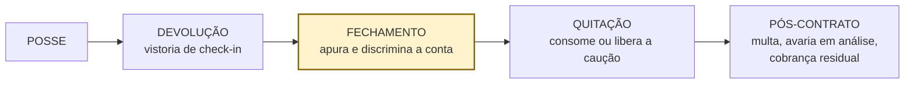
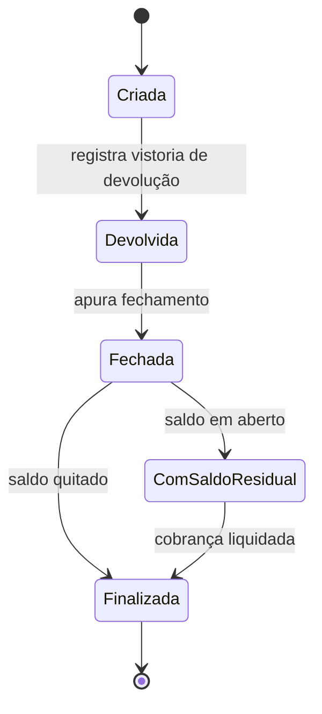
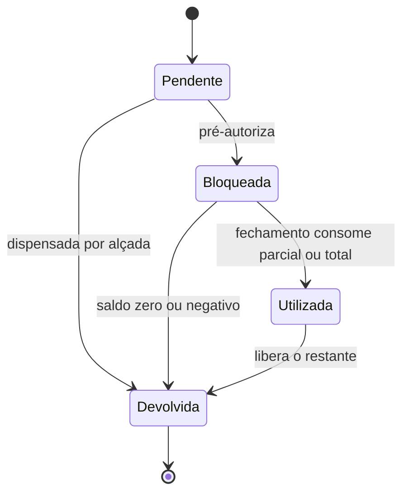

# 07 — Especificação: fechamento financeiro da devolução

> **Este documento é prescritivo.** Diferente de `01` a `06`, que descrevem o que o sistema
> **faz hoje**, aqui está o que o fechamento de contrato **precisa fazer**. Nada do que está
> abaixo está implementado no momento da escrita.

Hoje `ILocacaoService.FinalizarAsync(id, dataFimReal, kmFinal, valorFinal, filialDevolucao)`
recebe o `valorFinal` pronto: quem chama a Api decide quanto cobrar. Não há cálculo de diária,
hora excedente, quilometragem, combustível, proteção, acessórios nem taxas. `CategoriaVeiculo.LimiteKm`,
`CategoriaVeiculo.ValorKmExcedente` e `Seguro.Franquia` existem apenas em CRUD e mapper —
nenhum cálculo os lê. O nível de combustível é gravado na vistoria e nunca vira dinheiro.

Esta especificação fecha esse buraco.

**Fora do escopo** (blocos seguintes, mas o desenho deixa o gancho pronto): sinistro, nota
fiscal, multa de trânsito recebida após o fechamento, condutor adicional e tabela de tarifas
por faixa de duração/canal.

---

## 1. Processo de negócio



O processo dispara com a vistoria de devolução registrada e termina com a caução resolvida —
não com o carro no pátio. Devolução é a vistoria; o contrato só morre no fechamento.

## 2. Atores e responsabilidades

| Ator | Responsabilidade |
|---|---|
| Atendente / vistoriador | Registra a vistoria de devolução: hodômetro, combustível, avarias, limpeza |
| Sistema | **Apura** a conta — nenhum valor de cálculo é digitado |
| Gerente de filial | Única alçada para isentar linha do fechamento, com motivo registrado |
| Financeiro / retaguarda | Trata saldo residual e devolução de crédito |
| Cliente | Recebe a conta discriminada e o extrato da caução |

## 3. Regras obrigatórias

### 3.1 Período e diárias

| RN | Regra | Porquê |
|---|---|---|
| **RN-01** | A diária é um ciclo de **24h contado do instante de `DataInicio`**, nunca por data de calendário | Contar por calendário erra na virada do dia e gera contestação garantida |
| **RN-02** | Diárias cheias = `floor((DataFimReal − DataInicio) / 24h)`; o resto do último ciclo vai para tolerância/hora excedente. Mínimo de **1 diária** | Contrato de 2 horas continua sendo uma diária |
| **RN-03** | Excedente sobre o último ciclo **≤ `ToleranciaMinutos`** não gera cobrança | Fila de balcão e trânsito são rotina; cobrar 5 minutos custa mais em atrito do que rende |
| **RN-04** | Passada a tolerância, cobra-se **hora excedente por hora iniciada**, no valor `ValorDiariaContratada × PercentualHoraExcedente` | |
| **RN-05** | **Teto:** quando o acumulado de horas excedentes atingir o valor de 1 diária, cobra-se **1 diária cheia** no lugar das horas | Sem teto o cálculo produz valor maior que a diária e é indefensável |
| **RN-06** | O valor unitário da diária é o **congelado na abertura** (`Locacao.ValorDiariaContratada`), nunca `CategoriaVeiculo.ValorDiaria` lido no fechamento | Hoje alterar a categoria reescreveria contratos passados e impediria fechar mês |
| **RN-07** | **Devolução antecipada** cobra o período efetivamente utilizado, respeitando o mínimo de 1 diária, sem taxa | Não há tabela de faixas no modelo; quando houver, esta RN é reaberta |

### 3.2 Quilometragem

| RN | Regra | Porquê |
|---|---|---|
| **RN-08** | Km só é cobrado quando `CategoriaVeiculo.LimiteKm` estiver preenchido. `null` = **km livre**, cobrança zero | |
| **RN-09** | Franquia = `LimiteKm × diárias cobradas` (as de RN-02/RN-05, não as previstas) | |
| **RN-10** | Excedente = `max(0, KmFinal − KmInicial − franquia) × ValorKmExcedente` | |
| **RN-11** | `KmInicial` vem da vistoria de **retirada** e `KmFinal` da vistoria de **devolução** — nenhum dos dois é digitado no fechamento | Cobrança de km sem hodômetro nas duas pontas não se sustenta |
| **RN-12** | Ao fechar, `Veiculo.KmAtual` recebe `KmFinal` | Revisão por km, depreciação e custo por km dependem disso; hoje o odômetro do ativo nunca avança |

### 3.3 Combustível

| RN | Regra | Porquê |
|---|---|---|
| **RN-13** | Regime **full-to-full**: nível de devolução **≥** nível de retirada não gera cobrança | |
| **RN-14** | Litros faltantes = `(fraçãoRetirada − fraçãoDevolução) × Veiculo.CapacidadeTanqueLitros`, arredondado para cima. Frações do enum atual: `Vazio`=0 · `UmQuarto`=0,25 · `Meio`=0,5 · `TresQuartos`=0,75 · `Cheio`=1,0 | O enum `NivelCombustivel` já existente suporta o cálculo sem alteração |
| **RN-15** | Cobrança = `litros × PrecoLitroCombustivel + TaxaServicoAbastecimento`. A taxa é cobrada **uma vez**, só quando há litros a cobrar | |
| **RN-16** | Nível **acima** do de retirada **não gera crédito** | Prática consolidada de mercado; precisa estar no contrato para não virar reclamação |

### 3.4 Proteções e acessórios

| RN | Regra | Porquê |
|---|---|---|
| **RN-17** | Acessórios = soma de `LocacaoAdicional.CalcularTotal()`, recalculada pelas **diárias efetivas** | Hoje `Dias` é congelado na inclusão com base na previsão; em devolução antecipada ou atrasada o valor fica errado |
| **RN-18** | Proteção = `ValorDiariaContratada do seguro × diárias cobradas`. Exige congelar `ValorDiariaContratada` e `FranquiaContratada` em `LocacaoSeguro` | Mesma convenção que `LocacaoAdicional` já usa |
| **RN-19** | Proteção cancelada durante o contrato é cobrada **pró-rata** até a data do cancelamento | |
| **RN-20** | Proteção **não** cobre combustível, limpeza, multa de trânsito nem km excedente | É a confusão que mais gera conflito no balcão |

### 3.5 Taxas

| RN | Regra | Porquê |
|---|---|---|
| **RN-21** | `IdFilialDevolucao ≠ IdFilialRetirada` → cobra **taxa de retorno (one-way)** | O carro precisa voltar e a filial de origem fica desfalcada; sem a taxa, quem paga é a margem |
| **RN-22** | One-way só é aceito entre filiais habilitadas; filial não habilitada bloqueia o fechamento e exige alçada | |
| **RN-23** | **Limpeza especial** é valor fixo, cobrada só com registro na vistoria de devolução **e ao menos uma foto** | Sujeira comum é custo da operação, não cobrança |

### 3.6 Avarias e multas

| RN | Regra | Porquê |
|---|---|---|
| **RN-24** | Entram no fechamento apenas avarias em `Aprovado` ou `Cobrado`. `Registrado` e `EmAnalise` **não entram** — seguem para o pós-contrato com prazo máximo declarado | Avaria em análise por tempo indefinido é caução retida e cliente irritado |
| **RN-25** | Havendo proteção ativa que cubra o tipo da avaria, a cobrança ao cliente é **limitada à `FranquiaContratada`**, somando todas as avarias do contrato — não por avaria | |
| **RN-26** | Multas em `StatusMulta.Pendente` conhecidas até o fechamento entram na conta; as recebidas depois são pós-contrato e **não reabrem** o fechamento | |

### 3.7 Composição, caução e integridade

| RN | Regra | Porquê |
|---|---|---|
| **RN-27** | Total = `diárias + horas excedentes + km excedente + combustível + proteções + acessórios + taxas + avarias apuradas + multas conhecidas − pagamentos confirmados` | |
| **RN-28** | Só abatem pagamentos em `StatusPagamento.Pago`; `Pendente` e `Falhou` não abatem | |
| **RN-29** | Saldo **> 0** gera cobrança; saldo **< 0** gera devolução ao cliente. Nunca truncar saldo negativo para zero | |
| **RN-30** | A caução só é resolvida **depois** de apurado o saldo: saldo ≤ caução consome o necessário e **devolve o restante**; saldo > caução consome tudo e gera cobrança residual | Caução é garantia, não receita |
| **RN-31** | Cada linha é gravada **discriminada** (tipo, base de cálculo, quantidade, valor unitário, total) e é **imutável** após o fechamento. Correção é lançamento novo com autor e motivo | Conta agregada é conta contestada; edição silenciosa é apontamento de auditoria |
| **RN-32** | O fechamento é **idempotente**: apurar duas vezes não duplica linha nem cobra a caução de novo | |
| **RN-33** | Arredondamento a 2 casas **por linha**, `MidpointRounding.AwayFromZero`, nunca só no total | |
| **RN-34** | Nenhuma isenção de linha sem **autor e motivo** registrados, e quem vistoriou não pode isentar | É a fronteira entre erro e fraude |

## 4. Exceções

| Situação | Tratamento |
|---|---|
| Devolução sem vistoria de retirada no contrato | **Bloqueia** o fechamento — não há base comparável para km, combustível nem avaria |
| Devolução after-hours (chave em cofre) | Responsabilidade do cliente encerra na entrega da chave, com horário registrado; vistoria e fechamento ocorrem na abertura, usando a data/hora da entrega |
| Veículo não devolvido (muito além do previsto, sem contato) | Deixa de ser atraso e vira ocorrência; não é fechamento. Precisa de limiar declarado, senão o contrato fica "atrasado" por semanas |
| `CapacidadeTanqueLitros` não cadastrada | Não cobra combustível e **notifica** — melhor perder a cobrança do que emitir número inventado |
| Categoria com `LimiteKm` preenchido e `ValorKmExcedente` nulo | Bloqueia: cadastro inconsistente |
| `KmFinal < KmInicial` | Bloqueia — hodômetro adulterado ou erro de digitação, exige apuração |
| Saldo negativo | Não consome caução; libera integral e gera crédito a devolver |
| Proteção contratada depois do início | Pró-rata a partir da contratação |

## 5. Validações

| O que se checa | Quando | Falha |
|---|---|---|
| Existe vistoria de retirada **e** de devolução | Antes de apurar | Bloqueia |
| `DataFimReal ≥ DataInicio` | Antes de apurar | Bloqueia |
| `KmFinal ≥ KmInicial` | Antes de apurar | Bloqueia |
| Contrato ainda não fechado | Antes de apurar | Idempotente: devolve o fechamento existente |
| Filial de devolução habilitada para one-way | Ao apurar | Alçada de gerente |
| Avaria em `EmAnalise` no contrato | Ao apurar | Avisa e segue; a linha vai para o pós-contrato |
| Caução suficiente | Após apurar | Avisa e gera cobrança residual |

## 6. Estados e transições



Transições **proibidas**:

- `Criada → Fechada` — apurar sem vistoria de devolução.
- `Fechada → Devolvida` — reabrir fechamento; correção é lançamento novo.
- `Finalizada → qualquer estado`.
- Liberar caução antes de `Fechada`.
- Alterar qualquer linha do fechamento depois de `Fechada`.

Isso exige três estados que hoje não existem (`Devolvida`, `Fechada`, `ComSaldoResidual`), e
aproveita os dois que estão órfãos no enum (`Pendente` e `EmAndamento` nunca são atribuídos).
O `Cancelada` ausente — que hoje faz `Locacao.Cancelar()` gravar `Finalizada` — entra junto.



Transição proibida: `Devolvida → qualquer estado`.

> Hoje `Caucao.Devolver()` só aceita status `Pendente`, então uma caução `Bloqueada` — o fluxo
> normal — nunca pode ser devolvida; e `Deduzir` zera o valor marcando `Bloqueada` em vez de
> `Utilizada`. `StatusCaucao.Utilizada` nunca é atribuído em lugar nenhum.

## 7. Eventos de negócio

`VeiculoDevolvido` · `FechamentoApurado` · `CaucaoConsumida` · `CaucaoLiberada` ·
`SaldoResidualGerado` · `AvariaEnviadaParaAnalise`

São eles que depois acordam a régua de cobrança, o extrato ao cliente e o relatório de
vazamento de receita.

## 8. Dados que faltam no modelo

| Onde | Campo | RN |
|---|---|---|
| `Locacao` | `ValorDiariaContratada` | RN-06 |
| `LocacaoSeguro` | `ValorDiariaContratada`, `FranquiaContratada` | RN-18, RN-25 |
| `Veiculo` | `CapacidadeTanqueLitros` | RN-14 |
| `Filial` | `HabilitadaOneWay`, `TaxaRetornoOneWay` | RN-21, RN-22 |
| Parâmetros (filial ou global) | `ToleranciaMinutos`, `PercentualHoraExcedente`, `PrecoLitroCombustivel`, `TaxaServicoAbastecimento`, `ValorLimpezaEspecial` | RN-03, RN-04, RN-15, RN-23 |
| Nova entidade | `FechamentoLocacao` + `LinhaFechamento` | RN-31 |

Toda alteração de entidade acima exige migration na mesma mudança
(`dotnet ef migrations add <Nome> --project Locadora_Auto.Infra --startup-project Locadora_Auto.Api --output-dir Data/Migrations`).

## 9. Parâmetros que são decisão da empresa

Nenhum destes é exigência legal — são política da casa, e a escolha muda o resultado.

| Parâmetro | Opções | Recomendação |
|---|---|---|
| Tolerância | sem tolerância · 30 min · 60 min | **30 min** — equilíbrio dominante no Brasil |
| Hora excedente | 1/5 · 1/4 · 1/3 da diária | **1/3 da diária**, teto de 1 diária |
| Combustível | full-to-full · pré-pago · full-to-empty | **full-to-full** + taxa de serviço — o mais defensável, e o único que o enum atual já suporta |
| Devolução antecipada | recalcula faixa · cobra período efetivo · cobra taxa | **período efetivo, mínimo 1 diária, sem taxa** |
| One-way | valor por filial de destino · matriz origem × destino | **valor por filial** agora; matriz quando houver mais de 4–5 filiais |

**Não faça em cenário nenhum:** hora excedente sem teto; liberar caução antes de apurar a
conta; cobrar linha sem documento de suporte.

## 10. Critérios de aceite

```gherkin
Cenário: diária é ciclo de 24h, não calendário
  Dado um contrato com retirada em 10/03 às 22:00 e diária contratada de R$ 150,00
  Quando o veículo for devolvido em 11/03 às 20:00
  Então devem ser cobradas 1 diária
  E o valor de diárias deve ser R$ 150,00

Cenário: tolerância de 30 minutos não gera cobrança
  Dado um contrato com retirada em 10/03 às 09:00 e devolução prevista em 12/03 às 09:00
  E tolerância de 30 minutos
  Quando o veículo for devolvido em 12/03 às 09:25
  Então devem ser cobradas 2 diárias
  E nenhuma hora excedente

Cenário: hora excedente por hora iniciada, após a tolerância
  Dado um contrato com retirada em 10/03 às 09:00, diária de R$ 150,00
  E tolerância de 30 minutos e hora excedente de 1/3 da diária
  Quando o veículo for devolvido em 12/03 às 11:30
  Então devem ser cobradas 2 diárias + 2 horas excedentes
  E o valor das horas excedentes deve ser R$ 100,00
  E o total de período deve ser R$ 400,00

Cenário: teto de uma diária substitui as horas excedentes
  Dado um contrato com retirada em 10/03 às 09:00, diária de R$ 150,00
  E tolerância de 30 minutos e hora excedente de 1/3 da diária
  Quando o veículo for devolvido em 12/03 às 13:00
  Então deve ser cobrada 1 diária cheia no lugar das 3 horas excedentes
  E devem ser cobradas 3 diárias no total, R$ 450,00

Cenário: km livre não cobra excedente
  Dado uma categoria com LimiteKm nulo
  E vistoria de retirada com 15.000 km e de devolução com 16.800 km
  Quando o fechamento for apurado
  Então a linha de quilometragem excedente deve ser R$ 0,00

Cenário: km controlado cobra o que passou da franquia
  Dado uma categoria com LimiteKm de 200 km/diária e ValorKmExcedente de R$ 1,20
  E um contrato de 3 diárias cobradas
  E vistoria de retirada com 15.000 km e de devolução com 15.750 km
  Quando o fechamento for apurado
  Então a franquia deve ser 600 km
  E devem ser cobrados 150 km excedentes, R$ 180,00
  E o Veiculo.KmAtual deve passar a 15.750

Cenário: combustível cobrado pela diferença de nível
  Dado um veículo com tanque de 48 litros
  E vistoria de retirada com nível Cheio e de devolução com nível Meio
  E preço do litro de R$ 6,20 e taxa de serviço de R$ 40,00
  Quando o fechamento for apurado
  Então devem ser cobrados 24 litros
  E a linha de combustível deve ser R$ 188,80

Cenário: devolver com mais combustível não gera crédito
  Dado vistoria de retirada com nível Meio e de devolução com nível Cheio
  Quando o fechamento for apurado
  Então a linha de combustível deve ser R$ 0,00
  E nenhum crédito deve ser lançado

Cenário: devolução em outra filial cobra taxa de retorno
  Dado retirada na filial 1 e devolução na filial 3
  E a filial 3 habilitada para one-way com taxa de R$ 250,00
  Quando o fechamento for apurado
  Então deve haver uma linha de taxa one-way de R$ 250,00

Cenário: avaria com proteção é limitada à franquia
  Dado uma proteção contratada com franquia de R$ 2.000,00
  E duas avarias aprovadas de R$ 1.500,00 e R$ 1.800,00
  Quando o fechamento for apurado
  Então a cobrança de avarias ao cliente deve ser R$ 2.000,00

Cenário: avaria em análise não entra no fechamento
  Dado uma avaria em status EmAnalise de R$ 900,00
  Quando o fechamento for apurado
  Então a avaria não deve compor o total
  E deve ser gerado o evento AvariaEnviadaParaAnalise

Cenário: caução cobre o saldo e o restante volta
  Dado uma caução bloqueada de R$ 1.500,00
  E um saldo apurado de R$ 940,00
  Quando o fechamento for concluído
  Então R$ 940,00 devem ser consumidos da caução
  E R$ 560,00 devem ser devolvidos ao cliente
  E a caução deve ficar em status Utilizada

Cenário: saldo maior que a caução gera cobrança residual
  Dado uma caução bloqueada de R$ 1.500,00
  E um saldo apurado de R$ 2.300,00
  Quando o fechamento for concluído
  Então a caução deve ser consumida integralmente
  E deve ser gerada cobrança residual de R$ 800,00
  E a locação deve ficar em status ComSaldoResidual

Cenário: fechamento é idempotente
  Dado um contrato já fechado com total de R$ 1.240,00
  Quando o fechamento for apurado novamente
  Então nenhuma linha nova deve ser criada
  E a caução não deve ser consumida de novo
  E o total deve continuar R$ 1.240,00

Cenário: não fecha sem vistoria de retirada
  Dado um contrato sem vistoria de retirada registrada
  Quando o fechamento for apurado
  Então deve ser notificado "Fechamento exige vistoria de retirada e de devolução"
  E o contrato deve permanecer em status Criada
```

## 11. Requisitos não funcionais

- **Idempotência** da apuração e do consumo de caução (RN-32) — retentativa de rede não pode
  cobrar duas vezes.
- **Trilha de auditoria** em toda isenção, alçada e lançamento de correção: autor, data, motivo.
- **Datas em UTC** ponta a ponta (`DateTime.UtcNow`, nunca `Now`) — o cálculo é por minuto e um
  erro de 3h muda a conta.
- **Retenção**: fechamento e linhas preservados pelo prazo fiscal, imutáveis.
- Apuração **síncrona** no balcão, resposta abaixo de ~2s — o cliente está esperando com a
  chave na mão.

## 12. Indicadores

| Indicador | Fórmula | Para que serve |
|---|---|---|
| Vazamento de receita | `(Σ ValorPrevisto − Σ ValorFinal) / Σ ValorPrevisto`, por filial e atendente | Mede o que a regra recuperou; hoje é indeterminável |
| Receita acessória / receita total | linhas de combustível + adicionais + taxas ÷ total | É a linha que mais explica a margem |
| Ticket médio de fechamento | Σ total ÷ nº de fechamentos | Acompanha o efeito da política de tolerância |
| Caução liberada em D+0 | % de contratos | Mede a principal reclamação de locadora |
| Contratos com saldo residual | % e valor | Alimenta a régua de cobrança |
| Isenções por alçada | valor e nº, por gerente | Controle de fraude e de cortesia não medida |

## 13. Observações

- Os valores de franquia saem da **apólice**, não deste documento.
- "Proteção" só pode ser vendida como **"seguro"** se houver apólice de seguradora por trás —
  confirme com jurídico e corretora antes de nomear o produto.
- Os parâmetros da seção 9 são política da empresa, não exigência legal. Prazos e alíquotas
  citados em outros blocos (indicação de condutor, por exemplo) exigem confirmação da redação
  vigente.
