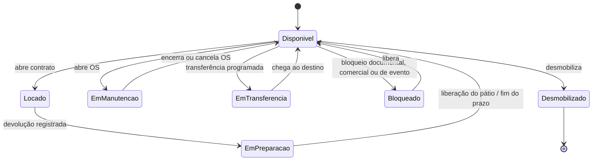

# 08 — Especificação: invariante do ativo (veículo)

> **Este documento é prescritivo.** Diferente de `01` a `06`, que descrevem o que o sistema
> **faz hoje**, aqui está o que o controle do veículo **precisa fazer**. As RN-35 a RN-56 estão
> **implantadas**, com os indicadores da seção 12; o que falta é tela, e está no backlog `09`.
> Veja [Estado da implementação](#estado-da-implementação).

Continuação de [07 — Fechamento financeiro](07-especificacao-fechamento-financeiro.md). A
numeração das regras segue de onde aquele documento parou (RN-35 em diante), para as RNs não
colidirem entre especificações.

Este bloco trata o veículo como **ativo controlado**. Ele fecha quatro buracos do estado atual:

- `StatusVeiculo.Locado` existe no enum e **nunca é atribuído** — só é lido em quatro guardas
  dentro de `Veiculo`, todas inalcançáveis. `Indisponibilizar()` mexe apenas no booleano
  `Disponivel`, então um carro na rua fica com `Status = Disponivel` e `Disponivel = false`.
- Nada impede **dois contratos sobrepostos no mesmo veículo**: `Locacao.Criar` só consulta
  `veiculo.Disponivel`, um booleano volátil, e não verifica período.
- `KmFinal` e `IdFilialDevolucao` são gravados na locação, mas `Veiculo.KmAtual` e
  `Veiculo.FilialAtualId` **não avançam** — o odômetro do ativo nunca anda e a frota fica
  registrada na filial errada.
- `ReservaService.ValidarDisponibilidade` **desconta o mesmo carro duas vezes** e ignora
  sobreposição de período.

## Estado da implementação

A implantação foi fatiada. O que está **de pé no domínio** (`Veiculo` e `Locacao`):

| RN | O que passou a valer |
|---|---|
| RN-35, RN-36 | `AplicarStatus` é a única escrita de `Status`/`Disponivel`; o booleano virou derivado (`Ativo && Status == Disponivel`) |
| RN-38, RN-43 | `Veiculo.Locar()` é chamado por `Locacao.Criar` e valida por status — o booleano deixou de decidir |
| RN-44, RN-45 | `RegistrarDevolucao` leva a `EmPreparacao`; `LiberarDaPreparacao` devolve à oferta |
| RN-12, RN-47 | A devolução avança `KmAtual` e `FilialAtualId` do veículo |
| RN-50 | A guarda "locado não entra em oficina" ficou alcançável, porque `Locado` passou a ser atribuído |
| RN-51 | A ordem corretiva por avaria abre no fechamento, não no registro da vistoria |
| RN-53 | Toda saída de indisponibilidade (oficina, preparação) só devolve à oferta se `Ativo` |
| RN-54 | `KmAtual` não retrocede, nem na devolução nem na atualização do cadastro |
| RN-37 | `MovimentoVeiculo` registra cada transição: situação de origem e destino, documento que a autorizou e data. Como `AplicarStatus` já era a escrita única de status, virou também o registro único do movimento — e a origem é parâmetro obrigatório dele, então **transição sem documento não compila** |
| RN-52 | `Indisponivel` virou `Bloqueado` (mesmo valor 2) e ganhou documento: `BloqueioVeiculo`, com motivo tipado, data prevista de liberação e funcionário responsável. Um bloqueio aberto por vez; liberar devolve o carro à situação em que ele estava, e não à oferta |
| RN-48, RN-49 | `EmTransferencia` e `TransferenciaVeiculo`: o veículo sai da oferta da origem no envio e só entra na do destino na chegada — durante o trecho não conta em filial nenhuma. `Filial.PermiteTransferencia` gate as duas pontas. A RN-48 continua valendo: devolução one-way **não** passa por aqui |
| RN-56 | `Desmobilizado` como estado terminal, com motivo, data e responsável no próprio veículo. A guarda mora no `AplicarStatus`, então nenhuma transição nova pode ressuscitar carro vendido |

E o que está **ligado à Application e à Api** — sem isso a máquina de estados acima existia mas
não era alcançada por nenhum endpoint:

| RN | O que passou a valer |
|---|---|
| RN-38, RN-43 | `LocacaoService.CriarAsync` carrega **veículo, cliente e funcionário** com `rastreado: true`. Sem isso o `Add` da locação pinta de `Added` todo o grafo solto: o `Locar()` do domínio não vira UPDATE e o EF ainda tentaria inserir de novo os três. Cliente e funcionário entram na conta porque `Locacao.Criar` os guarda como navegação, mesmo sem alterá-los |
| — | Isso só passou a valer de fato quando o `rastreado` de `RepositorioGlobal.ObterPorIdAsync` foi corrigido: ele fazia `FindAsync` (que rastreia) e **destacava quando `true`**, ou seja, entregava o oposto do que o nome prometia. O caminho sem rastreio virou consulta `AsNoTracking` em vez de `FindAsync` seguido de `Detached`, que destacaria junto qualquer instância já alterada na mesma requisição. `Infra/ParametroRastreadoTests` fixa o significado |
| RN-45 | `PATCH api/v1/veiculos/{id}/liberar-preparacao` → `VeiculoService.LiberarDaPreparacaoAsync`: é a porta pela qual o pátio devolve o carro à oferta |
| — | Os serviços repetem as guardas de `Veiculo` (`Ativo`, `Status`, km) **antes** de chamar o domínio, para a recusa sair como `ProblemDetails` 4xx. `DomainException` é `internal`, não deriva de `InvalidOperationException` e não é mapeada no `ExceptionProblemFactory`: se escapar, é 500 |
| RN-40, RN-43 | `LocacaoService.CriarAsync` recusa abertura com contrato sobreposto, pelo filtro `Locacao.Sobrepostas` — a guarda de status é um retrato de agora e não enxerga período |
| RN-42 | `LocacaoService.AtualizarAsync` revalida a sobreposição antes de estender, ignorando a própria locação |
| RN-41 | A constraint `ex_locacao_sem_sobreposicao` está na migration `SobreposicaoDeContrato` (SQL bruto, sem modelo por trás), e a violação — SQLSTATE `23P01` — vira **409** no `ExceptionProblemFactory` |
| RN-46 | `ReservaService.ValidarDisponibilidade` usa a fórmula da seção 9: a base é a frota ativa (não `Disponivel`, que já excluía os locados e causava o desconto dobrado) e as locações são filtradas por período, recuado pelo tempo de preparo da filial |
| RN-45 (parâmetro) | `Filial.TempoPreparacaoMinutos` (migration `TempoPreparacaoDaFilial`, padrão 120, teto de 1440). É de filial e não de categoria porque quem executa a preparação é o pátio dela; em one-way vale o da filial de destino, para onde a RN-47 já move o ativo |
| RN-37 (autor) | O autor sai do `IAuditoria` que `MovimentoVeiculo` implementa, preenchido pelo `AplicarAuditoria` do `SaveChangesAsync` — nenhum serviço precisou de `ICurrentUser`. Enquanto a autenticação estiver comentada no `Program.cs` grava `"SYSTEM"`, e volta a gravar o usuário sozinho quando ela for reativada. O par `DataModificacao`/`IdUsuarioModificacao` fica nulo de propósito: movimento não se altera |
| RN-37 (leitura) | `GET api/v1/veiculos/{id}/movimentos` → `VeiculoService.ObterMovimentosAsync`, paginado, com filtro por período e por tipo de documento, e `termo` procurando o autor. Consulta `MovimentoVeiculo` pelo repositório próprio, e não `veiculo.Movimentos` por `Include`: não há como paginar dentro de um Include, e a trilha de um carro antigo tem centenas de linhas |
| Seção 12 | `GET api/v1/veiculos/indicadores` → `IndicadoresFrotaService`: utilização real e tempo médio de preparação, mais o tempo por situação (a "frota parada por motivo" medida em tempo). Janela padrão de 30 dias |
| RN-52 (porta) | `POST veiculos/{id}/bloquear`, `PATCH veiculos/{id}/bloqueios/{idBloqueio}/liberar` e `GET veiculos/{id}/bloqueios`. O serviço repete as guardas do domínio para a recusa sair 4xx, e confere no `IFuncionarioRepository` que o responsável existe |
| RN-49 (porta) | `POST veiculos/{id}/transferencias`, `PATCH .../chegada`, `PATCH .../cancelar` e `GET veiculos/{id}/transferencias`. A checagem das duas filiais (existir, estar ativa, aceitar transferência) mora no serviço porque `Filial` é outro agregado |
| RN-56 (porta) | `PATCH veiculos/{id}/desmobilizar`. A guarda que só o serviço faz é a do contrato **futuro**: o status do veículo é retrato de agora e não enxerga período |
| RN-55 | Índice único **parcial** (`WHERE ativo`) sobre placa e chassi, na migration `UnicidadeEntreVeiculosAtivos`. O serviço repete a regra com o texto já normalizado (trim + maiúscula), e `AtivarAsync` ganhou a guarda: reativar é a única operação que pode colidir |
| RN-45/RN-60 (agendador) | Três `BackgroundService`, um por varredura: preparação vencida (5 min), reserva vencida (15 min) e locação atrasada (10 min). Um por varredura e não um host com três métodos — cadência própria, chave de configuração própria e falha isolada |
| Seção 12 | Os três indicadores de controle: bloqueios vencidos, transições sem documento (tem que dar zero) e tentativas de sobreposição recusadas por filial, esta última sobre a tabela `RecusaSobreposicao` |
| RN-45 (automática) | `LiberacaoPreparacaoBackgroundService` varre o pátio a cada 5 min e solta quem passou do `TempoPreparacaoMinutos` da filial, por `VeiculoService.LiberarPreparacoesVencidasAsync`. Sem porta na Api: é lote de agendador, e a liberação manual já tem a dela. Desligável por `Jobs:LiberacaoPreparacao:Habilitado` |

A constraint foi aplicada e exercitada contra um PostgreSQL de verdade (`locadora_autos`, Npgsql,
`btree_gist` 1.7). O que o banco confirmou:

| Caso | Resultado |
|---|---|
| Contrato sobreposto, contido ou englobando o existente | recusado, `SQLSTATE 23P01` |
| Contrato encostado (começa no instante em que o outro termina) | aceito — `tstzrange` é meio-aberto |
| Mesmo período com o outro contrato em `Finalizada` | aceito — terminal não ocupa a placa |
| **Duas transações abrindo o mesmo período ao mesmo tempo** | a segunda **bloqueia** até a primeira decidir e então leva `23P01`: exatamente uma grava |

O último é o critério de aceite "concorrência é barrada pelo banco" da seção 11, e é a razão de a
constraint existir — nenhum `if` no serviço produz esse bloqueio.

> **Ao aplicar em base que já tem dados:** a constraint valida o que já está gravado, e o
> `ALTER TABLE` falha se houver sobreposição pré-existente. A migration traz comentada a consulta
> que encontra os pares em conflito.
>
> A verificação acima foi feita por script descartável, fora do repositório: **não há teste de
> integração** que a repita. Os dois testes que ficaram (`SobreposicaoDeContratoTests`) leem o SQL
> da própria migration e o comparam com `Locacao.StatusTerminais` e `Locacao.Sobrepostas` — eles
> pegam a lista de status divergindo, não uma regressão no banco.

Três decisões da RN-37 que o código não explica sozinho:

| Decisão | Porquê |
|---|---|
| O documento de origem entra como **navegação** (`LocacaoOrigem`, `ManutencaoOrigem`), não só como id | Na abertura do contrato e na abertura da OS o documento ainda não foi gravado — o id nasce no mesmo `SaveChanges`. Guardar `contrato.IdLocacao` ali registraria zero; pela navegação quem resolve a chave é o EF. Documento que já tem id entra pelos dois |
| Movimento só é registrado quando o estado do ativo **muda** | `Ativar()` num carro que já está na oferta não é transição, e registrar viraria ruído no indicador da seção 12. Efeito colateral conhecido: desativar um carro **locado** não gera movimento, porque ele já estava fora da oferta — essa alteração é cadastral, e `Veiculo` continua sem `IAuditoria` |
| O `xmin` foi apagado à mão do `CreateTable` da migration | Mesmo motivo que esvazia a `ConcorrenciaOtimista`: `xmin` é coluna de sistema do Postgres e declará-la no `CREATE TABLE` faz o comando falhar. O token de concorrência continua valendo, como propriedade sombra. Se a migration for regerada, apague a linha de novo |

A migration `MovimentoVeiculo` foi aplicada contra o `locadora_autos` real, que é o que prova a
remoção do `xmin` e os dois caminhos de cascata (o veículo apaga o movimento direto e também pela
manutenção).

E cinco decisões da apuração dos indicadores, que são regra de negócio e não detalhe de cálculo:

| Decisão | Porquê |
|---|---|
| A janela termina no máximo **agora** — `ate` no futuro é truncado | A última situação de cada carro é esticada até o fim da janela. Aceitar data futura acumularia tempo que ainda não passou e diluiria a utilização, sempre para baixo |
| O denominador é o tempo apurado **menos** o tempo em `Indisponivel` | É a "frota operacional" do mercado: carro fora da oferta por decisão da casa não é frota trabalhando, e deixá-lo no denominador puniria a utilização por uma decisão administrativa |
| A preparação é contada pela **entrada**, e as que não fecharam saem da média mas aparecem em `PreparacoesEmAberto` | Sem o par, um pátio que nunca libera carro nenhum exibiria a melhor média da rede — só as preparações rápidas fechariam dentro da janela e entrariam na conta |
| Veículo cadastrado dentro da janela só conta a partir do cadastro | O relógio dele começa no primeiro movimento, não na borda da janela: contar antes inventaria frota que ainda não tinha sido comprada |
| `idFilial` filtra pela filial **atual** do cadastro, não pela histórica | A trilha não guarda filial, e a do veículo muda a cada devolução one-way (RN-47). Enquanto a transferência (RN-48/RN-49) não existir, não há de onde tirar a filial da época — o recorte responde "onde o carro está hoje" |

Duas ressalvas de leitura, para o número não ser usado como não é:

- **Esta utilização é física, não comercial.** Ela mede o que o ativo fez (tempo em `Locado`); a
  utilização do mercado mede o que foi vendido (diárias faturadas ÷ frota × dias) e sai do
  contrato, não da trilha. A diferença entre as duas é informação: diária faturada acima do tempo
  em `Locado` aponta cobrança sem carro na rua; o contrário aponta carro na rua sem contrato.
- **`VeiculosComTrilha` vem abaixo de `VeiculosNoRecorte` enquanto a RN-37 for recente.** Carro que
  não se moveu desde a implantação não tem linha nenhuma, e é por isso que ele fica fora da conta
  em vez de entrar como frota parada — o que baixaria a utilização por falta de dado, não por
  ociosidade.

A apuração é feita **em memória** sobre as linhas do período, de propósito: enquanto a frota for de
centenas de carros, ler as linhas é mais barato que manter um fechamento diário que ninguém audita.
O ponto de virada é conhecido — quando a trilha crescer, isso vira agregação no banco ou tabela de
fechamento.

Quatro decisões da liberação automática (RN-45), que são regra e não detalhe do agendador:

| Decisão | Porquê |
|---|---|
| A liberação por prazo grava origem **`Prazo`**, separada de `Patio` | A distinção é de negócio: o prazo devolve à oferta um carro que **ninguém conferiu**. Fundidos num tipo só, o tempo médio de preparação da seção 12 viraria ficção — um pátio que nunca declara nada exibiria exatamente o `TempoPreparacaoMinutos` da casa, a melhor média da rede, sem ter limpado carro nenhum. Separados, a liberação sem conferência fica contável por filial e a métrica continua medindo o pátio |
| O carro parado há dias (Api fora do ar, backlog) é solto com data de **agora**, nunca retroativa | A trilha registra o que aconteceu, e o indicador tem que mostrar os dias em que o carro ficou parado. Datar a liberação no vencimento esconderia exatamente a falha que se quer enxergar |
| Avaria não ganhou guarda nova | A RN-51 abre a ordem corretiva **no fechamento**, e o carro vai para `EmManutencao`. Quem tem avaria não está em `EmPreparacao`, então a varredura nunca o vê — repetir a decisão aqui a duplicaria em dois lugares |
| Veículo em `EmPreparacao` **sem carimbo** de entrada é liberado, e contado à parte | É o carro que entrou no pátio antes da RN-37 existir: está parado há mais tempo que qualquer `TempoPreparacaoMinutos`, logo o prazo venceu por construção. Datar o início como "agora" reiniciaria o relógio de um carro parado há dias. O contador `SemCarimbo` tende a zero e não deve voltar a subir |

O agendador é um `BackgroundService`, e não o Hangfire: a varredura olha o estado atual do pátio em
vez de consumir uma fila, então é idempotente — tick perdido se resolve no próximo e não há nada que
precise sobreviver a um restart. Fila persistente, retry e dashboard só pagam o custo com trabalho
que não pode se perder ou com mais de uma instância; o Hangfire ainda exigiria storage próprio no
banco (hoje há só o pacote no `csproj`, sem extension e com `HangfireConnection` vazia). Com mais de
uma instância as duas varreriam junto sem estragar nada: a segunda encontra o carro fora de
`EmPreparacao` e a guarda do domínio o descarta; empatando na leitura, o `xmin` derruba a segunda
gravação.

Seis decisões do bloqueio, da transferência e da desmobilização que o código não explica sozinho:

| Decisão | Porquê |
|---|---|
| O responsável do bloqueio é **funcionário**, com FK, e não o autor da auditoria | São perguntas diferentes: a auditoria responde "quem digitou", a RN-52 quer "a quem cobrar o carro de volta". E é a única que funciona hoje — enquanto a autenticação estiver comentada no `Program.cs`, o autor de tudo é `"SYSTEM"` |
| Desativar o veículo **não** é bloqueio da RN-52 | Os dois levam a `Bloqueado`, e a trilha os separa pelo `TipoDocumentoOrigem` (`Cadastro` × `Bloqueio`). A desativação não é temporária, sai por `Ativar()` e aparece em qualquer filtro por `Ativo` — ela não é o carro que "some da oferta e ninguém percebe", que é o defeito que a RN-52 fecha. Por isso ela fica fora do indicador de bloqueios vencidos, e por isso `Ativar()` recusa liberar bloqueio pela porta dos fundos |
| Liberar bloqueio devolve o carro ao `StatusAnterior`, não à oferta | Bloqueio **suspende** a situação do ativo, não a apaga. Carro bloqueado no pátio volta ao pátio (ainda não foi conferido) e carro bloqueado por não devolução volta a `Locado` (o contrato segue aberto e ele segue na rua). Soltar os dois direto na venda ofertaria um carro sujo e um carro que nem está na filial |
| Um bloqueio aberto por vez | Dois simultâneos deixariam a liberação sem resposta para "voltar para onde", e o carro só pode estar fora da oferta por um motivo de cada vez. O segundo motivo é observação do primeiro, ou é bloqueio novo depois de liberar este |
| `FilialAtualId` **não** muda no envio da transferência, só na chegada | Enquanto o carro roda, quem responde por ele é a origem. Trocar no envio faria o destino contá-lo como frota antes de ele existir lá — o mesmo overbooking da RN-49, só que do outro lado |
| `EmTransferencia` **fica** no denominador da utilização; `Desmobilizado` sai | Transferência é meio para alugar o carro em outro lugar, não renúncia a alugá-lo: a utilização deve mesmo cair quando a estrada demora, e essa é a pressão que se quer sobre quem remaneja frota. Carro vendido não é frota nenhuma e sai da conta |

E duas do indicador de tentativas recusadas, que é o único deste bloco que **grava** dado novo:

| Decisão | Porquê |
|---|---|
| A recusa vira **tabela** (`RecusaSobreposicao`), não linha de log | A leitura do número é comparativa e no tempo: se sobe numa filial, o problema é processo de balcão — agenda de pátio desatualizada, treinamento, frota curta — e não sistema. Contagem que mora no arquivo de log ninguém acompanha, e some a cada restart |
| As duas origens são contadas à parte (`Consulta` × `Banco`) | Recusa pela consulta é o atendente escolhendo placa comprometida: erro de processo. Recusa pelo `23P01` é concorrência real — dois pontos de venda disputando o mesmo carro no mesmo instante, e aí o que falta é frota ou coordenação entre canais, não treinamento. Somadas num número só, as duas causas ficariam indistinguíveis |

A tabela não tem chave estrangeira **de propósito**: a recusa precisa sobreviver ao veículo ser
excluído ou desmobilizado. Uma FK `Restrict` travaria a exclusão do veículo por causa de uma
tentativa recusada meses atrás, e uma `Cascade` apagaria a série histórica, que é exatamente o que
se quer acompanhar.

Ainda **não** implementado:

- **Tela da trilha, dos indicadores, do bloqueio, da transferência e da desmobilização** — os
  endpoints existem e nenhuma tela os consome. A trilha e os bloqueios cabem na `TabelaGenerica`;
  os indicadores são painel, que o front ainda não tem. Está no backlog `09` (`F5`, `F6`).
- **A recusa registrada pelo banco não tem teste automatizado.** O `RepositorioFake` não tem
  constraint, e reproduzir o `23P01` exigiria teste de integração com Postgres, que não existe. O
  caminho está no `catch` de `LocacaoService.CriarAsync`, junto do `throw` que preserva o 409.

---

## 1. Escopo

Este bloco não é um processo de balcão — é o **invariante que atravessa todos eles**. Qualquer
movimento do carro (abrir contrato, devolver, mandar para oficina, transferir, desmobilizar)
passa por aqui.

## 2. Atores e responsabilidades

| Ator | Responsabilidade |
|---|---|
| Atendente | Abre e encerra contrato — consome e libera a placa |
| Pátio / manobrista | Executa a preparação; declara o carro pronto |
| Oficina | Abre e encerra ordem de serviço |
| Gerente de filial | Autoriza bloqueio, transferência e desmobilização |
| Sistema | Recusa transição ilegal; nenhuma troca de status é digitada à mão |

## 3. Regras obrigatórias

### 3.1 Status como fonte única de verdade

| RN | Regra | Porquê |
|---|---|---|
| **RN-35** | `Veiculo.Status` é a **única** fonte de verdade do ativo. `Disponivel` continua existindo como coluna (o filtro precisa traduzir para SQL) mas vira **derivada**: só a transição de status a escreve | Hoje `Indisponibilizar()` mexe só no bool e `Status` fica em `Disponivel` — carro na rua aparece como disponível em qualquer relatório por status |
| **RN-36** | `Disponivel = (Ativo && Status == Disponivel)`, recalculado em **toda** transição | Elimina a divergência estruturalmente, em vez de confiar em quem chama |
| **RN-37** | Toda transição registra **documento de origem** (contrato, OS, transferência, bloqueio), autor e data. Transição sem origem é proibida | Status trocado à mão sem origem é buraco de auditoria e de conciliação de frota |
| **RN-38** | Abrir contrato leva o veículo a `Locado`; encerrar leva a `EmPreparacao` | `Locado` nunca é atribuído hoje |
| **RN-39** | Reserva **não** altera o status do veículo, em hipótese nenhuma | Reserva vende categoria, contrato entrega placa. Prender placa na reserva trava frota e cria falta artificial |

### 3.2 Um contrato ativo por veículo

| RN | Regra | Porquê |
|---|---|---|
| **RN-40** | Um veículo tem **no máximo um contrato não encerrado** por vez. Recusar abertura quando existir contrato com período sobreposto: `l.IdVeiculo = X AND l.Status NOT IN (terminais) AND l.DataInicio < fimNovo AND COALESCE(l.DataFimReal, l.DataFimPrevista) > inicioNovo` | É o defeito mais grave de um sistema de locadora: gera cliente no balcão sem carro |
| **RN-41** | A garantia é **do banco**, não da checagem em memória — dois atendentes simultâneos passam por qualquer `if` | Ver seção 8 |
| **RN-42** | Extensão de contrato **revalida** a sobreposição para o novo período | Extensão aceita sem checar disponibilidade é o gerador nº 1 de falta de carro na filial |
| **RN-43** | `Locacao.Criar` deixa de decidir por `veiculo.Disponivel` e passa a decidir por status + ausência de sobreposição | O bool é volátil; uma finalização fora de ordem hoje libera um segundo contrato no mesmo carro |

### 3.3 Preparação

| RN | Regra | Porquê |
|---|---|---|
| **RN-44** | Devolução leva o veículo a `EmPreparacao`, **nunca** direto a `Disponivel` | O carro devolvido às 10h não está disponível às 10h: precisa de vistoria, limpeza e abastecimento |
| **RN-45** | Sai de `EmPreparacao` por **liberação explícita** do pátio, ou automaticamente após `TempoPreparacaoMinutos` — o que vier primeiro | Sem liberação explícita a fila do pátio some do controle; sem o automático o carro fica preso por esquecimento |
| **RN-46** | O cálculo de disponibilidade conta devoluções previstas **menos** o tempo de preparação | Agenda de reserva construída sobre devolução instantânea não fecha na prática |

### 3.4 Localização do ativo

| RN | Regra | Porquê |
|---|---|---|
| **RN-47** | No fechamento, `Veiculo.FilialAtualId` recebe a filial de devolução | Hoje o veículo continua "na" filial de origem e a disponibilidade das duas filiais mente |
| **RN-48** | Devolução one-way deixa o carro **disponível no destino**; `EmTransferencia` fica reservado para movimentação programada | A taxa de retorno (RN-21) já pagou o desequilíbrio; prender o carro seria cobrar duas vezes |
| **RN-49** | Em transferência programada, o veículo sai da oferta da origem **antes** de entrar na do destino | Contar o mesmo carro em duas filiais é overbooking involuntário |

### 3.5 Manutenção e bloqueio

| RN | Regra | Porquê |
|---|---|---|
| **RN-50** | Veículo `Locado` não entra em manutenção | A guarda já existe em `Veiculo.IniciarManutencao`, mas hoje é **inalcançável** |
| **RN-51** | Avaria registrada na vistoria de devolução abre manutenção corretiva **após o fechamento**, não no ato do registro | Hoje `RegistrarDanoVistoria` chama `IniciarManutencao` na hora, com o contrato aberto — e só passa porque o status está errado |
| **RN-52** | Todo bloqueio tem **data prevista de liberação** e responsável | Bloqueio sem prazo é carro que some da oferta e ninguém percebe |
| **RN-53** | Sair de manutenção, preparação ou bloqueio só devolve a `Disponivel` se `Ativo` | Comportamento que `SairDaManutencao` já tem; generalizar para todas as saídas |

### 3.6 Consistência de frota

| RN | Regra | Porquê |
|---|---|---|
| **RN-54** | `KmAtual` **nunca retrocede** | Hodômetro que anda para trás é adulteração ou erro de digitação; nos dois casos precisa de apuração, não de gravação |
| **RN-55** | Placa e chassi são únicos entre veículos ativos | Duplicata quebra a conciliação de multa e de sinistro |
| **RN-56** | Desmobilização exige ausência de contrato aberto e é **estado terminal** | Vender carro com contrato ativo é o pior desfecho possível |

## 4. Estados e transições



Transições **proibidas**:

- `Locado → EmManutencao` — carro na rua não entra em oficina.
- `Locado → Disponivel` — devolução passa obrigatoriamente por `EmPreparacao`.
- `Desmobilizado → qualquer estado`.
- Qualquer transição sem documento de origem.
- `Disponivel → Locado` havendo contrato sobreposto no mesmo veículo.
- Reserva alterar qualquer status.

Três estados novos em relação ao enum atual (`EmPreparacao`, `EmTransferencia`,
`Desmobilizado`); `Indisponivel` é renomeado conceitualmente para `Bloqueado` e passa a exigir
motivo e prazo.

> A **versão mínima** prevista aqui (implantar só `EmPreparacao` e adiar `EmTransferencia` e
> `Desmobilizado`) não foi necessária: os três estão no enum, com `Bloqueado` no lugar de
> `Indisponivel`. O texto fica como registro da alternativa que existia.

## 5. Exceções

| Situação | Tratamento |
|---|---|
| Contrato aberto com data retroativa que colide com contrato encerrado | Recusa. Correção de data histórica é lançamento de ajuste com alçada, não abertura normal |
| Devolução antecipada | Vai para `EmPreparacao`; a disponibilidade recalcula sozinha porque o contrato passa a `Finalizada` |
| Troca de veículo no meio do contrato | Devolução do antigo e retirada do novo **no mesmo ato**: antigo para `EmPreparacao`, novo para `Locado`, com as duas vistorias fechadas |
| Veículo não devolvido além do limiar | Sai da oferta para `Bloqueado` com motivo "não devolvido" — não fica `Locado` indefinidamente contaminando a utilização |
| Carro sinistrado durante o contrato | `Bloqueado` com origem no sinistro; não volta para `Disponivel` sem OS encerrada |
| Veículo desativado (`Ativo = false`) enquanto locado | Permitido registrar, mas o status continua `Locado` até a devolução; a desativação só surte efeito na saída da preparação (RN-53) |

## 6. Validações

| O que se checa | Quando | Falha |
|---|---|---|
| Ausência de contrato sobreposto | Ao abrir e ao estender | Bloqueia |
| `Status == Disponivel && Ativo` | Ao abrir contrato | Bloqueia |
| Documento de origem informado | Em toda transição | Bloqueia |
| `KmNovo >= KmAtual` | Ao gravar km | Bloqueia |
| Placa e chassi únicos entre ativos | Ao criar e atualizar | Bloqueia |
| Bloqueio com data de liberação e responsável | Ao bloquear | Bloqueia |
| Contrato aberto no veículo | Ao desmobilizar | Bloqueia |

## 7. Eventos de negócio

`VeiculoLocado` · `VeiculoDevolvido` · `PreparacaoIniciada` · `VeiculoLiberadoParaOferta` ·
`VeiculoBloqueado` · `VeiculoTransferido` · `VeiculoDesmobilizado`

## 8. Dados e garantia técnica

| Onde | O que | RN |
|---|---|---|
| `StatusVeiculo` | `EmPreparacao`, `EmTransferencia`, `Desmobilizado`; `Indisponivel` → `Bloqueado` com motivo e prazo | RN-44, RN-49, RN-52, RN-56 |
| Nova entidade `MovimentoVeiculo` | id do veículo, status origem/destino, tipo e id do documento de origem, autor, data | RN-37 |
| Parâmetro (filial) | `TempoPreparacaoMinutos` | RN-45 |
| `Filial` | `PermiteTransferencia` | RN-49 |

**A garantia de RN-40 é do banco.** Nenhum `if` no serviço resolve duas requisições
simultâneas. No PostgreSQL a forma correta é uma constraint de exclusão sobre o intervalo:

```sql
CREATE EXTENSION IF NOT EXISTS btree_gist;

ALTER TABLE tb_locacao ADD CONSTRAINT ex_locacao_sem_sobreposicao
  EXCLUDE USING gist (
    id_veiculo WITH =,
    tstzrange(data_inicio, COALESCE(data_fim_real, data_fim_prevista)) WITH &&
  ) WHERE (status NOT IN ('Finalizada'));
```

> **Atenção ao predicado.** `tb_locacao.status` é **`character varying(20)`**, não `int`:
> `LocacaoConfig` aplica `HasConversion<string>()`, então os terminais entram **entre aspas** e
> escrever os inteiros do enum ali compila, não dá erro e desliga a constraint em silêncio.
> (Cuidado: `tb_reserva.status` e `tb_veiculo.status` **são** `int` — a inconsistência é do
> modelo, não deste documento.)
>
> A lista de terminais vive em `Locacao.StatusTerminais`; hoje é só `Finalizada`, porque
> `Cancelar()` também grava `Finalizada`. Ela muda quando a especificação `07` acrescentar
> `Fechada`, `ComSaldoResidual` e uma `Cancelada` de verdade — mexeu lá, mexa aqui.
> `SobreposicaoDeContratoTests.Status_terminal_chega_ao_banco_como_texto` fixa exatamente os
> literais que este `NOT IN` precisa conter.

A migration precisa de SQL bruto (o EF não gera `EXCLUDE`), na mesma linha da
`ConcorrenciaOtimista`, que já é escrita à mão. A violação chega como `PostgresException` com
`SqlState = 23P01` e deve ser traduzida no `ExceptionProblemFactory` para **409**, como já se
faz com `DbUpdateConcurrencyException`.

A checagem em memória continua existindo — mas como **mensagem amigável**, não como garantia.

## 9. Correção do cálculo de disponibilidade

> **Implementado**, menos a última linha da fórmula. O que havia antes: `ValidarDisponibilidade`
> contava veículos com `Disponivel = true` — que depois da RN-35/RN-36 já exclui os locados — e
> **subtraía as locações abertas de novo**, sem nenhum filtro de período. Cada carro na rua saía
> da conta duas vezes, e contrato encerrado ou atrasado bloqueava a venda para sempre.

Com RN-35/RN-36 a fórmula correta fica:

```
disponível(categoria, filial, [início, fim)) =
    veículos da categoria na filial com Ativo = true
  − os que estão em [Bloqueado, EmManutencao, EmTransferencia, Desmobilizado]
  − contratos abertos cujo período atravessa [início − preparo, fim)
  − reservas Reservado cujo período atravessa [início, fim)
```

> **Correção da última linha.** A versão anterior deste documento somava as *devoluções previstas
> dentro de `[início, fim)`, deslocadas pelo tempo de preparação*. Esse termo está certo para uma
> **curva de ocupação de frota** — quantos carros estão livres em cada instante — mas **errado para
> validar uma reserva**, que precisa do mesmo carro pelo período inteiro. Um veículo devolvido no
> meio da janela não serve uma reserva que começou antes dele voltar; somá-lo de volta venderia
> carro que não existe, que é exatamente o defeito que a RN-40 fecha do outro lado.
>
> O efeito real do preparo é o **inverso**: ele *estende* a ocupação do contrato anterior para
> `fim + preparo`, porque o carro devolvido às 09:00 com preparo de 2h só entrega às 11:00. Por
> isso a subtração passou a usar `[início − preparo, fim)` — recuar o início é algebricamente o
> mesmo que estender o fim do contrato, e mantém a consulta sem aritmética de data no SQL.
>
> Consequência: **o preparo torna a checagem mais restritiva, não mais frouxa.** É a oferta caindo
> no papel para passar a bater com o pátio, como a seção 10 já previa.

O status deixa de ser subtraído duas vezes, e contrato que termina antes do início da reserva
deixa de bloquear a venda.

Note que `EmPreparacao` **não** está na lista de subtração, e isso é deliberado: o contrato do
carro devolvido já está encerrado, a fila do pátio se resolve em horas e a reserva é sempre
futura (o serviço recusa início no passado). Quem trata a dimensão de tempo da preparação é a
última linha da fórmula, não a subtração de estado.

## 10. Impacto

**Financeiro** — o duplo desconto de hoje recusa venda de carro que está livre; a correção
recupera receita sem frota nova. Em contrapartida, `EmPreparacao` reduz a oferta declarada em
algumas horas por devolução: a disponibilidade cai no papel e passa a bater com o pátio.

**Operacional** — o pátio ganha uma fila explícita (`EmPreparacao`) e uma responsabilidade
nova: declarar o carro pronto. É o único custo de processo real deste bloco.

**Riscos que fecha** — cliente no balcão sem carro; carro vendido com contrato aberto;
utilização de frota mentindo para a diretoria; oficina abrindo OS em carro na rua.

## 11. Critérios de aceite

```gherkin
Cenário: abrir contrato coloca o veículo em Locado
  Dado um veículo em status Disponivel e Ativo
  Quando um contrato for aberto para ele
  Então o status do veículo deve ser Locado
  E Disponivel deve ser false
  E deve existir um MovimentoVeiculo com origem no contrato

Cenário: segundo contrato sobreposto no mesmo veículo é recusado
  Dado o veículo 7 com contrato aberto de 10/03 09:00 a 14/03 09:00
  Quando for aberto outro contrato para o veículo 7 de 12/03 08:00 a 13/03 08:00
  Então a abertura deve ser recusada
  E deve ser notificado "Veículo já possui contrato no período"

Cenário: contrato encostado no anterior é aceito
  Dado o veículo 7 com contrato aberto de 10/03 09:00 a 14/03 09:00
  Quando for aberto outro contrato para o veículo 7 de 14/03 09:00 a 16/03 09:00
  Então a abertura deve ser aceita

Cenário: concorrência é barrada pelo banco
  Dado duas requisições simultâneas abrindo contrato para o veículo 7 no mesmo período
  Quando ambas forem processadas
  Então exatamente uma deve ser gravada
  E a outra deve responder 409

Cenário: reserva não prende placa
  Dado uma reserva confirmada para a categoria 2 na filial 1
  Quando a reserva for criada
  Então nenhum veículo deve mudar de status
  E a contagem de veículos Disponivel na categoria 2 deve permanecer a mesma

Cenário: devolução passa por preparação
  Dado um veículo em status Locado
  E TempoPreparacaoMinutos igual a 120
  Quando o contrato for fechado às 10:00
  Então o status do veículo deve ser EmPreparacao
  E o veículo não deve aparecer como disponível às 10:30
  E deve aparecer como disponível às 12:00

Cenário: liberação explícita antecipa o fim da preparação
  Dado um veículo em EmPreparacao desde as 10:00 com prazo de 120 minutos
  Quando o pátio liberar o veículo às 10:40
  Então o status deve ser Disponivel às 10:40

Cenário: devolução one-way move o veículo de filial
  Dado um veículo com FilialAtualId igual a 1
  Quando o contrato for fechado com filial de devolução 3
  Então FilialAtualId deve passar a 3
  E o veículo deve entrar em EmPreparacao na filial 3

Cenário: carro locado não entra em manutenção
  Dado um veículo em status Locado
  Quando for solicitada abertura de manutenção
  Então deve ser recusado com "Veículo locado não pode entrar em manutenção"

Cenário: avaria abre manutenção só depois do fechamento
  Dado uma avaria registrada na vistoria de devolução
  Quando a avaria for registrada
  Então nenhuma manutenção deve ser aberta
  Quando o contrato for fechado
  Então uma manutenção corretiva deve ser aberta com origem na avaria

Cenário: hodômetro não retrocede
  Dado um veículo com KmAtual igual a 15.750
  Quando for gravado km igual a 15.200
  Então deve ser recusado
  E KmAtual deve permanecer 15.750

Cenário: veículo desativado não é ofertado ao sair da preparação
  Dado um veículo em EmPreparacao com Ativo igual a false
  Quando a preparação terminar
  Então o status deve ser Bloqueado
  E Disponivel deve ser false

Cenário: disponibilidade não desconta o mesmo carro duas vezes
  Dado a categoria 2 na filial 1 com 5 veículos ativos
  E 2 deles em contrato aberto que atravessa o período consultado
  E nenhuma reserva no período
  Quando a disponibilidade for consultada para o período
  Então o resultado deve ser 3

Cenário: contrato que termina antes do período não bloqueia a venda
  Dado a categoria 2 na filial 1 com 1 veículo ativo
  E um contrato aberto de 01/03 a 05/03
  Quando for consultada disponibilidade de 10/03 a 12/03
  Então o resultado deve ser 1

Cenário: desmobilizar com contrato aberto é recusado
  Dado um veículo em status Locado
  Quando for solicitada a desmobilização
  Então deve ser recusada
```

## 12. Indicadores

| Indicador | Fórmula | Para que serve |
|---|---|---|
| Utilização real | dias em `Locado` ÷ dias de frota ativa | **Implantado** em `GET api/v1/veiculos/indicadores`. Medida física: é o que o ativo fez, não o que foi faturado |
| Tempo médio de preparação | média de permanência em `EmPreparacao` | **Implantado** no mesmo endpoint, com as preparações em aberto contadas à parte. Mede o pátio; entra direto no cálculo de disponibilidade |
| Frota parada por motivo | % em `EmManutencao`, `Bloqueado`, `EmTransferencia` | **Implantado** como `TempoPorSituacao`, em tempo e não em contagem de carros. Carro parado custa igual — depreciação, IPVA, seguro, capital |
| Bloqueios vencidos | nº com data de liberação no passado | **Implantado** como `BloqueiosVencidos`, sobre `BloqueioVeiculo` em aberto. Carro que sumiu da oferta e ninguém percebeu |
| Tentativas de sobreposição recusadas | nº por filial | **Implantado** como `TentativasSobreposicaoRecusadas` e `RecusasPorFilial`, aberto por origem (consulta × banco). Se subir, indica processo de balcão errado, não sistema |
| Transições sem documento de origem | deve ser **zero** | **Implantado** como `TransicoesSemDocumento`, apurado sobre as linhas da trilha que já estão em memória. Controle de auditoria |

O recorte por filial dos dois primeiros **não é o mesmo**. `BloqueiosVencidos` segue o recorte do
resto do relatório — a filial atual do veículo, "onde o carro está". `RecusasPorFilial` usa a filial
de **retirada da tentativa**, "onde alguém tentou vendê-lo indevidamente", que é o balcão que
precisa aparecer. São perguntas diferentes de propósito.

## 13. Sequência de implantação

A sequência foi cumprida inteira. Fica como registro da ordem, que continua sendo a certa para
quem for reimplantar isto em outra base:

1. ~~**RN-35 a RN-39** — o status vira verdadeiro. Sem isso nada mais é medível.~~
2. ~~**RN-40 a RN-43** — sobreposição, com a constraint no banco.~~
3. ~~**RN-44 a RN-46** — preparação e correção do cálculo de disponibilidade.~~
4. ~~**RN-47 a RN-49** — localização e transferência.~~
5. ~~**RN-50 a RN-56** — manutenção, bloqueio e consistência de frota.~~

O que sobrou não é regra, é tela: nenhum endpoint deste documento tem consumidor no front.
