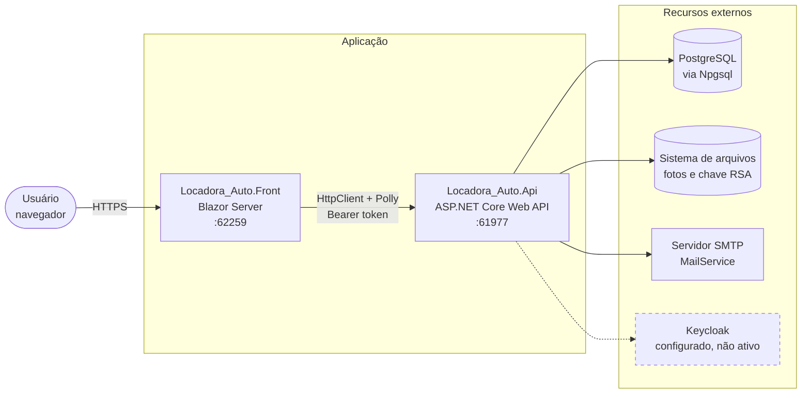
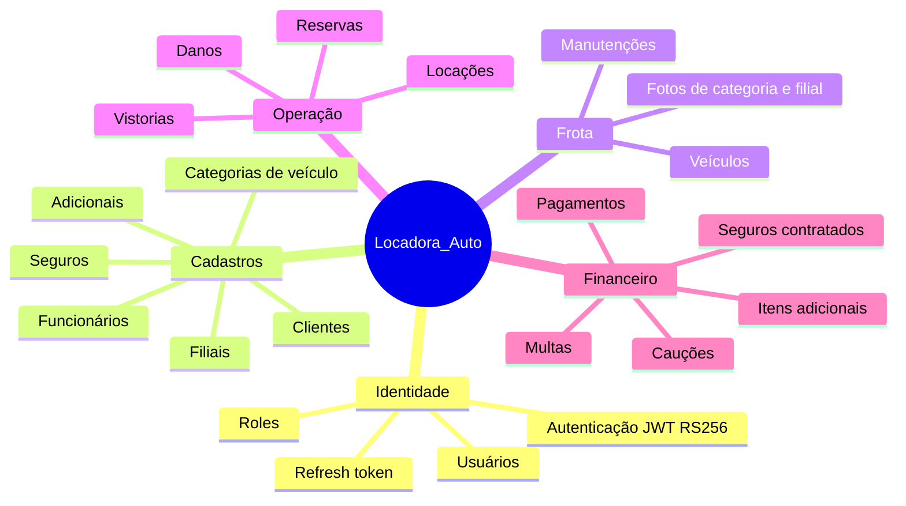

# Documentação — Locadora_Auto

Documentação técnica do sistema de locadora de automóveis. Todos os diagramas estão em
[Mermaid](https://mermaid.js.org/) e renderizam direto no GitHub, no Visual Studio Code
(extensão *Markdown Preview Mermaid Support*) e no Azure DevOps.

## Índice

| Documento | Conteúdo |
|---|---|
| [01 — Arquitetura](01-arquitetura.md) | Camadas, projetos, dependências, fluxo de requisição, tratamento de erros, autenticação |
| [02 — Diagrama de classes](02-diagrama-de-classes.md) | Modelo de domínio por contexto, enumerações, contratos de aplicação e infraestrutura |
| [03 — Modelo entidade-relacionamento](03-modelo-entidade-relacionamento.md) | Tabelas PostgreSQL, colunas, chaves e cardinalidades |
| [04 — Casos de uso](04-casos-de-uso.md) | Atores, casos de uso por módulo e rastreabilidade para os endpoints |
| [05 — Máquinas de estado](05-maquinas-de-estado.md) | Ciclo de vida de locação, veículo, reserva, pagamento, caução, multa, dano, manutenção e cliente |
| [06 — Diagramas de sequência](06-diagramas-de-sequencia.md) | Fluxos ponta a ponta: login, criação e finalização de locação, upload de fotos, auditoria |
| [07 — Especificação: fechamento financeiro](07-especificacao-fechamento-financeiro.md) | **Prescritivo.** Regras de apuração do valor final na devolução: diária, hora excedente, km, combustível, proteção, taxas, caução |
| [08 — Especificação: invariante do ativo](08-especificacao-invariante-do-ativo.md) | **Prescritivo.** Status do veículo como fonte única, um contrato ativo por placa, preparação, localização, manutenção e disponibilidade |
| [09 — Backlog](09-backlog.md) | Fila de trabalho da Api e do front: o que está aberto, em que ordem pegar e de que outro item depende |

Os documentos `01` a `06` descrevem o sistema **como ele é hoje**. Os numerados a partir de
`07` são **especificações** — descrevem o que ainda precisa ser construído, e trazem essa
marcação no cabeçalho. O `09` não é nem uma coisa nem outra: é a lista de tarefas derivada
deles e do código, e sai de sincronia rápido — atualize junto com o documento de origem.

## Visão geral

O sistema gerencia o ciclo completo de locação de veículos: cadastro de clientes e
funcionários, frota distribuída em filiais, reservas por categoria, abertura e devolução de
locações, vistorias com registro de danos, e o financeiro associado (pagamentos, cauções,
multas, seguros e itens adicionais).

São dois executáveis independentes: uma **API REST** (`Locadora_Auto.Api`) e um **front-end
Blazor Server** (`Locadora_Auto.Front`) que consome essa API por HTTP.

## Módulos funcionais

## Convenções adotadas nesta documentação

- Nomes de classes, propriedades e tabelas aparecem **exatamente como estão no código**,
  inclusive quando contêm erros de grafia consolidados (`Indentity`, `Ultils`, `Midlleware`,
  `InjecaoDepedencia`).
- Blocos comentados no `Program.cs` (autenticação, Elmah, health checks, Hangfire, CORS) são
  marcados como *desativado temporariamente* e aparecem tracejados nos diagramas.
- Divergências entre o modelo e o que o código de fato faz estão registradas em seções
  **"Observações"** ao final de cada documento — são apontamentos factuais, não sugestões de
  refatoração.
